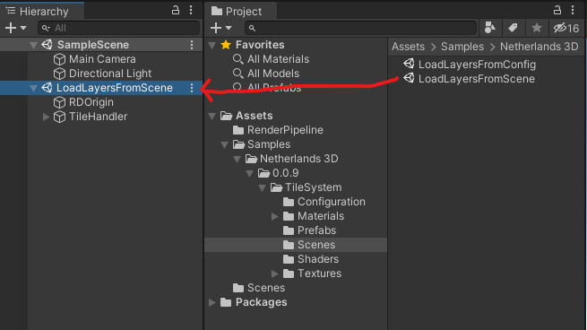
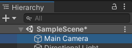
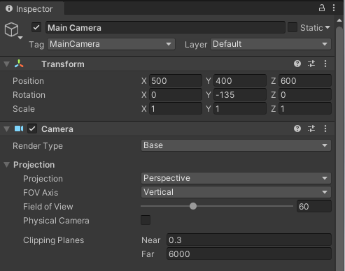

# TileSystem gebruiken

Om het TileSystem in actie te zien gaan we in de assetsFolder naar de eerder geimporteerde Sample.
In deze sample openen we de map "Scenes".

Vervolgens slepen we het bestand "LoadLayersFromScene" naar de hierarchy.

Om een goed beeld te kunnen krijgen willen we de Main Camera nog even verplaatsen. Dit doen we door in de Hierarchy de Main Camera aan te klikken:

En vervolgens in de inspector de Position en Rotation aan te passen.

Nu we toch in de Inspector voor de camera bezig zijn zetten we ook onder het kopje "Camera", "Projection", "Clipping plane" de afstand voor Far even van 1000 op 6000.

Klik vervolgens op **"Play"**, et voila, we zien het 3D-model van Amsterdam.

Je bent nu klaar om met de volgende stap te beginnen "het koppelen van je eigen dataset", volg hiervoor de handleiding 'DataKlaarzetten.md'
