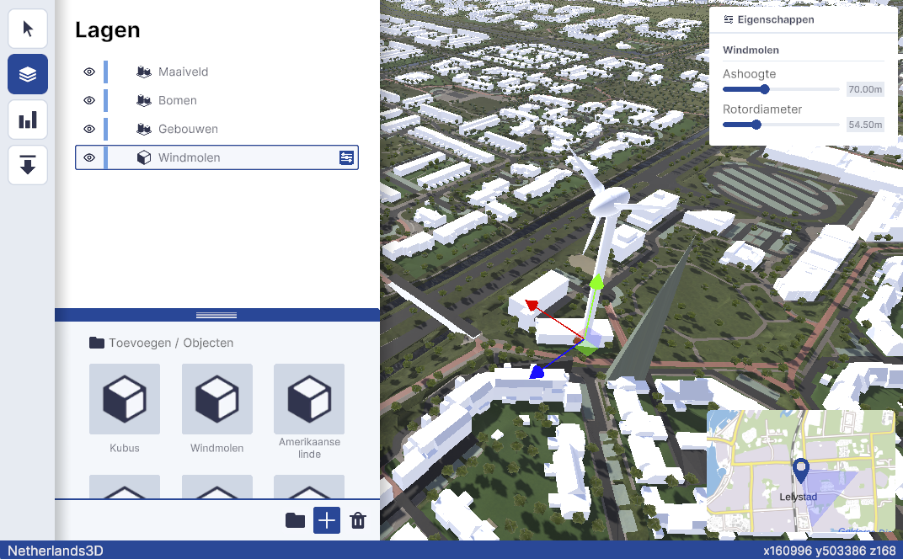

# Properties

## Design

### Usage

The "Properties" block in Netherlands3D serves as a critical interface element, allowing users to interact with and
modify the attributes of various layers within the application. This documentation provides insights into the design
considerations and implementation strategies for this block, ensuring a seamless integration within the Netherlands3D
platform.

This block enables users to access and adjust the transformation properties (position, rotation, scale) of selected 3D
objects or layers. Additionally, it provides access to specific attributes for certain objects, such as Windmills, which
may include properties like axis height or rotor diameter.

<figure markdown="span">
  
  <figcaption>A screenshot of a windmill with an open properties panel</figcaption>
</figure>

### Anatomy

<figure markdown="span">
    
  <figcaption>Anatomical breakdown of the properties block</figcaption>
</figure>

The Properties panel is constructed using a Card component, organized into several key areas for intuitive
user interaction:

1. [Card](../components/cards.md): The overarching container for the Properties panel, designed for clarity and
   cohesion.
2. [Card Header](../components/cards.md): Displays the Properties icon and the term "Eigenschappen," indicating the
   panel's purpose.
3. Section: Each layer or object type, such as Windmills, has its dedicated section within the card.
4. Section Header: Identifies the specific layer or object type, e.g., "Windmolen" for Windmills, guiding users to the
   relevant properties.
5. Section Content: Contains form elements for adjusting the specific properties of the selected layer or object. This
   area is designed for direct interaction, allowing users to modify attributes like axis height or rotor diameter.

### Design Principles

* **Clarity**: The use of a card-based layout ensures that the Properties panel is easily navigable and understandable,
  with distinct sections for different layers or objects.
* **Consistency**: Maintaining a uniform structure across different sections ensures that users have a cohesive
  experience, regardless of the variety of objects or layers they interact with.
* **Immediate Feedback**: Interactions within the Properties panel are designed to provide immediate visual feedback in
  the Netherlands3D environment, emphasizing the panel's role in direct manipulation of objects and layers.

### Interaction

Users interact with the Properties panel by selecting an object or layer within the Netherlands3D platform, and clicking
on the properties button with that layer.

Upon opening, the panel updates to display the relevant sections for the chosen item. Adjustments made within the form
elements of a section are immediately applied, allowing users to see the effects of their changes in real-time. This
design supports a tactile and intuitive experience, encouraging exploration and modification within the digital twin
environment.

## Implementation

### Overview

The Properties panel's functionality in the Netherlands3D platform is achieved through a combination of Unity prefabs
and scripting. This implementation ensures dynamic interaction within the UI, allowing for the seamless addition of
properties sections based on the selected layer or object.

### Prefab Structure

- **Main Properties Prefab:** The core of the Properties panel, this prefab is a part of the default canvas and acts as
  the container for all dynamically added sections.

- **Section Prefabs:** Individual prefabs for each type of section (e.g., Windmill properties) that can be instantiated
  within the main Properties panel.

### Scripting and Interfaces

#### IPropertySection Interface

An essential element in the dynamic nature of the Properties panel is the `IPropertySection` interface. This interface
allows for the detection and instantiation of properties sections based on the presence of specific MonoBehaviours
within a layer's prefab.

- **Detection and Instantiation:** A script running in the layer system detects MonoBehaviours that implement
  the `IPropertySection` interface on a layer's prefab being added to the scene. Upon detection, the `AddToProperties`
  method of the interface is called.

- **Factory Behavior:** Implementations of the `IPropertySection` can act as factories, instantiating the appropriate
  section prefab and adding it to the Properties panel as a "slot". The `AddToProperties` method is being provided with
  the properties content area to which the section can be added.

##### AddToProperties Method

The `AddToProperties` method is where the logic for instantiating the section prefab and integrating it into the
Properties panel is defined. This method allows for flexibility in the UI, permitting custom designs per section while
adhering to the overall design guidelines.

!!! example

    ### Example: Windmill Property Section
    
    The Windmolen prefab, used for the Windmill implementation in the Object Library, includes a MonoBehaviour
    named `WindmillPropertySectionInstantiator` that demonstrates this system in action.
    
    - **Functionality:** The `WindmillPropertySectionInstantiator` responds to the addition of a Windmill object and
      instantiates a dedicated section within the Properties panel. This section is specifically designed to bind and
      display the properties of the windmill, such as axis height or rotor diameter.
    
      - **Binding:** The script binds the windmill's data to the instantiated section, ensuring that any adjustments made
        within the Properties panel are immediately reflected in the windmill's properties within the scene.

### Implementation Steps

Given an existing layer's prefab:

**Implement the IPropertySection interface:** For each layer requiring a properties section, create a MonoBehaviour 
that implements `IPropertySection` and defines how its section prefab should be instantiated and added to the 
Properties panel.

### Design Adherence

While implementing sections, it's crucial to adhere to the established design rules to maintain consistency across the
Properties panel. However, the flexibility of this system allows for the introduction of unique UI elements where
necessary to better represent specific properties.
