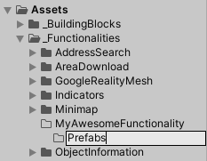
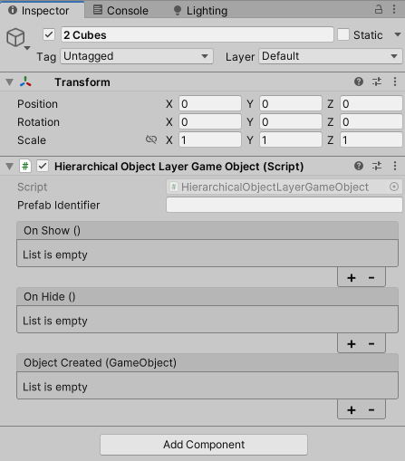
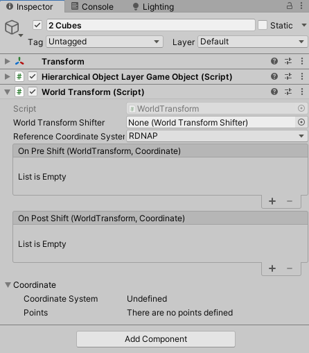
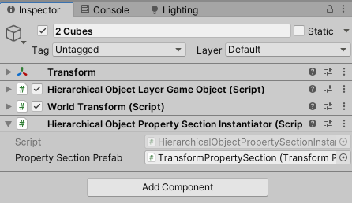

In this step-by-step guide, you’ll learn to add a new layer type, ideal for developers ready to start
building within the platform.

_Note: Steps 6 and 7 may change as functionalities become more independent, reducing the need for adjustments in the 
Twin application._

---

### Step 1: Pick a Functionality, or Create a New One

{ align=right width="275" }
Layers are part of a Functionality and to maintain the necessary structure it is recommended to pick the functionality
to which the layer should belong or, if this is the first time adding your own material,it is recommended to create 
your own.

To create a Functionality, create a subfolder in `Assets/_Functionalities` and name it after the functionality that will 
manage this new layer, and add a new subfolder `Prefabs` to it; here we will place our new layer prefab.

---

### Step 2: Create a Prefab to Visualize the Layer

Create a new prefab to represent your layer. This can include 3D objects as needed for the layer's visual appearance.
This prefab serves as the visual representation of your data in the 3D viewer.

_An example of this could be a Prefab that we call '2 Cubes', where we add two Cubes from Unity's '3D Object' creation 
menu._

---

### Step 3: Attach the `HierarchicalObjectLayerGameObject` Component

{ align=right width="275" }

Add the `HierarchicalObjectLayerGameObject` MonoBehaviour to your prefab. Leave the `Prefab Identifier` field empty or
assign a unique identifier to make sure this layer is globally unique. This identifier will allow the prefab to register
as a new layer within the layer system upon instantiation.

_This component will automatically add a Layer -to the project and in the UI- when an instance of this prefab is 
added to the scene._ 

!!! info "Leaving the `Prefab Identifier` empty will allow for the `PrefabLibrary` (see Step 6) to assign a unique identifier, thus populating it when the prefab is added to the library."

---

### Step 4: Add the WorldTransform Component

{ align=right width="275" }

To ensure the object holds real-world coordinates and remains anchored in place as the user navigates, add the
WorldTransform MonoBehaviour to your prefab. This enables the object to maintain accurate positioning in the 3D
environment.

_The World Transform is similar to, and extends, Unity's own Transform, it provides the means for an object to be 
located in a real world position and to track that._ 

!!! warning "When you want to move a GameObject with a WorldTransform, it is highly recommended to do that by changing the Coordinates on the WorldTransform instead of the `transform.position`."

---

### Step 5: (Optional) Add Transform properties to your layer

{ align=right width="275" }

If you want users to reposition, rotate, or scale this layer in the viewer, add the
`HierarchicalObjectPropertySectionInstantiator` component. Set its _Property Section Reference_ to 
`TransformPropertySection`, enabling these manipulations within the project and allowing them to persist in the 
`.nl3d` project file.

_You can learn more about properties and property sections in the explanation section of the documentation._

---

### Step 6: Register the Prefab in the PrefabLibrary

To ensure the layer system recognizes and loads this layer, add your prefab to the `PrefabLibrary` ScriptableObject. In 
it, you can either create a new prefab group or add it to an existing one for organization.

---

### Step 7: (If Needed) Create UI Elements to Add Your Layer

If you created a new prefab group, or added your prefab to a group without the `auto-populate UI` toggle enabled, add 
UI elements to allow users to instantiate this layer. The default location is within the `AddLayerPanel` prefab, which 
serves as the UI hub for adding layers.
