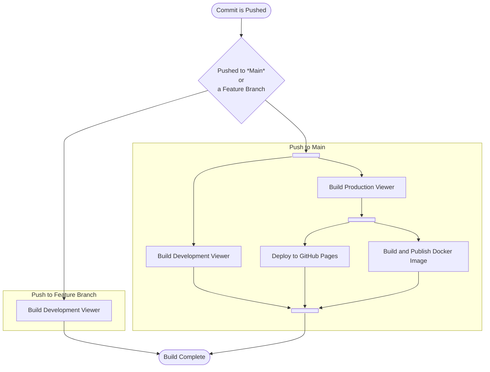

# Our Build Pipeline

## What is a Build, or CI, Pipeline?

!!! info "Already know this?"
    If you are familiar with the concept of Continuous Integration or Build Pipelines, feel free to skip ahead to
    [the chapter "Overview of the Build Pipeline"](#overview-of-the-build-pipeline).

A build pipeline, sometimes called a Continuous
Integration ([https://en.wikipedia.org/wiki/Continuous\_integration](https://en.wikipedia.org/wiki/Continuous_integration))
Pipeline, is a sequence of automated processes that converts source code into a deployable application. It enables
developers to:

1. Compile and build the application.
2. Run automated tests to ensure code quality.
3. Package the application for deployment.
4. Deploy the application to the target environment.

A critical aspect of a build pipeline is its ability to identify issues with the source code as early as possible in an
automated way before deployment. The primary goal of a build pipeline is to "fail fast." This means identifying issues
early in the process to reduce wasted effort and allow developers to address problems as soon as they arise. Jobs and
steps are generally constructed in such a way to aid in this process, ensuring that critical checks occur early and
provide immediate feedback.&#x20;

### Jobs in a Build Pipeline

Build pipelines are generally organized into **jobs**, each representing a major step in the development lifecycle. Note
that in other CI systems, **jobs** may be referred to as **stages**.

For example:

1. **Checkout**: Retrieves the latest source code from version control.
2. **Build**: Compiles the code and resolves dependencies.
3. **Test**: Executes automated tests.
4. **Deploy**: Publishes the built artifacts to a production or staging environment.

Please see the next chapter how our build pipeline is set up.

### Build Steps in a Job

Each **job** consists of smaller units called **steps**, which represent discrete tasks. For instance, a **step** might
involve running a specific script, configuring an environment, or uploading an artifact.

## Overview of the Build Pipeline

!!! tip inline end
    You can find the definition of our pipeline [here](https://github.com/Netherlands3D/twin/blob/main/.github/workflows/main.yml).

Netherlands3D uses GitHub Actions as its Continuous Integration (CI) solution to execute pipelines. 

The platform employs
the principle of [Continuous Deployment](https://en.wikipedia.org/wiki/Continuous_deployment) to automatically build and
deploy changes as soon as they are pushed to the main branch. This ensures that the latest updates are always available 
in production, reducing manual intervention and speeding up the release cycle.

The build pipeline defined in the [GitHub Actions workflow](https://github.com/Netherlands3D/twin/blob/main/.github/workflows/main.yml) 
consists of two primary flows:

1. **Pull Request Flow**: When a branch is created or updated, a development build of the viewer is triggered. The
   resulting artifact, named `viewer-development`, is stored and can be downloaded from the build page in the 
   [GitHub Actions interface](https://github.com/Netherlands3D/twin/actions). Developers can use this build for 
   debugging or profiling locally.

2. **Main Branch Flow**: When a commit is pushed to the [`main` branch](https://github.com/Netherlands3D/twin/tree/main), 
   both development and production builds are triggered:

    - The development build produces an artifact (`viewer-development`) for debugging purposes.
    - The production build generates a production-ready artifact (`viewer`) at the same time, and then concurrently

        - Deploys the viewer to GitHub Pages.
        - Builds and publishes a Docker image containing the production viewer.

Below is a visual representation of the pipeline:

## Jobs and Steps

### Pull Request Flow

#### Build Development Viewer

The goal of this job is to create a development build of the Netherlands3D viewer that includes debugging options. This
build allows developers to test, debug, and profile the application locally. The resulting artifact, named
`viewer-development`, is stored and available for download.

1. [**Free Disk Space**](#free-disk-space-jlumbrosofree-disk-space): Frees up runner storage for the build.
2. [**Checkout Repository**](#checkout-repository-actionscheckout): Retrieves the repository's code.
3. [**Cache Dependencies**](#cache-dependencies-actionscache): Speeds up builds by caching the Unity `Library` folder.
4. [**Build Unity Project**](#build-unity-project-game-ciunity-builder): Builds a development version of the viewer with
   debugging options enabled.
5. [**Upload Development Artifact**](#upload-artifact-actionsupload-artifact): Stores the development build as
   `viewer-development`.

### Main Branch Flow

#### Build Development Viewer

This is the exact same job as [used in the Build Development Viewer job of the Pull Request Flow](#build-development-viewer),
see that chapter for more information.

#### Build Production Viewer

The goal of this job is to create a production-ready build of the Netherlands3D viewer. This build is optimized for
deployment and does not include debugging options. The resulting artifact, named `viewer`, is used in subsequent
deployment and Dockerization steps.

1. [**Free Disk Space**](#free-disk-space-jlumbrosofree-disk-space): Frees up runner storage for the build.
2. [**Checkout Repository**](#checkout-repository-actionscheckout): Retrieves the repository's code.
3. [**Cache Dependencies**](#cache-dependencies-actionscache): Speeds up builds by caching the Unity `Library` folder.
4. [**Build Unity Project**](#build-unity-project-game-ciunity-builder): Builds a production version of the viewer.
5. [**Upload Production Artifact**](#upload-artifact-actionsupload-artifact): Stores the production build as `viewer`.

#### Deploy to GitHub Pages

The goal of this job is to deploy the production build of the Netherlands3D viewer to GitHub Pages. This ensures that
the latest version of the viewer is accessible via [https://netherlands3d.eu/twin](https://netherlands3d.eu/twin).

1. [**Download Production Artifact**](#download-artifact-actionsdownload-artifact): Retrieves the production build
   artifact.
2. [**Prepare Artifact for Deployment**](#build-and-push-docker-image-dockerbuild-push-action): Prepares the artifact
   for GitHub Pages.
3. [**Deploy to GitHub Pages**](#deploy-to-github-pages-actionsdeploy-pages): Publishes the production viewer.

#### Build and Publish Docker Image

The goal of this job is to create a Docker image containing the production build of the Netherlands3D viewer. The image
is then pushed to the GitHub Container Registry, enabling easy deployment to containerized environments.

1. [**Download Production Artifact**](#download-artifact-actionsdownload-artifact): Retrieves the production build artifact.
2. [**Login to Docker**](#login-to-docker-dockerlogin-action): Authenticates with Docker to push the image.
3. [**Build and Push Docker Image**](#build-and-push-docker-image-dockerbuild-push-action): Creates and uploads the Docker image.

## Reference: Environment Variables

The following environment variables are defined in the build pipeline to standardize and simplify configurations:

- `BUILD_OUTPUT_FOLDER`: Specifies the folder where the build output for the WebGL viewer is stored (
  `build/WebGL/WebGL`). This path is used across jobs to locate the built artifacts.
- `PRODUCTION_BUILD_ARTEFACT_NAME`: Defines the name of the artifact created for production builds (`viewer`). This is
  used for identifying the production-ready build in artifact storage and subsequent deployment jobs.
- `DEVELOPMENT_BUILD_ARTEFACT_NAME`: Defines the name of the artifact created for development builds (
  `viewer-development`). This is used for storing builds meant for debugging and testing.

These environment variables ensure consistency and reduce hardcoding of values across multiple steps in the workflow.

## Reference: Actions in Depth

### Free Disk Space ([jlumbroso/free-disk-space](https://github.com/jlumbroso/free-disk-space))

This step ensures sufficient storage on the GitHub Actions runner by removing unnecessary tools and files. It's critical
for resource-intensive builds like Unity.

**Inputs**

- `tool-cache`: Determines if the tool cache should be cleared. Default is `false`.
- `android`, `dotnet`, `haskell`, `docker-images`, `swap-storage`: Specify which resources to clean up. All default to
  `true` except `large-packages`.

### Checkout Repository ([actions/checkout](https://github.com/actions/checkout))

This step retrieves the source code from the repository, including support for large files managed by Git LFS.

**Inputs**

- `lfs`: Fetches Git LFS objects if set to `true`.

### Cache Dependencies ([actions/cache](https://github.com/actions/cache))

Caches the Unity `Library` folder to avoid redundant imports and expedite builds.

**Inputs**

- `path`: Folder to cache, such as `Library`.
- `key`: Unique cache key, typically derived from file hashes.
- `restore-keys`: Fallback keys if the primary cache key is not found.

### Build Unity Project ([game-ci/unity-builder](https://github.com/game-ci/unity-builder))

Compiles the Unity project for WebGL. For pull requests, development builds are configured with debugging options.

**Inputs**

- `targetPlatform`: Specifies `WebGL` as the build target.
- `unityVersion`: Detects the Unity version automatically.
- `customParameters`: Adds parameters like `-Development` and `-AllowDebugging` for development builds.

### Upload Artifact ([actions/upload-artifact](https://github.com/actions/upload-artifact))

Saves the build outputs as downloadable artifacts for later use.

**Inputs**

- `name`: Name of the artifact (`viewer` or `viewer-development`).
- `path`: Path to the files to upload (`build/WebGL/WebGL`).

### Download Artifact ([actions/download-artifact](https://github.com/actions/download-artifact))

Retrieves previously uploaded artifacts, enabling other jobs to access the build outputs.

**Inputs**

- `name`: Name of the artifact to download.
- `path`: Path to store the downloaded artifact.

### Prepare Artifact for Deployment ([actions/upload-pages-artifact](https://github.com/actions/upload-pages-artifact))

This step prepares the production build artifact for deployment to GitHub Pages.

**Inputs**

- `path`: Specifies the location of the artifact to be uploaded for deployment.

### Deploy to GitHub Pages ([actions/deploy-pages](https://github.com/actions/deploy-pages))

Publishes the production viewer to GitHub Pages, making it accessible at [https://netherlands3d.eu/twin](https://netherlands3d.eu/twin).

### Login to Docker ([docker/login-action](https://github.com/docker/login-action))

This step logs into Docker using credentials provided via GitHub Actions, enabling the push of Docker images to the
[GitHub Container Registry for the twin repository](https://github.com/orgs/Netherlands3D/packages/container/package/twin).

**Inputs**

- `registry`: Specifies the Docker registry (e.g., `ghcr.io`).
- `username`: Username for the registry, typically the GitHub actor.
- `password`: Access token or password used for authentication.

### Build and Push Docker Image ([docker/build-push-action](https://github.com/docker/build-push-action))

Creates and publishes a Docker image containing the production viewer at the
[GitHub Container Registry for the twin repository](https://github.com/orgs/Netherlands3D/packages/container/package/twin).

**Inputs**

- `context`: Build context, usually the repository root.
- `file`: Path to the Dockerfile.
- `tags`: Tags for the Docker image (e.g., `latest`).
- `build-args`: Build arguments, such as the artifact path.
