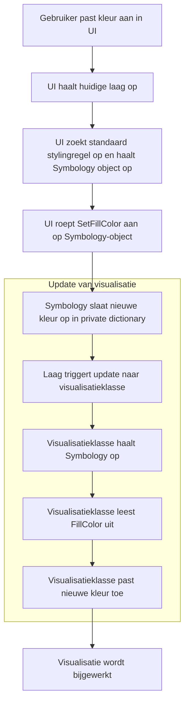

# 2024-10-09 - Laagstijlen / Symbologie

|            |              |
|------------|--------------|
| **Datum**  | 09-10-2024   |
| **Status** | Geaccepteerd |

## Context

Als uitkomst van dit voorstel willen we dat Netherlands3D gebruik maakt van visualisaties waarbij lagen worden
gestileerd met behulp van symbologie, gebaseerd op de **OGC Cartographic Symbology - Part 1: Core Model & Encodings** 
(https://docs.ogc.org/DRAFTS/18-067r4.html). De implementatie is een **systeem vergelijkbaar met CSS**, waarbij een 
**Symbolizer** styling-eigenschappen bevat, en **Selectors** (beschreven als **Expressions**) bepalen wanneer en hoe 
deze eigenschappen worden toegepast.

Hoewel de term "symbologie" gebruikelijk is in GIS, noemen we dit systeem "styling" om het toegankelijker te maken voor
een breder publiek en de parallel met CSS te benadrukken.

!!! warning "Scheiding tussen Styling en Visualisatie"

    Het styling-systeem zelf doet **niets** met de daadwerkelijke visualisatie. Het systeem beschrijft alleen hoe de
    styling moet zijn, maar het is aan de visualisatiecode die hoort bij een laag om te bepalen of en hoe de
    styling-eigenschappen worden toegepast. Dit betekent dat het mogelijk is dat bepaalde styling-eigenschappen **niet**
    worden toegepast als de visualisatiecode daarvoor geen ondersteuning biedt.

## Besluit

We implementeren een flexibel styling-systeem waarin **Symbolizers** styling-eigenschappen bevatten, en **Selectors** en
**Expressions** bepalen wanneer deze eigenschappen van toepassing zijn. Dit systeem wordt toegepast op lagen, en de
mogelijke waarden binnen een Symbolizer worden bepaald door de aanwezige **Symbolizer-extensies**.

Externe partijen kunnen hun eigen extensies en **styling-eigenschap prefixes** toevoegen, volgens het patroon uit
hoofdstuk 8.1.7 van de OGC-specificatie: `vendor.<vendor naam>.<eigenschap naam>`. Voor Netherlands3D betekent dit dat
we de prefix `vendor.netherlands3d.<eigenschap naam>` zullen hanteren.

## Rationale

Het gebruik van een systeem, vergelijkbaar met CSS, biedt de flexibiliteit en uitbreidbaarheid die nodig is voor het
werken met dynamische geodata. Door selectors en expressies te gebruiken, kunnen we styling-eigenschappen toepassen op
basis van attribuutwaarden of andere condities. Symbolizer-extensies zorgen ervoor dat nieuwe styling-eigenschappen
kunnen worden toegevoegd zonder de kernstructuur te verstoren. Door gebruik te maken van extension methods met
default-waarden, waarborgen we een voorspelbare werking van het systeem, zelfs wanneer geen expliciete waarde aanwezig
is.

## Codeorganisatie

De implementatie van het systeem wordt ondergebracht in een aparte **OpenUPM-package**. De code voor de verschillende 
**Symbolizer-extensies** wordt georganiseerd in mappen, waarbij iedere extensie een **Requirement Class** uit de
OGC-specificatie volgt. Dit maakt het beheer van verschillende extensies overzichtelijk en zorgt voor een heldere
scheiding tussen kernfunctionaliteit en uitbreidingen.

Wij passen zelf de **styling-eigenschap prefix** `vendor.netherlands3d.<eigenschap naam>` toe voor onze eigen
uitbreidingen. Derde partijen kunnen hun eigen extensies via hun eigen packages toevoegen en daarbij hun eigen 
**styling-eigenschap prefixes** introduceren volgens hetzelfde patroon uit hoofdstuk 8.1.7 van de OGC-specificatie.

## Implementatiestrategie

We voeren de implementatie **stapsgewijs** uit. Dit houdt in dat we niet alle eigenschappen van de Symbolizer in één
keer toevoegen, maar in kleine iteraties werken. Elke iteratie implementeert één of meer specifieke **eigenschappen**
van de Symbolizer, afhankelijk van de eisen van een user story. Bijvoorbeeld: wanneer een user story vraagt om een laag
een enkele vulkleur te geven, wordt alleen de **fill**-eigenschap van de Symbolizer-extensie voor vectorfeatures
geïmplementeerd.

Hoewel hoofdstuk 17 van de OGC-specificatie extra opties beschrijft zoals het gebruik van het "alter" veld, variabelen
en het includen van stylesheets, zullen we deze opties expliciet **niet** implementeren. Ons doel is niet om de
volledige specificatie te implementeren, maar om de organisatiestructuur van symbolizers, expressies en styling te
adopteren. Dit voorkomt dat we het wiel opnieuw uitvinden, maar zorgt ervoor dat we ons beperken tot een basisstructuur
die ons flexibiliteit biedt zonder de complexiteit van volledige implementatie.

## Implementatie

```mermaid
classDiagram
    namespace Netherlands3D {
        class Layers
    }
    namespace Layers {
	    class LayerData {
	        +LayerStyle styles
	    }
	    class Styles
    }
    
    namespace Styles {
    class LayerStyle {
        +StylingRule stylingRules
        +Metadata metadata
    }

	class Metadata {
	    + string name
	}
	
    class StylingRule {
        +string name
        +Symbolizer symbolizer
        +Expression selector
    }

    class Expression {
    }
    
    class Symbolizer {
        - Dictionary properties
        ~ void GetProperty(string name)
        ~ object SetProperty(string name, object value)
    }

    class CoreSymbolizerExtension {
        +GetVisibility() bool
        +SetVisibility(bool visible)
        +GetOpacity() float
        +SetOpacity(float opacity)
    }

    class VectorSymbolizerExtension {
        +GetFill() Color
        +SetFill(Color fillColor)
    }
    }
    
    LayerData --> "0..*" LayerStyle
    LayerStyle --> "0..*" StylingRule
    LayerStyle --> "0..1" Metadata
    StylingRule --> "0..1" Symbolizer
    StylingRule --> "0..1" Expression
    CoreSymbolizerExtension .. Symbolizer : extension of
    VectorSymbolizerExtension .. Symbolizer : extension of

```

!!! note "Let op"

    We wijken in de naamgeving af van de beschrijving in de OGC standaard bij de LayerStyle klasse, in de OGC standaard
    heeft deze enkel `Style`, maar om consistent te zijn in de applicatie en ter verduidelijking voegen wij het
    voorzetsel `Layer` toe om te benadrukken dat dit een style is behorende bij layers; vergelijkbaar
    met `LayerPropertyData`

### Opslag van Stijlen in het Projectbestand

Elke **layer** in het projectbestand krijgt een nieuw veld genaamd **"styles"** waarin de stylinginformatie wordt
opgeslagen. Dit veld verwijst naar een JSON-structuur die hetzelfde formaat is zoals gedefinieerd in hoofdstuk 17 van de
**OGC Cartographic Symbology - Part 1: Core Model & Encodings** OGC-standaard. Hierdoor kunnen we stijlen opnieuw laden
en heen en weer converteren tussen het interne representatiemodel en het JSON-bestand. Dit zorgt ervoor dat stijlen
behouden blijven wanneer ze eenmaal gedefinieerd zijn.

!!!warning "Technische Vereisten voor Serialization"

    Omdat het hele projectbestand wordt geserialized met **Newtonsoft's JSON.net**, moet de klassestructuur van de
    symbolizers ook in dit format worden geserialized. Dit waarborgt strict typing en maakt het consistent met de rest 
    van het project.
   
    Voor de Symbolizer zal een aparte JsonConverter geschreven moeten worden die ervoor zorgt dat de waarden in
    de `properties` dictionary als losse velden direct in de JSON voor het symbolizer object verschijnen en niet dat een
    extra veld `properties` in de JSON terecht komt.

### Expressions, en Selectors

Bij het implementeren van **expressions** en **selectors** volgen we de structuur zoals beschreven in hoofdstuk 8.1.5
van de **OGC Cartographic Symbology - Part 1: Core Model & Encodings**. Net als bij de styling-eigenschappen, zullen we
de expressie-taal niet in één keer volledig implementeren, maar stap voor stap, afhankelijk van de vereisten van user
stories.

!!!example "Voorbeeld"

    Een voorbeeld hiervan is een user story waarin we een groep features kleuren op basis van een attribuutwaarde. Voor deze
    implementatie hebben we alleen de volgende onderdelen nodig:
   
    - Een **vergelijkingsoperator** (alleen gelijkheid),
    - Een **attribuut-identiteits-expressie** (om het attribuut aan te duiden),
    - Een **TextLiteral-expressie** (om de letterlijke waarde te beschrijven).

Dit iteratieve proces maakt het mogelijk om gericht de functionaliteiten toe te voegen die direct noodzakelijk zijn voor
de behoeften van de gebruikers.

## Risico's

De OGC Cartographic Symbology-standaard bevindt zich in een draft-stadium, wat betekent dat de specificaties nog kunnen
veranderen. We accepteren dat onze implementatie niet volledig overeenkomt met de definitieve specificatie, en houden
hier rekening mee in toekomstige aanpassingen.

## Appendix A: Woordenlijst

- **OGC Cartographic Symbology-standaard**: De standaard waarop het styling-systeem is gebaseerd.
- **Layer**: Een verzameling van geografische objecten die in een bepaalde stijl worden weergegeven.
- **Styling**: Het toekennen van visuele eigenschappen aan geografische objecten.
- **Style**: Een verzameling van stylingregels die wordt toegepast op een layer.
- **Styling-eigenschap**: Een specifieke visuele eigenschap, zoals kleur of lijnstijl, die wordt toegepast op een
  object.
- **Symbolizer**: Een object dat styling-eigenschappen bevat voor lagen.
- **Symbologie**: Een GIS-term voor het beschrijven van hoe geografische objecten visueel worden weergegeven.
- **Selector**: Een conditie die bepaalt wanneer een symbolizer moet worden toegepast.
- **Expression**: Een voorwaarde of waarde die bepaalt hoe en wanneer een bepaalde styling-eigenschap wordt toegepast.
- **Symbolizer-extensie**: Uitbreidingen die nieuwe styling-eigenschappen toevoegen aan de Symbolizer.
- **Styling-eigenschap prefix**: Een voorvoegsel toegevoegd aan eigen styling-eigenschappen om conflicten met
  OGC-gedefinieerde eigenschappen te voorkomen, zoals beschreven in hoofdstuk 8.1.7 van de OGC-specificatie.

## Appendix B: Voorbeeld flow voor het wijzigen van kleur

Wanneer een gebruiker de kleur van een laag aanpast in de UI, doorloopt de applicatie de volgende stappen:



1. **Gebruiker past kleur aan in UI**: De gebruiker kiest een nieuwe kleur voor een laag.
2. **UI haalt huidige laag en standaard stylingregel op**: De UI haalt de geselecteerde laag en de standaard
   stylingregel op, inclusief het bijbehorende Symbology-object.
3. **Symbology-object bijwerken**: De UI roept de `SetFillColor` method aan op het Symbology-object, dat de nieuwe kleur
   opslaat in een private dictionary.
4. **Update van visualisatie**: De laag triggert een update naar de visualisatieklasse, die vervolgens het
   Symbology-object ophaalt, de nieuwe kleur uitleest, en deze toepast op de visualisatie.
5. **Visualisatie wordt bijgewerkt**: De visualisatie wordt automatisch bijgewerkt om de nieuwe stijl van de laag te
   reflecteren.

Het updaten van de visualisatie is een herbruikbaar blok dat niet alleen in deze flow kan worden ingezet, maar ook bij
het openen van een project. Door de scheiding tussen de symbologie data en de visualisatie kan, vergelijkbaar met de
scheiding tussen LayerData en visualisatie, styling in het project uniform worden opgeslagen.
