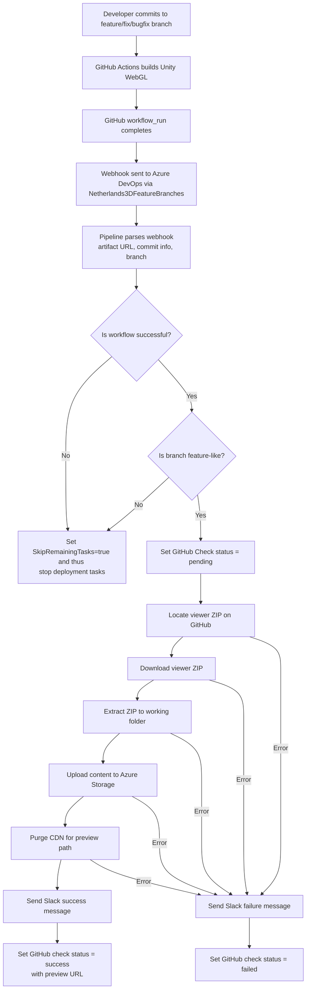

# Our Feature Build Pipeline (Azure DevOps)

!!! info "Introduction to CI/CD and pipelines"
    In [the explainer on our build pipeline](build-pipeline.md#what-is-a-build-or-ci-pipeline) is a short introduction 
    on builds, pipelines and CI/CD.

This page explains how *feature builds* work in the Netherlands3D CI/CD workflow, why they exist, and how they are
automatically deployed as isolated preview environments. It also describes the Azure DevOps pipeline that handles the
deployment of feature builds based on GitHub’s webhook events.

The intended audience is developers who may not yet be familiar with CI/CD, Azure Pipelines, or automated deployments.
This page provides both a simple overview and a deeper technical explanation.

---

## 1. What Are Feature Builds?

Netherlands3D uses a **[Feature Branch Workflow](https://www.atlassian.com/git/tutorials/comparing-workflows/feature-branch-workflow)**, 
where:

- All production-ready code lands on `main`.
- Developers implement new work in **short-lived feature branches** with a specific prefix, either`feature/*`, 
  `fix/*` or `bugfix/*`.
- Feature branches map closely to **individual work items** in the product backlog.

Every work item—bug, fix, enhancement, or new feature — should have its own branch, and *each branch gets its 
own deployment*.

Feature builds act as a **per-work-item acceptance environment**, which can also be called a Preview environment:

- Multiple features can be reviewed in parallel without conflicting with each other.
- Developers can share a direct preview link without needing a local build.
- Product owners and stakeholders can review a feature *before* it is merged.
- QA can validate work in isolation.

Each build results in a unique Preview URL. This URL can be found in a channel dedicated to CI/CDI in our team's 
communication app, or it can be found in a Pull Request's check section named "Netherlands3D Preview".  

These paths for these branches follow this format:

```
/autobuild/<branch-prefix>/<branch-name>/<commit-hash>/feature/
```

This enables complete traceability and instant previewing of every commit. When a branch is deleted, the Preview builds
are also removed.

---

## 2. End-to-End Flow (High-Level Overview)

At a high level, feature build deployment works like this:



---

## 4. Technical Explanation of the Pipeline (Simple → Detailed)

Below is a step-by-step explanation of the pipeline.

---

### 4.1 Pipeline Triggering

The pipeline is triggered by: 
**GitHub [workflow_run](https://docs.github.com/en/actions/reference/workflows-and-actions/events-that-trigger-workflows#workflow_run) 
webhooks** via the [service connection](https://learn.microsoft.com/en-us/azure/devops/pipelines/library/service-endpoints?view=azure-devops):

```
Netherlands3DFeatureBranches
```

This webhook fires when any GitHub Action workflow in the `Netherlands3D/twin` Github repository completes.

---

### 4.2 Parsing the Webhook & Branch Validation

The pipeline reads:

- `artifacts_url`
- `head_branch`
- `author`
- `commit hash`
- Commit message
- Workflow `conclusion`

Validation rules:

- If GitHub did **not** succeed → skip deployment by setting `SkipRemainingTasks` to true.
- If branch is **not** one of `feature/*`, `fix/*`, `bugfix/*` → skip deployment by setting `SkipRemainingTasks` to true.

If valid, the script extracts:

- `ContainerName` — branch prefix before the first slash
- `FeatureName` — everything after the last slash
- A cleaned commit title (max 55 characters)

---

### 4.3 Setting GitHub Commit Status to “Pending”

If `SkipRemainingTasks == false`, GitHub commit status is set to:

```
state = pending
description = "Preview is building"
```

This gives immediate PR feedback in the checks section of a PR with a direct link to the Azure Pipeline run.

---

### 4.4 Locating and Downloading the Viewer

The Azure Pipeline does not build its own viewer but relies on the viewer that is built on Github. This ensures that
there is no uncertainty that the version you are previewing identical to what is built.

Azure DevOps:

1. Retrieves artifact metadata from GitHub.
2. Selects the artifact named `viewer-development` that contains the development build.
3. Downloads the ZIP file using GitHub API.

If download fails, the error message is saved for reporting.

---

### 4.5 Extracting the Artifact

The ZIP archive is extracted into:

```
$(System.DefaultWorkingDirectory)/feature/
```

This becomes the build that will be published.

---

### 4.6 Uploading to Azure Storage

The extracted WebGL build is uploaded to:

```
$web/autobuild/<Container>/<Feature>/<CommitHash>/
```

Where:

- **Container** = first part of the branch name (`feature`, `fix`, `bugfix`)
- **Feature** = last part of the branch name
- **CommitHash** = SHA of the commit that triggered the build

This ensures fully isolated preview environments.

---

### 4.7 CDN Purge

To ensure instant cache refresh for new builds and to show the latest version, the pipeline purges only the relevant 
folder:

```
/autobuild/<Container>/<Feature>/*
```

---

### 4.8 Slack Success Notification

On success, Slack receives:

- A green checkmark
- The author’s name
- The preview URL
- The commit title

This gives product and team members immediate visibility.

---

### 4.9 GitHub Status Updated to Success

The commit status is updated to:

```
state = success
description = "Preview available"
target_url = <preview URL>
```

GitHub PRs now show a checkmark that links directly to the preview environment for easy access.

---

### 4.10 Failure Notifications

If the pipeline itself fails:

- A Slack message with a red square is sent.
- It includes a link to the Azure DevOps build logs.
- GitHub status is set to `failure` or `error`.

This helps developers quickly debug issues.

