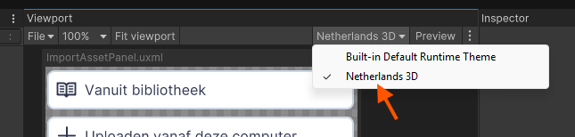

# Editing a Custom Control using the UI Builder

## Introduction

Unity’s UI Builder is a powerful tool for visually creating and editing UXML templates. However, **Custom Controls**
behave differently inside the Builder than during actual runtime.

When you open a Custom Control in the UI Builder, Unity displays **only the raw UXML template**—without executing its
C# logic and without auto‑loading the control’s USS files.

This means:

* Attributes defined in C# are **not applied**
* USS added by C# (e.g., via `AddComponentStylesheet`) is **not loaded**
* The element often appears **unstyled or broken** in the preview

To properly edit and preview the template, you must manually load the styling that the control normally receives at
runtime.

This guide shows how to do that safely and correctly.

---

## Goal

This guide consists of the following parts:

1. [Understanding What UI Builder Loads (and Doesn’t Load)](#1-understanding-what-ui-builder-loads-and-doesnt-load)
2. [Preparing UI Builder to Edit a Custom Control Template](#2-preparing-ui-builder-to-edit-a-custom-control-template)
3. [Restoring the Control Styling for Accurate Preview](#3-restoring-the-control-styling-for-accurate-preview)
4. [Cleaning Up After Editing](#4-cleaning-up-after-editing)

The purpose is to ensure:

* you **see the control as it truly looks**
* you **don’t accidentally break runtime behaviour**
* and you **avoid duplicate USS loading**

---

## Prerequisites

You should be familiar with:

* The Unity **UI Builder**
* UI Toolkit concepts like UXML, USS, themes, and custom controls
* The Netherlands3D custom control pattern where C# injects:
    * Layout via `CloneComponentTree("Components")`
    * Styles via `AddComponentStylesheet("Components")`

---

## 1. Understanding What UI Builder Loads (and Doesn’t Load)

When editing a custom control directly in the UI Builder:

### ✔ UI Builder *does* load:

* The **raw UXML** file (the template)
* The **Preview Theme** selected in the Preview window
* Any **USS you manually attach** in the *Stylesheets* section

### ✖ UI Builder *does not* load:

* Your custom control’s **C# code**
* Any USS added by that C# code (e.g. `Header-style.uss`)
* Any dynamic behaviour (attributes, events, mutations)

!!! important
    The UI Builder is *only a template editor*, not a runtime execution sandbox.

This means custom controls typically appear **unstyled**, **misaligned**, or even **empty** until you manually restore
the missing pieces.

---

## 2. Preparing UI Builder to Edit a Custom Control Template

To get an accurate live preview, you must configure the UI Builder to include the correct styling.

### 2.1. Select the Netherlands3D Theme

In the UI Builder’s **Preview window**, choose:

> **Theme → Netherlands 3D**



This ensures the following are automatically included:

* `Assets/UI Toolkit/UnityThemes/Netherlands3D.tss`
* `_Foundation.uss`
* `_Theme.uss`

These provide:

* All spacing variables
* All font sizes
* The color palette
* Layout defaults

Without them, the control will look completely wrong.

!!! tip

    If you see missing colors, tiny text, or collapsed layout — check the theme first.

---

## 3. Restoring the Control Styling for Accurate Preview

Now you must manually re-attach the USS file that normally gets added by C#.

### 3.1. Add the Control’s USS File

In the **Stylesheets** panel (left sidebar):

1. Click the **+** button
2. Select the control’s stylesheet (e.g. `Header-style.uss`)

This restores:

* Class styling (e.g., `.header`, `.header-title`)
* Custom control layout rules
* Font sizing and text appearance
* Flexbox behaviour specific to this control

After this step, your control should look exactly like it does at runtime.

!!! warning

    If the control uses child custom controls (e.g., `HelpButton`), their styling should atutomatically have been added.
    When this is not the case, then the child has been added not as a "Custom Control C\#", but as a 
    "UI Document (UXML)".

---

## 4. Cleaning Up After Editing

This step is **crucial**.

When you are done editing the UXML, **you must remove the USS file you manually added**.

Why?

Because at runtime, the C# code adds the USS via:

```csharp
this.AddComponentStylesheet("Components");
```

!!! info
    It is done this way because Unity is unable to load stylesheets from packages using the `<Style/>` tags. By loading 
    the stylesheets from code, Unity will be able to load from packages as it will check all `Resources` (folders).

If the UXML also references that stylesheet, you get:

* Duplicate rules
* Conflicts in cascade
* Theme variable overrides executed twice
* Unexpected layout behaviour

### **To clean up:**

In the UI Builder:

1. Go to the *Stylesheets* section
2. Remove the control’s USS file
3. Save the UXML

Now the template is clean again, and runtime styling works as intended.

***

## Best Practices

* Always turn on **Netherlands 3D** as the preview theme before styling
* Add the control’s `-style.uss` only temporarily during editing
* Remove manually added stylesheets before saving your final version
* Never rely on C# behaviour inside the UI Builder — it is ignored
* Keep control classes and their template structure consistent with naming conventions (e.g., `.header-title`)
* When your control’s preview looks wrong, verify:
    1. Theme selected
    2. Stylesheet added
