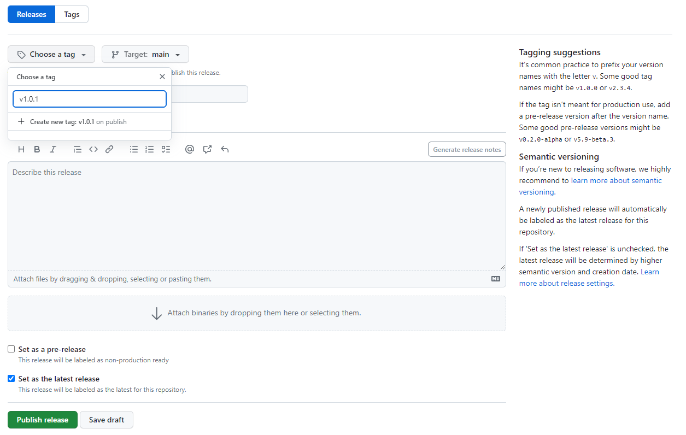

Creating and managing Packages
==============================

Netherlands3D is a framework where you, as developer, can pick the functionality that you need from a series of 
packages. This guide will empower you to develop your own packages by providing step-by-step instructions how
you can create your own package, release it and last, but not least, publish it to [OpenUPM](https://openupm.com).

## Variables / Placeholders

Before we get started, let's define some terms as if they were variables. This documentation and the template files 
in the Gist mentioned in the chapter [Creating a new package](#creating-a-new-package) uses various placeholders. These 
can recognized as they are between brackets, for example `{NAME}`. 

This table provides an overview of them and their meaning.

| Name              | Explanation                                                                                                                                                                              | Example                                                                                                    |
|-------------------|------------------------------------------------------------------------------------------------------------------------------------------------------------------------------------------|------------------------------------------------------------------------------------------------------------|
| NAME              | The name of the code repository, this is usually the DISPLAY_NAME in PascalCase. It is recommended to limit the name to two words, if more words add clarity than that takes precedence. | PeriodicSnapshots                                                                                          |
| PACKAGE_NAME      | The package name as known in the package manager and/or package.json; always starts with `eu.netherlands3d.` and followed by the display name -or similar- in kebab-case                 | eu.netherlands3d.periodic-snapshots                                                                        |
| DISPLAY_NAME      | The human-readable name of a package, shown in the README or in the Package Manager                                                                                                      | Periodic Snapshots                                                                                         |
| REPOSITORY_NAME   | Alias of NAME, used to make explicit that we want the repository name there.                                                                                                             | PeriodicSnapshots                                                                                          |
| VERSION           | The version number in the package.json, according to SemVer. **Important**: contrary to the git tag, this does not start with a letter `v`                                               | 1.0.1                                                                                                      |
| DESCRIPTION       | A single-line short description describing the package, can also be used on Github as the description for the repository                                                                 | This package provides the means to do take a series of snapshots for specific moments throughout the year. |
| LONG_DESCRIPTION  | The description of the package detailing what it is used for.                                                                                                                            |                                                                                                            |
| USAGE_INFORMATION | Documentation how to use this package.                                                                                                                                                   | *See existing packages for examples*                                                                       |
| NOTE              | One or more entries in the CHANGELOG -according to [Keep A Changelog](http://keepachangelog.com/en/1.0.0/)- describing what has been added, changed, removed or deprecated in a package  |                                                                                                            |

This vocabulary and their definitions will help to have a consistent experience when working with packages.

## Creating a new package

When creating a new package, it is recommended to first create it as an embedded package in the 
[Netherlands3D twin project](https://github.com/Netherlands3D/twin). This will help to prototype and experiment until 
the point where it is stable enough to be distributed.

This can be done using the following steps:

1. Clone the Netherlands3D Twin project, located at https://github.com/Netherlands3D/twin.

2. Make sure Unity is not open while performing the following steps; it generally tends to crash when it updates while setting up a package.

3. Create a directory for your [embedded package](https://docs.unity3d.com/Manual/CustomPackages.html#EmbedMe) in the 
   `Packages` folder.

    !!! warning "Important"

        The directory name *MUST* follow the structure `eu.netherlands3d.[name]` where `name` is in lower-case [kebab-case](https://www.pluralsight.com/blog/software-development/programming-naming-conventions-explained#kebab-case).

4. Copy the template files, located at https://gist.github.com/mvriel/8a8251b492d9d8f742da16667c49e412, and fill in the placeholders.

5. Set up the package according to the following recommended directory structure: https://docs.unity3d.com/Manual/cus-layout.html

6. Start Unity and allow for it to install the new package, you should see your new package in the "Installed Packages" section of the Package Manager with the tag `Custom` behind the name.

7. When you want to add Scripts to this package: Make sure you have created the folder `Runtime\Scripts` as a location to store them and add an Assembly Definition with the name `{PACKAGE_NAME}.Runtime`. 

## Promoting an embedded package

It takes time and effort to get a package into a usable and moderately stable condition. Because of this the recommended
way of working is to first create an embedded package in the Twin project -like an incubator project- and once it is 
moderately stable: promote it to its own repository.

Promoting an embedded package is done by one of the project maintainers -if not alone for the fact that a repository 
needs to be made- and follows the following sequence of steps:

1. Create a repository whose name matches the `{NAME}` placeholder, thus a PascalCase representation of the 
   human-readable name.

2. Move all files from the `Packages\{PACKAGE_NAME}` folder in the Twin repository to the newly made repository's root 
   folder

3. Check and adjust, at least, the URL's for the LICENSE, README and CHANGELOG in the `package.json`.

4. Release and publish the promoted package, see the chapters on [releasing](#releasing-a-package) and 
   [publishing](#publishing-a-package) for the involved steps.

5. In the Twin project, add a reference to `{PACKAGE_NAME}` to the package.json or install the package through
   the package manager.

    !!! warning "Important"

        After a package is added to OpenUPM for the first time, it can take between 30 and 60 minutes for it to 
        show up in the package listing.

Once a package is promoted, you can no longer edit it as part of the Twin project; in the next chapter 
[Changing a Package](#changing-a-package) it is described how you can change a promoted package without all too much 
hassle.

## Changing a package

> To be written

## Releasing a package

When you want to release a new version of a package you generally go through the following steps:

!!! tip

    Before releasing, make sure you have tested your package in [the Twin](https://github.com/Netherlands3D/twin) -or 
    another Netherlands3D-based project- installed as a local package.
   
    Especially important is:
    
    * verifying that the correct dependencies are set and installed
    * that the Assembly Definition can be used and
    * that the Assembly Definition does not depend on Assembly Definitions that are not a dependency of your package,
      especially Netherlands3D.Core.Runtime should be avoided
   
    Failure to do so may cause extra work because once a package is released, it is impossible to change something
    in the release and a new release must be made.

1. Go to the repository of your package. If there is none: see the chapter on 
   [Promoting an embedded package](#promoting-an-embedded-package) and do that first.

2. Ensure the version number in the package.json is updated

3. Check the CHANGELOG.md: 

   1. Does it contain all changes since the last version?
   2. Is the top-entry `[Unreleased]`? Fill in the new version number and add a date, see: https://keepachangelog.com/en/1.0.0/#effort

4. Ensure any changes in the above are in the main branch

5. Go to "Releases" on Github (`https://github.com/Netherlands3D/{NAME}/releases`) and

   1. Draft a new release
      
   2. Click on "Choose a tag"
   3. Enter the version number from the package.json with a preceding letter `v`, for example: `v1.0.1`.
   4. Click on the option "Create new tag: `v{VERSION}` on publish"
   5. (optional) Add a release title and description
   6. Click on the button "Publish Release"

Once a new release/tag has been made, your new release of your package is all set! If it has already been 
published on [OpenUPM](https://openupm.com) before, no further action is needed. OpenUPM will automatically pick
up on the new tag and make the new version available.

When the package has not been published on OpenUPM yet, now is a good time to do it.

## Publishing a package on OpenUPM

When a package is released for the first time, it needs to be published by registering it on OpenUPM.

!!! tip

    Before publishing, make sure you have tested your package in https://github.com/Netherlands3D/twin -or another
    Netherlands3D-based project- installed as a local package.
    
    Especially important is:
    
    * verifying that the correct dependencies are set and installed
    * that the Assembly Definition can be used and 
    * that the Assembly Definition does not depend on Assembly Definitions that are not a dependency of your package,
      especially Netherlands3D.Core.Runtime should be avoided
    
    Failure to do so may cause extra work because once a package is published, it is inconvenient to unpublish it or 
    change publication details such as the name.

To do so, you can take the following steps:

1. Go to https://openupm.com.

2. Click on the "+" button in the menu bar to add a new package
   

3. Fill out the Github repository name in the intended field and click on "Go".
   
   A form expands where you can verify the package name, ReadMe location and more

4. Enter your github username in the "Discovered by" field; this is used to base a fork of OpenUPM from and add the 
   package as a pull request.

    

    !!! note
   
        The section "Advanced" is for advanced use when multiple packages are hosted in the same repository; at the moment
        this method is not recommended and as such that part of the submission form can be skipped
   
5. Check the "Promotion" section if the package fits any of these categories, and check these.

6. Click on the "Verify Package" button, all other fields can be left unchanged.

As soon as the steps above have completed, you are asked to fork the `OpenUPM` repository and to commit these changes in
a feature branch. At this point you can use the "Create pull request" button to create a pull request to OpenUPM.

!!! tip

    If this is your first time submitting a package to OpenUPM, the maintainer of OpenUPM needs to approve the Pull 
    Request manually; this is generally done within 24 hours. Any subsequent pull requests will be automatically merged.

After the pull request is merged, it will take 30 to 60 minutes for `OpenUPM` to add the package to the registry.

## FAQ

> Can I depend on the `Netherlands3D.Core.Runtime` assembly?

At time of writing, this assembly is within the code of the https://github.com/Amsterdam/Netherlands3D skeleton; meaning
that this dependency only works when the package is used within a project that is based on this skeleton. This can be
a problematic dependency since we are actively working on moving the contents of this skeleton into components.

Because of the above, it is not recommended for a published package to depend on the `Netherlands3D.Core.Runtime`
assembly.

If code from this assembly is needed, it is recommended to extract this code into another package that you can depend 
on or duplicate it into your own package until such a package can be made.

For more information on this, see the question `Can I depend on Assemblies that are not in my own package?`.

> Can I depend on Assemblies that are not in my own package?
 
You sure can! As long as these assemblies are in a package that is published in a Unity Package Registry such as 
OpenUPM, and that you have added that package as a dependency to your `package.json` file.

If you add an assembly whose package cannot be included in your `package.json` -either because it is not a package or
a git-based package- then you will need to add installation instructions in the README. Without these instructions,
any user of the package will have a missing assembly -and thus errors- without knowing how to fix it.

> One of the packages does not show up in the Package Manager after publishing

Have you checked the minimum unity version in the `package.json`? If the minimum version is newer than your
installed version, it will not be visible.

> Why OpenUPM and not add packages through a Git URL?

Good question! When you add packages through a Git URL you lose certain features that packages hosted on a registry do
have. This includes but is not limited to:

1. Unable to update to a new version: when you use a Git tag/release, then you need to uninstall and reinstall the 
   package when a new becomes available instead of just using the `Update` button.

2. Git-url based packages cannot be used as dependencies: this means that if a package depends on another, with git 
   urls you need to manually install the correct dependencies and face possible version conflicts with newer versions.
