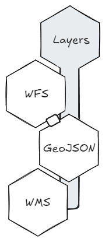
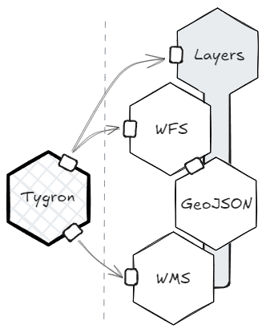

Netherlands3D is a comprehensive platform designed to develop specialized 3D viewers that unify geospatial data from
various sources. By integrating information from multiple parties, it enables organizations to visualize, analyze, and
interact with spatial data in one centralized, interactive 3D environment. This approach transforms individual datasets
into a cohesive, integral viewer, providing insights and context that would be hard to achieve by viewing data in
isolation.

## A Platform for Building Custom Viewers

Netherlands3D stands out as a flexible solution for creating tailored viewers suited to specific use cases. Its modular
design, composed of individual Unity packages, allows developers to select and combine only the components they need.
Each viewer built with Netherlands3D can be as simple or as complex as the project demands, with the ability to
incorporate advanced functionalities such as live data updates, 3D rendering of large datasets, and interactive tools
for exploration.

## Centralized Data Integration

The platform’s core strength lies in its capacity to aggregate data from multiple external sources, including GIS
databases, real-time sensor feeds, and specialized geospatial services. Netherlands3D acts as a data integrator,
gathering disparate data streams and presenting them in a unified 3D viewer. This enables users to work within a single
environment while accessing and analyzing comprehensive spatial data from various partners and services. By bringing
diverse datasets together, Netherlands3D supports the development of digital twins and other projects requiring
up-to-date and holistic data views.

## Core Components

### Building Blocks (Unity Packages)

{ align=right width="150" }
Building blocks are the fundamental components of the Netherlands3D platform, each packaged as a Unity module with a
specific function. These packages manage key tasks within the viewer -such as data handling, layer management, 
and integrations with OGC standardized services- and can be added or removed independently to suit the viewer’s 
purpose.

Each package is designed to be modular, allowing developers to choose only the components required for a particular
project. This modularity supports the integration of data from various sources, such as GIS services and sensor
networks, into a cohesive and interactive 3D viewer. By breaking down functionality into separate, reusable Unity
packages, Netherlands3D simplifies maintenance and scalability, making it easy to adapt the viewer to evolving needs and
datasets.

### Functionalities

{ align=right width="275" }
Functionalities are specialized modules that encapsulate the capabilities of Netherlands3D’s core building blocks. These
functionalities handle unique tasks or provide interactions that enrich the viewer. Examples include urban development, 
live sensor data overlays, and environmental simulation tools.

The modular nature of functionalities allows them to be activated or configured on a per-project basis. By
offering specific, configurable tools, functionalities make it easy for end-users to create viewers that cater to 
specialized use cases. This flexible setup also enables developers to integrate real-time data or add interactive
features, fostering engagement and insight through data visualization.

### The "Twin" Application

The Twin application provides a foundational viewer setup, pre-configured with essential building blocks and a selection
of baseline functionalities. Designed to help users get started quickly, Twin offers an accessible path for building on
the platform, providing a solid base configuration that can be expanded as needed.

In addition to being a starting template, Twin also serves as an _incubator_ for Netherlands3D’s development team. New
building blocks and functionalities are developed, tested, and refined within Twin before being packaged independently.
This process allows the development team to evaluate how emerging functionalities interact within a full viewer context,
addressing any issues early and ensuring seamless integration into the larger ecosystem.

Once a new module or functionality reaches a level of stability and maturity, it is moved into its own Unity package,
making it available for integration into other projects. This approach fosters innovation within a controlled
environment, accelerating development while maintaining reliability.

_You can see the code at [https://github.com/Netherlands3D/twin](https://github.com/Netherlands3D/twin) or see it in
action at [https://netherlands3d.eu/twin](https://netherlands3d.eu/twin)._
