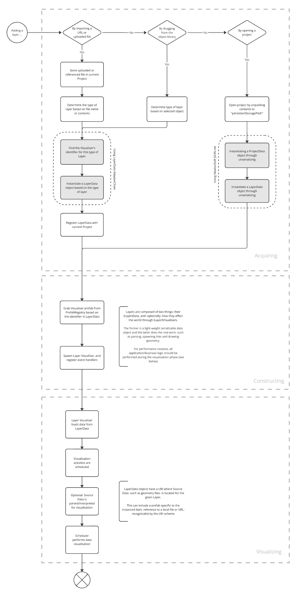

# Projects

## Overview

Netherlands3D is a dynamic platform designed to allow users to interact with 3D geographical maps of locations across
the Netherlands. This platform enables a wide array of spatial data interactions, from visualizing sensor telemetry
to managing infrastructure data like cables, pipes, and zoning information. At the core of this functionality is the
concept of Projects, which serve as containers for all user interactions and data on the platform.

**Projects** in Netherlands3D encompass everything from the base map to the specific data layers, styles, and configurations
that define the user's current view. Users can save these projects as snapshots of their work, allowing them to revisit,
share, or continue working seamlessly at any time. This structure not only facilitates complex data analysis but also
ensures that all spatial relationships are preserved and accurately represented.

## Project File Format

Before diving into the technical specifics of how projects operate within the system, it's essential to understand
the file format used to store project data. The project file acts as a blueprint, capturing all the layers, styles,
configurations, and settings that define the project. 

!!! TODO

    Describe the file format

## System Operation Overview

Netherlands3D operates on a robust system that initializes with a default project file[^1]. This default project acts as
the foundation upon which all subsequent user interactions and loaded projects are based.

### Included Empty Project

Upon startup, the system loads an empty project file[^1] from the _Assets_[^2] folder. This project serves as the 
initial state of the application, providing a base map and predefined configurations that set the scene for the user's 
interaction. The empty project is crucial for ensuring that the application is ready to use immediately upon launch, 
without requiring any user input.

### Customizable Default Project

A default project is fully configurable per deployment, allowing providers to tailor the initial view and settings to
their specific needs. For instance, a province or municipality might want to highlight a particular region or set
specific visualization parameters to align with their objectives. This flexibility ensures that the application can be
used in various contexts, whether as an interactive tool for end-users or a static viewer for presenting a digital twin
of a specific location.

!!! TODO

    Describe how this can be done

### Project Loading and Replacement

Once the application is running, users can load their own project files. When a new project file is loaded, it replaces
the current project in its entirety, bringing in all new data layers, styles, and configurations. This process ensures a
smooth transition between different datasets and views, allowing users to focus on their work without worrying about
residual configurations from previous projects.

!!! TODO

    Describe how this works in more detail with a flowchart illustrating the overall process

## How Layers Work

The diagram provided illustrates the lifecycle of layers within a project, detailing how they are acquired,
constructed, and visualized. Here's a breakdown:

### Acquiring Layers

Layers in Netherlands3D can be added to a project in several ways:

- **Importing via URL or File Upload**: The system allows users to import data layers by providing a URL or uploading a file.
The uploaded or referenced file is stored within the current project, and the system determines the layer type based on
the file name or its contents.
 
- **Dragging from Object Library**: Users can also add layers by dragging objects from a pre-existing object library. The
system determines the type of layer based on the selected object.
- **Opening a Project**: When a project is opened, the system unpacks its contents to a predefined storage path. This process
involves instantiating a ProjectData object and associated LayerData objects through deserialization.

### Constructing Layers

Once a layer is added, the system begins constructing it:

- The system finds a visualizer identifier for the specific layer type and then instantiates a LayerData object
accordingly.
- The LayerData is then registered with the current project, linking it to the broader project context.

Layers consist of two primary components:

- **Layer Data**: This is a lightweight, serializable data object containing information about the layer, such as its source
data location (e.g., file paths, URIs).
- **Layer Visualizer**: This component handles the actual visualization work, such as spawning tiles and rendering geometry.

### Visualizing Layers

The final stage is visualizing the layers within the application:

- The system grabs the appropriate visualizer prefab based on the identifier in LayerData.
- The visualizer loads the data from LayerData, and the application schedules visualization activities.
- If necessary, the source data is parsed or interpreted before visualization, ensuring that all data layers are
accurately represented.
- Finally, the visualization scheduler renders the data, allowing users to interact with the newly loaded layers
seamlessly.

This structured approach to handling layers ensures that all data is properly managed, visualized, and integrated within
the project framework, offering a powerful tool for spatial analysis and geographic data management in the Netherlands3D
platform.

## Frequently Asked Questions (FAQ)

### Why don't I see the changes to the empty project?

The asset for the empty project[^1] is added to the `.gitignore` file to prevent unintentional changes while working on 
the project. This asset is a ScriptableObject in Unity, which is particularly susceptible to unintentional modifications
during in-editor work. ScriptableObjects often contain configuration data that should remain stable across different
environments and users. To avoid accidental changes being committed to the repository, the empty project file is
ignored by Git.

However, if you need to make deliberate changes to the empty project file, you can explicitly add the modified file to
your Git repository using the --force argument with the `git add` command. This ensures that only intentional changes 
are tracked and pushed to the repository, preserving the integrity of the default project across different deployments 
and environments.

[^1]: https://github.com/Netherlands3D/twin/blob/main/Assets/Scriptables/CurrentProject.asset
[^2]: https://github.com/Netherlands3D/twin/tree/main/Assets/Scriptables
