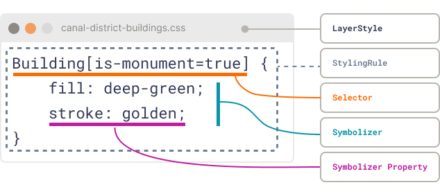

# Layer Styles

{align=right width=300}

Imagine you are dressing a city map for a public event. The `eu.netherlands3d.layer-styles` package is the wardrobe
manager: it keeps outfits ready for every feature, checks who is walking past, and hands out the right clothes on the
spot. 

This document walks through that wardrobe in plain language, highlighting the moving parts, the flow of data, and
how other systems in Netherlands3D pick up the finished look.

## Quick cheat sheet

- **Purpose:** Bridge the gap between saved styling data and the layer-specific renderers that bring it to life.
- **Audience:** Anyone wiring layer data to presentation logic—whether you script styles on the fly, ship them with
  layer metadata, or build custom authoring tools later.
- **Mental shortcut:** Treat the package as CSS for features. Rules match features, symbolizers hold properties, and the
  resolver cascades them into a single outfit per feature.

## 1. Mental model at a glance

| Term              | Think of it as                                                                               | Where it lives     |
|-------------------|----------------------------------------------------------------------------------------------|--------------------|
| **LayerStyle**    | A labeled clothing rack that groups related outfits                                          | `LayerStyle.cs`    |
| **StylingRule**   | A note on the rack saying “If the visitor matches this description, give them outfit X”      | `StylingRule.cs`   |
| **Symbolizer**    | The actual outfit: colors, visibility flags, masks, custom notes                             | `Symbolizer.cs`    |
| **StyleResolver** | The wardrobe attendant who reads every note, checks the visitor, and layers outfits together | `StyleResolver.cs` |

Together they deliver CSS-inspired “cascade” behaviour: several rules can match one feature, and the last matching rule
wins when the same property is set twice.


/// caption
Pseudo-CSS to illustrate the anatomy of a Layer Style.
///

!!! question "Why not just use CSS?"

    Good question! The expression language used for CSS selectors was never intended for complex queries such as
    the geospatial community knows, therefore we base our selectors on the Mapbox Style Spec's
    Expression language (https://docs.mapbox.com/style-spec/reference/expressions/).

    Also, we use JSON serializable data structures instead of a text-based syntax due to performance and layer 
    information is already stored in a JSON data structure. 

## 2. A day in the life of a feature

1. **A layer is loaded** and brings along one or more `LayerStyle` objects. Each style can include a
   `default` rule so the layer has a baseline outfit without writing any selectors.
2. **A feature walks up** with its attributes tucked inside `LayerFeature` and passes this to the StyleResolver.
3. **Every rule gets a chance**. If a rule has no selector, it matches automatically; otherwise the expression is
   evaluated against the feature. This is where you filter on height, zoning, owner, or any other attribute.
4. **Matching rules stack**. When the selector passes, that rule’s symbolizer is merged on top of the current
   symbolizer. Later matches overwrite earlier ones, just like cascading CSS
5. **The layer visualizer receives one symbolizer** containing the final set of properties. Each layer type (buildings,
   terrain, parcels…) interprets the symbolizer in its own rendering code, allowing wildly different visualisations
   while keeping the contract the same.

If you prefer a concrete -fictive- story, picture the **“Canal District Buildings”** layer with three rules:

| Rule          | Selector (story form)                   | Key style tweaks                            |
|---------------|-----------------------------------------|---------------------------------------------|
| `default`     | Everything gets a calm sandstone paint  | Soft beige fill, subtle outline             |
| `Monuments`   | Buildings marked with `isMonument`      | Swap fill to deep green, add golden outline |
| `NightLights` | Opening hours past 22:00                | Window color switches from blue to yellow   |

!!! example "Written as pseudo-CSS"

    ```css
    /* All features' fill color is "sandstone" */
    * {
        fill: sandstone;
    }
    
    /* Except for windows in buildings - their fill color is blue */
    Building Window {
        fill: blue;
    }
    
    /* 
      When buildings have the `is-monument` attribute set to the value `true`, 
      their fill color is deepgreen and they have a golden stroke
    */
    Building[is-monument=true] {
        fill: deepgreen;
        stroke: golden;
    }
    
    /* 
      Windows of buildings whose opening hours is later than 22:00 should 
      have yellow windows
    */
    Building[opening-hours > 22:00] Window {
        fill: yellow;
    }
    ```

When the feature for the *Old Town Hall* shows up, the resolver 

1. applies the default styling rule, 
2. spots the monument badge, and 
3. notes that its opening hours stretch late into the night. 

The final symbolizer mixes all three contributions, and the visualizer turns those knobs however it likes (perhaps by 
feeding a shader, perhaps by toggling a prefab).

## 3. What does a symbolizer look like?

Symbolizers store everything as strings so they survive JSON round-tripping without special converters. Typed helpers
translate those strings back into Unity data types when you need them, for example: 

- colors become `Color` structs, 
- visibility is exposed as `bool` 
- masks are bitfields written as binary strings, and 
- custom properties are JSON blobs prefixed with `--` to follow MDN-style naming (lowercase kebab-case).

Here is an illustrative example of what a symbolizer might represent when serialized:

```jsonc
{
  "properties": {
    "fill": "#FFAA33FF",     // soft orange facade
    "stroke": "#333333FF",   // charcoal outlines
    "visibility": "visible",       // feature should render
    "mask-layer-mask": "00000100", // use third mask layer bit
    "--shadow-style": "long"      // custom flag read by a shader extension
  }
}
```

You set these values with the `SetFillColor`, `SetStrokeColor`, `SetVisibility`, `SetMaskLayerMask`, and
`SetCustomProperty` helpers; clearing a property simply removes the key so downstream systems know to ignore it.

## 4. Understanding the Cascade

If several styling rules apply to the same feature, the **cascade** decides which property values survive.
It works like layers of transparent paint: each new rule adds color where it speaks, but leaves untouched areas showing
through from earlier coats.

**Core idea:**

1. Rules are evaluated in order.
2. Matching rules merge their `Symbolizer` properties into the current result.
3. If a property key already exists, the new value overwrites the old one.
4. Missing keys are ignored, meaning “keep whatever is already there.”

You can picture it as a running dictionary merge:

```csharp
foreach (var rule in rules)
{
    if (rule.Matches(feature))
        finalSymbolizer.Merge(rule.Symbolizer);
}
```

The **merge** method simply copies non-null entries:

```csharp
public void Merge(Symbolizer other)
{
    foreach (var kvp in other.Properties)
        Properties[kvp.Key] = kvp.Value;
}
```

### Pseudo-CSS Cascade Example

Let’s restate the “Canal District Buildings” scenario in cascade form:

```css
/* 1. Default look — everyone starts beige */
* {
  fill: sandstone;
  --my-custom-property: flagged;
}

/* 2. Monuments override fill and stroke */
Building[is-monument=true] {
  fill: deepgreen;
  stroke: golden;
}
```

Now imagine a single feature:

```json
{
  "geometry": [123.11, 123.12, 321.21, 321.11],
  "properties": {
    "is-monument": true,
    "opening-hours": "23:00"
  }
}
```

**Cascade resolution:**

| Step | Rule Applied  | Merged Properties                                  | Notes                         |
| ---- | ------------- |----------------------------------------------------|-------------------------------|
| 1    | `default`     | `fill: sandstone`, `--my-custom-property: flagged` | Base layer with property      |
| 2    | `Monuments`   | `fill: deepgreen`, `stroke: golden`                | Override fill and adds stroke |

**Final symbolizer result:**

```json
{
  "fill": "deepgreen",
  "--my-custom-property": "flagged",
  "stroke": "golden"
}
```

The renderer only ever sees this merged view. No selector logic or layer-specific detail leaks into rendering 
code—making it trivial to test and reuse.

### Key Takeaways

* Later rules **win** on key collisions.
* Missing properties **don’t clear** existing values.
* Order matters; specificity does not.
* The cascade operates purely through **dictionary merges**—no parsing, no sorting, no text evaluation.


## 5. Crafting styling rules

A `StylingRule` combines a friendly name, one symbolizer, and an optional selector expression. Selectors use the
Serializable GIS Expressions library, so you can compose Mapbox-style expressions (`==`, `in`, arithmetic, color
utilities, etc.) to decide when a rule applies. Leave the selector `null` to create a base rule that always fires.

**Narrative example**:

- *Rule name:* `Tall towers`
- *Selector:* "height > 70" expressed as `[">", ["get", "height"], 70]`
- *Symbolizer:* Glowing outline and a semi-transparent fill.

When a skyscraper feature arrives, the rule paints it accordingly; shorter buildings never see this style. During
resolution, any 72-metre high-rise will slip into this style after the default styling, while a 45-metre apartment
block simply keeps the baseline look. If you later add a `Residential highlight` rule that also matches the apartment
block, whichever rule comes last in the style list decides the final stroke colour.

## 6. Where styles live and how they travel

The package is deliberately agnostic about storage. Anything Newtonsoft JSON can serialize/deserialise will work, so
projects are free to tuck styles into scriptable objects, JSON files, or layer metadata. 

In Netherlands3D, layer styles travel alongside layer data objects—each layer reads the symbolizer contract and applies 
it using layer-specific visualisation code. This division keeps the package focused on the data contract between 
persistence and presentation: authoring tools fill in the styles, while visualizers interpret them.

Because styles are plain C# objects, you can experiment quickly in code. For example, during prototyping you might
deserialize a JSON file into a `LayerStyle`, tweak the resulting `Symbolizer` objects in memory to respond to user
input, and then write the updated structure back to disk—no custom editor tooling required. Later, if you decide to
build a designer UI, it only has to speak the same JSON contract.

Because the data structures are plain C# classes with JSON constructors, there is no dedicated Unity editor UI today.
Teams manipulate styles in code during runtime, keeping integration simple and leaving room for bespoke authoring
pipelines later on.

## 7. Tips, gotchas, and conventions

- **Custom properties:** Prefix them with `--` (automatically enforced) and use lowercase kebab-case for readability,
  mirroring CSS custom property conventions.
- **Merge order matters:** Supply styles/rules to the resolver in the order you want later rules to win. The resolver
  simply iterates the dictionary values, so keep the collection deterministic if you rely on precise overrides.
- **Specificity does not matter:** contrary to CSS, there is no resolving based on specificity. This may be added in a
  later version but to preserve performance it is not implemented.
- **Null means “ignore me”:** When a property is missing or a getter returns `null`, the renderer should leave the
  previous value untouched. This is how the cascade differentiates between “I don’t care” and “explicitly clear this
  setting.”

## 8. Recap

1. Start with a `LayerStyle` rack and its default rule.
2. Add descriptive `StylingRule` notes with selectors and symbolizers.
3. Hand the rack to the `StyleResolver`.
4. As each feature comes in, the resolver stacks matching symbolizers into one outfit.
5. The layer renderer interprets the final symbolizer however it likes—painting meshes, toggling game objects, feeding
   shaders—without ever needing to know where the data came from.

With this shared mental picture, team members can approach the package as a friendly wardrobe rather than a mysterious
black box, and layer teams can concentrate on rendering while data teams focus on expressive styling contracts.

## 9. Further reading

- [Explanation: Projects](projects.md)
- [Explanation: Layer styling](styling.md)
- [Guide: Adding a simple type of layer](adding-a-simple-type-of-layer.md)
