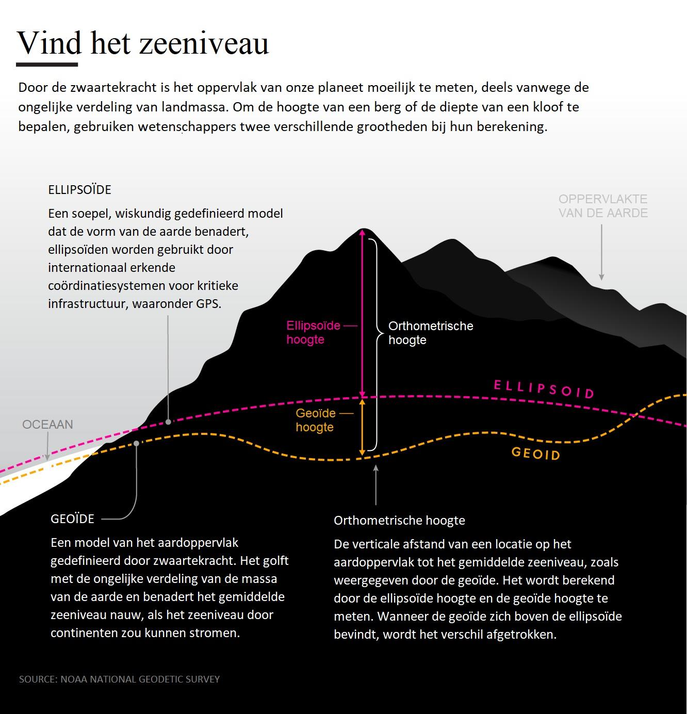

## Appendix C. Begrippen

// TODO: https://github.com/CesiumGS/3d-tiles/blob/main/specification/README.adoc uitkammen en de begrippen hierin zetten, zoals refinement

### Bounding Volume

**Aliassen**: Begrenzingsvolume.

Een begrenzingsvolume is een geometrisch volume dat wordt gebruikt om de ruimtelijke omvang van een object of een
verzameling objecten te beschrijven. Het wordt vaak gebruikt voor optimalisaties zoals zichtbaarheid, selectie en
hiërarchische structuren (zoals tile trees).

Er zijn drie standaardtypen begrenzingsvolumes:

- Box (doosvormig volume): een rechthoekige doos in 3D-ruimte (axis-aligned of georiënteerd).

- Sphere (bolvormig volume): een bol met een middelpunt en straal.

- Region (regiovormig volume): een complexere beschrijving die een geografisch gebied aanduidt, vaak gedefinieerd door 
  een rechthoekige uitsnede in lengte- en breedtegraden, met een minimale en maximale hoogte (bijvoorbeeld voor gebruik 
  op een globe).

Begrenzingsvolumes worden voornamelijk gebruikt om snel te kunnen bepalen of een object zichtbaar is of moet worden
ingeladen, zonder alle details van het object zelf te hoeven analyseren.

### Capabilities

### Change

Een Change is een handeling die nodig is om een tegel van begin tot einde - inclusief visualisatie - toe te voegen of te verwijderen uit de wereld.

Changes kunnen geannuleerd worden, in welk geval de Status Quo behouden blijft.

### Changeset

Een Changeset is een set aan Changes die als 1 geheel uitgevoerd moeten worden - als een ChangeSet geannuleerd wordt, dan wordt de status quo behouden.

Toevoegen altijd voor verwijderen, zodra verwijderen loopt mag niet meer geannuleerd

### Databron

### Design Pattern: Builder

### Design Pattern: Factory

### Design Pattern: Strategy

### Digitaal Terrein Model (DTM)

**Aliassen**: Maaiveld, Grondoppervlak, Digital Terrain Model

Een Digitaal Terrein Model (DTM) is een digitale representatie van het aardoppervlak, inclusief de natuurlijke
terreinvormen, **exclusief** bovengrondse objecten zoals gebouwen en vegetatie. Het model bestaat uit een reeks
gegevenspunten die hoogte-informatie bevatten, waardoor een driedimensionaal beeld van het terrein kan worden gecreëerd.


Meer informatie:

- https://www.eea.europa.eu/help/glossary/eea-glossary/digital-terrain-model
- https://nl.wikipedia.org/wiki/Digitaal_hoogtemodel

### Digitaal Oppervlakte Model (DSM)

**Aliassen**: Digitaal Hoogtemodel, Digital Surface Model

Omvat het [Digitaal Terrein Model (DTM)](#digitaal-terrein-model-dtm) **plus** alle bovengrondse objecten op het 
aardoppervlak zoals gebouwen en vegetatie. Het model bestaat uit een reeks gegevenspunten die hoogte-informatie 
bevatten, waardoor een driedimensionaal beeld van het terrein kan worden gecreëerd.


Meer informatie:

- https://www.eea.europa.eu/help/glossary/eea-glossary/digital-terrain-model
- https://nl.wikipedia.org/wiki/Digitaal_hoogtemodel

### Geoide

**Aliassen**: NAP (soort van)

De **geoïde** is het oppervlak op gemiddeld zeeniveau, waar
dezelfde [zwaartekrachtspotentiaal](https://nl.wikipedia.org/wiki/Zwaartekrachtspotentiaal "Zwaartekrachtspotentiaal")(
inclusief de potentiaal van de middelpuntvliedende kracht door de draaiing van de Aarde) heerst:
het[equipotentiaalvlak](https://nl.wikipedia.org/wiki/Equipotentiaalvlak "Equipotentiaalvlak"). Zonder getijden, wind en
verschillen in watertemperatuur en zoutgehalte zou het waterniveau in zee dit oppervlak volgen.

Geoïdehoogten zijn de hoogten tussen de geoïde en
een [referentie-ellipsoïde](https://nl.wikipedia.org/wiki/Referentie-ellipso%C3%AFde "Referentie-ellipsoïde")van
een[geodetisch coördinatensysteem](https://nl.wikipedia.org/wiki/Geodetisch_co%C3%B6rdinatensysteem "Geodetisch coördinatensysteem"),
bijvoorbeeld[WGS84](https://nl.wikipedia.org/wiki/WGS_84 "WGS 84"),[ETRS89](https://nl.wikipedia.org/wiki/European_Terrestrial_Reference_System_1989 "European Terrestrial Reference System 1989").

Meer informatie:

- https://nl.wikipedia.org/wiki/Geo%C3%AFde

### Geometric Error

De geometricError is een maat (in meters) die zegt hoe "grof" een tegel is in vergelijking met zijn fijnere kinderen.
Het komt neer op: hoeveel detail je mist als je deze tegel toont in plaats van zijn onderliggende (meer gedetailleerde)
tegels.

Tijdens het draaien van de app gebruiken we deze geometricError om te bepalen of een tegel voldoende detail geeft op het
scherm. Dat doen we door het om te rekenen naar screen space error (SSE) – dat is de fout uitgedrukt in pixels op je
scherm.

Bijvoorbeeld:

- Stel: een tegel heeft een geometricError van 50 meter.
- Als die 50 meter visueel overeenkomt met 10 pixels op het scherm, dan is de SSE = 10.
- Als je een maximum SSE van bijvoorbeeld 8 pixels hanteert, dan weet je: deze tegel moet worden vervangen door zijn
  kinderen, want hij is niet precies genoeg.

Waarom dit belangrijk is? Dit helpt het systeem beslissen wanneer het moet inzoomen naar meer detail (kindtegels laden),
of wanneer een grove weergave prima is (ouders tonen).

### HLOD

### Getegelde laag

### Lagensysteem

### LayerData

### Idempotent

**Idempotentie** is de eigenschap van een object (of systeem) en/of een operatie daarop dat het object niet meer
verandert als de operatie nogmaals wordt uitgevoerd.

Bron: https://nl.wikipedia.org/wiki/Idempotentie

### Mapping

### Midden van het Scherm

Het midden van het scherm betekent concreet het punt in de viewport waar de camera naar kijkt, op de hoogte van
het [digitale terreinmodel (DTM)](https://en.wikipedia.org/wiki/Digital_elevation_model), en als er geen digitaal
terrein model aanwezig voor de gegeven lokatie: de hoogte van de [[#Geoide]].

### NAP hoogte

**Zie**: [[Orthometrische hoogte]]

### Orthometrische hoogte



### Pluggable Architectuur

### Screen Space Error (SSE)

De *screen space error* is een maat voor hoe zichtbaar een geometrische afwijking is op het scherm, uitgedrukt in
pixels. Het wordt gebruikt om te bepalen of een object (zoals een tegel in een hiërarchie) voldoende detail heeft op
basis van de afstand tot de camera. Een hogere SSE betekent dat het detailverlies zichtbaar is voor de gebruiker, wat
aangeeft dat een meer gedetailleerde versie (bijvoorbeeld kindtegels) ingeladen moet worden.

De berekening is gebaseerd op de `geometricError` (een waarde in meters die de detailafwijking beschrijft) en de afstand
tot de camera. De standaardformule is:

```
SSE = (geometricError / distanceToCamera) * schermProjectieFactor
```

Waarbij:

- `geometricError` de maximale fout in wereldcoördinaten is (bijvoorbeeld 50 meter),
- `distanceToCamera` de afstand tot de camera is in meters,
- `schermProjectieFactor` een constante factor is die afhangt van het schermformaat en de field of view.

!!!info "schermProjectieFactor is 1"

    In onze situatie is `schermProjectieFactor` gelijk aan 1, dus de formule wordt vereenvoudigd tot:

    ```
    SSE = geometricError / distanceToCamera
    ```
 
    De keuze voor deze constante is omwille van performance en omdat een dergelijke mate van accuraatheid niet nodig is. 

Deze waarde wordt vergeleken met een ingestelde grenswaarde (`maximumScreenSpaceError`). Als de SSE groter is dan deze
grens, moet een meer gedetailleerde versie worden geladen.

### Spatial Coherence

De gezamenlijke inhoud van alle kindtegels valt volledig binnen het begrenzingsvolume van de oudertegel.

Dat betekent niet dat het hele begrenzingsvolume (zie [Bounding Volume](#bounding-volume)) van de oudertegel opgevuld 
moet zijn, maar wel dat de kindtegels niet buiten de grenzen van hun ouder mogen uitsteken.

Kindtegels mogen elkaar onderling wel overlappen, zoals te zien is in deze afbeelding:


Zie [https://portal.ogc.org/files/102132#core-bounding-volume-spatial-coherence](https://portal.ogc.org/files/102132#core-bounding-volume-spatial-coherence)
voor meer informatie.

### Staging

### Tick

### Tile

**Aliassen**: Tegel

Een tegel is een beschrijving van een voorgedefinieerd geografisch gebied, inclusief een verzameling van nul of meer [[#Feature|features]] en een of meer representaties in de vorm van 3D Data, raster of vector informatie.

Officiele OGC Definitie:

> [!quote] Bron: https://docs.ogc.org/is/20-057/20-057.html#term-tile
> Geometrische vorm met bekende eigenschappen die al dan niet het resultaat zijn van een betegelingsproces (
> tessellatie). Een tegel bestaat uit een enkel samenhangend “stuk” zonder “gaten” of “lijnen” (topologische schijf).
>
> In de context van een 2D-tegelmatrix is een tegel een van de rechthoekige gebieden in de ruimte, die uniek
> geïdentificeerd kan worden door rij- en kolomindices, welke samen de tegelmatrix vormen.
>
> In de context van een geospatiale data-tegelset bevat een tegel gegevens voor een dergelijke ruimtelijke indeling als
> onderdeel van een overkoepelende set tegels voor die betegelde geospatiale data.

### TileContentLoader

### TileMapper

### TileSelector

### TileSet

### TileSetBuilder

### TileSetFactory

### TilesTransitionPlanner

### Transition

### Visualisatie

### Zichtpunt

De lokatie in de wereld waar de camera naar kijkt; in tegenstelling tot de camerapositie is deze lokatie waarschijnlijk
middenin de viewport en de lokatie met het hoogste detailniveau en prioriteit van inladen.

Deze lokatie representeert datgeen waar de aandacht van de gebruiker naartoe gaat.

