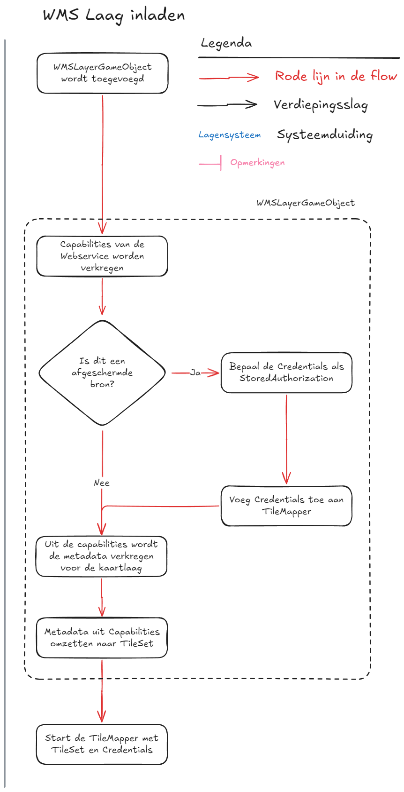

## Appendix D. Frequently Asked Questions

### D.1. Databronnen met meerdere lagen

{width=300 align=right}

Tilekit zelf biedt geen faciliteit om iets te doen met databronnen met meerdere lagen, in Tilekit wordt aangenomen dat
dit in de functionaliteit zelf gebeurd. 

In de afbeelding hiernaast kan je een voorbeeld flow zien waarbij de WMS functionaliteit de een TileSet definitie 
opbouwt vanuit de capabilities van de WMS service zelf.

In deze zelfde afbeelding is ook te zien hoe Tilekit omgaat met authenticatie, ook hierbij maken we gebruik van de 
bestaande authenticatie systemen en kan je Tilekit een sjabloon request -inclusief credentials- aanmaken. 

Door deze scheiding van verantwoordelijkheden kan Tilekit flexibel omgaan met allerlei vormen van services.
