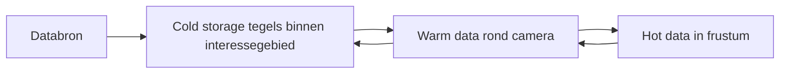

# Dataopslag

Tilekit is gebouwd op een gelaagd opslagmodel waarin tegels zich in drie hoofdcondities kunnen bevinden: **koud**, 
**warm** en **heet**. Deze drie lagen gebruiken hetzelfde tile-begrip, maar verschillen in hoeveel informatie er is 
opgeslagen en welke resources zijn gekoppeld.

Op hoog niveau kun je de opslaglagen zo zien:

* **Cold storage** bevat de minimale gegevens om tegels te herkennen en te selecteren binnen een interessegebied.
* **Warm data** voegt verwijzingen naar inhoud toe, zoals textures of meshes, voor tegels rond de camera.
* **Hot data** zijn de tegels waarvan de inhoud daadwerkelijk gevisualiseerd wordt omdat ze in beeld zijn.

De rest van dit hoofdstuk werkt deze drie lagen verder uit.

--- 

## Ruimte, Tijd en Resolutie: Waarom Tegels Vijf Dimensies Hebben

Voordat we verder gaan met de inhoud, eerst even een moment om wat context te geven over de selectie van ruimtelijke
"objecten".

Objecten — tegels én features — hebben een "omvang" in vijf dimensies: 

- de drie ruimtelijke dimensies (X, Y, Z), 
- het tijdsbereik waarin ze bestaan, en 
- het resolutiebereik waarin ze zichtbaar -of zinvol- zijn. 

Dat betekent dat elk object niet één punt is, maar een _5-dimensionale volume_: op welke plek met welke breedte, diepte en hoogte, 
wanneer het bestaat, en in welk detailniveau het betekenisvol is.

De camera definieert een 4-dimensionaal zichtbaar gebied in de wereld: de ruimtelijke zone die via de viewport 
zichtbaar is, plus het tijdstip waarin de gebruiker kijkt. Binnen dat zichtbare gebied geldt: elk punt bepaalt zijn eigen
resolutiedimensie, omdat de benodigde resolutie voortkomt uit de screen space error van dat punt — een directe afgeleide
van de afstand tussen het punt en de camera.

Een voorbeeld maakt dit direct duidelijk: 

!!! example "Voorbeeld: De Windmolen"
    Stel je voor dat de camera op een vast punt in de wereld gericht is en er een windmolen als object is. Dan is deze 
    windmolen zichtbaar (in beeld) als zijn positie op de X-, Y- of Z-as binnen camerabeeld valt. Dat is zichtbaarheid 
    in 3 dimensies.

    Stel je nu voor dat tijd een factor is en het beeld van de camera genomen is op een specifieke datum. Dan is de 
    windmolen alleen zichtbaar als deze gebouwd is voor deze datum, en gesloopt is na deze datum. Dit is zichtbaarheid in 
    4 dimensies. Want de windmolen zijn bestaansduur moet overlap hebben met dat moment in tijd.

    Stel je nu voor dat we naar hetzelfde punt blijven kijken - maar dat we uitzoomen. Dan gaat er een moment zijn waarop de
    windmolen niet meer zichtbaar is omdat je zover bent uitgezoomd dat deze te klein is geworden. Dit is zichtbaarheid in 
    5 dimensies, waarbij de 5de dimensie resolutie is. Het object is onzichtbaar als de resolutie van het beeldpunt niet 
    meer binnen het resolutiebereik van die windmolen ligt.

Zo bepaalt Tilekit voor elke tegel: is hij _op deze plek_, _op dit moment_, én _op deze resolutie_ **relevant**?

---

## Cold storage

Cold storage is een **gematerialiseerde view van de databron binnen een interessegebied**.

!!! info
    Het interessegebied is een tweedimensionaal ruimtelijk gebied (bijvoorbeeld een deel van Nederland in projectie) 
    dat:

    * groter is dan de actuele cameraview,
    * maar niet noodzakelijk de volledige dataset omvat.

    Dit interessegebied is een grotere regio waarin we de data van tegels beschikbaar willen hebben rondom het camera 
    punt omdat het materialiseren van de informatie een kostbare operatie is op de CPU.

Binnen dit gebied worden **alle tegels gematerialiseerd voor alle relevante dimensies**:

* drie ruimtelijke dimensies
* resolutie, uitgedrukt als geometrische error
* de temporele dimensie

Met andere woorden: de set koude tegels is de verzameling van alle tegels binnen het interessegebied valt, ongeacht 
resolutieniveau of tijd.

Cold storage slaat alleen de **minimale gegevens** op die nodig zijn om:

* een tegel ruimtelijk en structureel te identificeren,
* de resolutie en eventuele tijdsdimensie te kennen,
* naar children en inhoud te kunnen verwijzen.

Er wordt géén daadwerkelijke content (zoals Texture2D of Mesh) opgeslagen in cold storage.

!!! question

    Als het interessegebied de tweedimensionele representatie is met tegels van alle resoluties en tijdstippen - worden
    dat teveel tegels? Of moet er ook qua resolutie en tijdstippen een interessegebied zijn rondom de huidige resolutie
    en het huidige tijdstip. 

### Structuur van cold storage

Cold storage gebruikt een **[Structure of Arrays (SoA)](https://en.wikipedia.org/wiki/AoS_and_SoA)** benadering: elk 
veld - met een vaste afmeting - van een tegel heeft zijn eigen lineaire array. Denk bijvoorbeeld aan:

* `BoundingVolume[]` - Bounding Volume struct die een Region, Box of Sphere bounding volume representeert
* `GeometricError[]` - een double waarde die de resolutie van de tegel representeert
* `StartTime[]` - een 64-bits integer Unix Timestamp die het aantal microseconden sinds 1970-01-01 representeert in UTC.
* `EndTime[]` - een 64-bits integer Unix Timestamp die het aantal microseconden sinds 1970-01-01 representeert in UTC.
* `ChildrenStart[]`, `ChildrenCount[]` - een integer en shortint die beschrijft hoe kinderen uit de buffer te halen.
* `ContentsStart[]`, `ContentsCount[]` - een integer en shortint die beschrijft hoe content informatie uit de buffer te halen.

!!! info "Wat bedoelen we met 'veld met vaste afmeting'?"

    Denk aan een getal, boolean, struct, of ander type met een vaste grootte in geheugen. Ook een array met een vast 
    aantal elementen heeft een vaste afmeting. Strings, aantal kindertegels of een array met "content" is een dynamische
    structuur en zal in een buffer moeten worden opgeslagen waarbij de start en lengte in de buffer als veld in zijn 
    eigen lineair array moet worden opgeslagen.

Elke tegel heeft een **TileIndex** (een integer). Die index wordt gebruikt om in al deze arrays de juiste rij op te 
halen. Deze TileIndex is niet een opgeslagen waarde - maar is de index in elk lineair array. Dat betekent dus dat elk 
van deze lineaire arrays een lengte hebben gelijk aan het maximale aantal tegels dat in de Cold Storage kan zitten. 

### Buckets voor children en contents

Niet elke tegel heeft evenveel children of content elementen. Cold storage gebruikt daarom één onderliggende lijst per 
type, met daarboven een segmentindeling in **buckets**.

* De onderliggende lijst wordt bijvoorbeeld opgeslagen in een `NativeList<int>` met alle children indices achter elkaar.
* Een **bucket** is dan een segment in deze lijst, gedefinieerd door:

    * een startindex - zoals `ChildrenStart`.
    * een lengte - zoals `ChildrenCount`.

Per tegel worden alleen de `start` en `count` opgeslagen; de daadwerkelijke entries staan in de gedeelde lijst.

* De **bucket** zelf is dus geen apart blok geheugen, maar een logische slice van een groter blok middels een 
  `NativeSlice` object in Unity/C#.
* Dit patroon wordt ook gebruikt voor contents of andere structuren met een variabele lengte.

Door deze aanpak:

* blijven children en contents compact opgeslagen,
* zijn er geen reallocaties nodig als individuele tegels meer of minder children hebben,
* blijft de opslag pointer-vrij en index-gebaseerd.

---

## Warm data

Warm data vormt de **tussenschakel** tussen de minimale informatie in cold storage en de daadwerkelijke visualisatie in
hot data.

### Wat is warm data?

Zodra een tegel relevant wordt rondom de camera (maar nog niet in beeld is) wordt deze **warm**:

* de tegel blijft in cold storage bestaan met dezelfde TileIndex,
* er wordt aanvullende data -de content- geladen die nodig is om de tegel snel heet te kunnen maken,
* deze aanvullende data bestaat uit bijvoorbeeld:

    * Texture2D objecten voor rasterdata
    * gedeelde meshstructuren of vertexbuffers
    * voorbereide attributen of indices

In de warme laag wordt dus vooral een **handle** opgeslagen:

* een verwijzing naar een Texture2D in een pool,
* een index naar een meshbuffer,
* of een soortgelijke verwijzing naar content.

De tegel in warm data kan worden gezien als:

* dezelfde TileIndex als in cold storage,
* plus een set handles naar content die extern beheerd wordt.

Het doel hiervan is dat tegels snel gevisualiseerd kunnen worden door het "preloaden" van de content. Het binnenhalen
van content, zoals een GLB of PNG bestand, kan wel tot enkele seconden duren. Door buiten beeld te doen is de gebruikers
ervaring vloeiender, en verbruikt de applicatie minder bandbreedte.

De verwachting is dat het downloaden van content bestanden ook in de browser cache wordt opgeslagen - dus zonder dat 
daar WASM heap voor hoeft te worden ingenomen - en dat betekent dat her-downloaden van content dus potentieel sneller
gaat dan de initiële download. De content die ingeladen is bij een warme tegel staat wel in de WASM heap.

### Warm regio in de 5D ruimte

Warm data kun je zien als een **5-dimensionale bounding volume** rondom de gebruiker:

* drie ruimtelijke dimensies (waar bevind ik me)
* resolutie (welke detailniveaus houden we in de buurt paraat)
* tijd (welke tijdslagen moeten rondom de gebruiker snel beschikbaar zijn)

De set warme tegels is dus een subset van alle koude tegels, beperkt door een 5D-volume rond de gebruiker en de huidige
situatie.

De ruimte die de warm regio in beslag neemt is geheugen-intensief, door de grootte van deze regio dynamisch te 
maken is het mogelijk om een stricter geheugen-budget toe te passen door de regio te verkleinen en daarmee minder tegels 
warm te houden. Dit gaat ten kostte van de laadsnelheid van een laag, maar voorkomt problemen door geheugengebrek.

---

## Hot data

Hot data zijn de tegels die daadwerkelijk worden gevisualiseerd, omdat ze in de **camera frustum** liggen.

### Wat is hot data?

Een tegel wordt heet zodra:

* zijn ruimtelijke projectie overlapt met het frustum,
* zijn temporele dimensie overeenkomt met de geselecteerde tijd,
* en zijn resolutie passend is bij de gewenste schermfout (screen space error).

In de hot laag wordt de eerder voorbereidde content uit warm data daadwerkelijk gebruikt om de content te visualiseren 
door bijvoorbeeld:

* middels de Graphics API de content te renderen
* of GameObjects / renderstructuren uit een pool te halen en te activeren.

Hot data is daarmee het **eindpunt** in de keten:

1. **Cold**: minimale metadata en structuur binnen interessegebied
2. **Warm**: content-handles rond de camera
3. **Hot**: directe visualisatie in het frustum

### Hot regio in de 4D ruimte

De viewport van de gebruiker kun je zien als een **4-dimensionale ruimte**:

* drie ruimtelijke dimensies
* één temporele dimensie

Binnen deze ruimte bepaalt Tilekit aan de hand van **screen space error** welke resolutie van een tegel hot moet
worden. Dat wil zeggen:

* een punt in het frustum heeft een bepaalde fout op schermniveau,
* op basis daarvan kiest Tilekit welke tegel hot moet worden middels de combinatie van ruimtelijke positie, resolutie 
  en tijd.

---

## Samenvatting

In dit hoofdstuk hebben we de dataopslag van Tilekit beschreven als een gelaagd systeem:

* **Cold Storage**

    * gematerialiseerde view van de databron binnen een 2D interessegebied,
    * alle resoluties en tijdslagen binnen het interessegebied.
    * SoA-georganiseerde velden,
    * dynamische-length structuren via segmenten in gedeelde lijsten,

* **Warm data**

    * subset van koude tegels in een 5D-volume rond de gebruiker,
    * content-handles vooraf geladen zodat tegels snel heet kunnen worden.

* **Hot data**

    * tegels in een 4D viewport,
    * met passende resolutie,
    * waarvan de content daadwerkelijk wordt gerenderd.

Deze opslaglagen vormen samen de basis waarop later de selectie-algoritmen, prioritering en lifecycle-logica verder
worden uitgewerkt.
