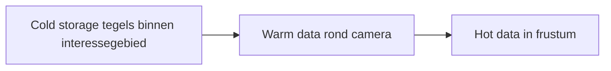
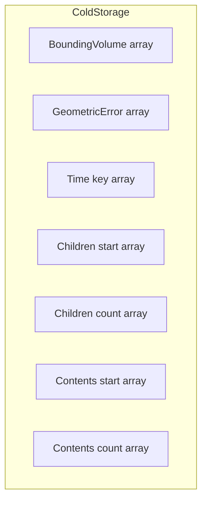
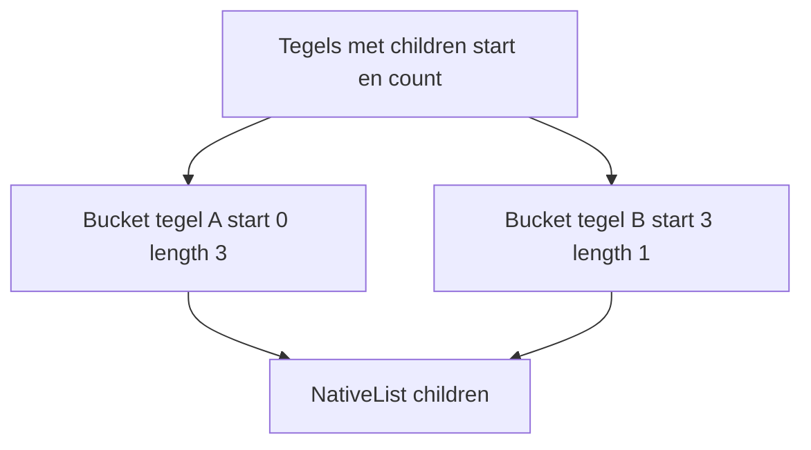

# Dataopslag

Tilekit is gebouwd op een gelaagd opslagmodel waarin tegels zich in drie hoofdcondities kunnen bevinden: **koud**, 
**warm** en **heet**. Deze drie lagen gebruiken hetzelfde tile-begrip, maar verschillen in hoeveel informatie er is 
opgeslagen en welke resources zijn gekoppeld.

Op hoog niveau kun je de opslaglagen zo zien:

* **Cold storage** bevat de minimale gegevens om tegels te herkennen en te selecteren binnen een interessegebied.
* **Warm data** voegt verwijzingen naar inhoud toe, zoals textures of meshes, voor tegels rond de camera.
* **Hot data** zijn de tegels waarvan de inhoud daadwerkelijk gevisualiseerd wordt omdat ze in beeld zijn.

De rest van dit hoofdstuk werkt deze drie lagen verder uit.

--- 

## Ruimte, Tijd en Resolutie: Waarom Tegels Vijf Dimensies Hebben

Voordat we verder gaan met de inhoud, eerst even een moment om wat context te geven over de selectie van ruimtelijke
"objecten".

Objecten — tegels én features — hebben een "omvang" in vijf dimensies: 

- de drie ruimtelijke dimensies (X, Y, Z), 
- het tijdsbereik waarin ze bestaan, en 
- het resolutiebereik waarin ze zichtbaar -of zinvol- zijn. 

Dat betekent dat elk object niet één punt is, maar een _5-dimensionale volume_: op welke plek met welke breedte, diepte en hoogte, 
wanneer het bestaat, en in welk detailniveau het betekenisvol is.

De camera definieert een 4-dimensionaal zichtbaar gebied in de wereld: de ruimtelijke zone die via de viewport 
zichtbaar is, plus het tijdstip waarin de gebruiker kijkt. Binnen dat zichtbare gebied geldt: elk punt bepaalt zijn eigen
resolutiedimensie, omdat de benodigde resolutie voortkomt uit de screen space error van dat punt — een directe afgeleide
van de afstand tussen het punt en de camera.

Een voorbeeld maakt dit direct duidelijk: 

!!! example "Voorbeeld: De Windmolen"
    Stel je voor dat de camera op een vast punt in de wereld gericht is en er een windmolen als object is. Dan is deze 
    windmolen zichtbaar (in beeld) als zijn positie op de X-, Y- of Z-as binnen camerabeeld valt. Dat is zichtbaarheid 
    in 3 dimensies.

    Stel je nu voor dat tijd een factor is en het beeld van de camera genomen is op een specifieke datum. Dan is de 
    windmolen alleen zichtbaar als deze gebouwd is voor deze datum, en gesloopt is na deze datum. Dit is zichtbaarheid in 
    4 dimensies. Want de windmolen zijn bestaansduur moet overlap hebben met dat moment in tijd.

    Stel je nu voor dat we naar hetzelfde punt blijven kijken - maar dat we uitzoomen. Dan gaat er een moment zijn waarop de
    windmolen niet meer zichtbaar is omdat je zover bent uitgezoomd dat deze te klein is geworden. Dit is zichtbaarheid in 
    5 dimensies, waarbij de 5de dimensie resolutie is. Het object is onzichtbaar als de resolutie van het beeldpunt niet 
    meer binnen het resolutiebereik van die windmolen ligt.

Zo bepaalt Tilekit voor elke tegel: is hij _op deze plek_, _op dit moment_, én _op deze resolutie_ **relevant**?

---

## Cold storage

Cold storage is een **gematerialiseerde view van de databron binnen een interessegebied**.
Het interessegebied is een tweedimensionaal ruimtelijk gebied (bijvoorbeeld een deel van Nederland in projectie) dat:

* groter is dan de actuele cameraview,
* maar niet noodzakelijk de volledige dataset omvat.

Binnen dit gebied worden **alle tegels gematerialiseerd voor alle relevante dimensies**:

* drie ruimtelijke dimensies
* resolutie, uitgedrukt als geometrische error
* de temporele dimensie

Met andere woorden: de set koude tegels is de verzameling van alle tegels waarvan de 2D-projectie binnen het
interessegebied valt, ongeacht resolutieniveau of tijd.

Cold storage slaat alleen de **minimale gegevens** op die nodig zijn om:

* een tegel ruimtelijk en structureel te identificeren,
* de resolutie en eventuele tijdsdimensie te kennen,
* naar children en inhoud te kunnen verwijzen.

Er wordt géén daadwerkelijke content (zoals Texture2D of Mesh) opgeslagen in cold storage.

### Structuur van cold storage

Cold storage gebruikt een **Structure of Arrays (SoA)** benadering: elk veld van een tegel heeft zijn eigen lineaire
array. Denk bijvoorbeeld aan:

* `BoundingVolume[]`
* `GeometricError[]`
* `TimeKey[]` of vergelijkbaar temporeel veld
* `ChildrenStart[]`, `ChildrenCount[]`
* `ContentsStart[]`, `ContentsCount[]`

Conceptueel kun je dit zo zien:

Elke tegel heeft een **TileIndex** (een integer). Die index wordt gebruikt om in al deze arrays de juiste rij op te 
halen.

### Buckets voor children en contents

Niet elke tegel heeft evenveel children of contents. Cold storage gebruikt daarom één onderliggende lijst per type, met
daarboven een segmentindeling in **buckets**.

* De onderliggende lijst wordt bijvoorbeeld opgeslagen in een `NativeList<int>` met alle childrenindices achter elkaar.
* Een **bucket** is dan een segment in deze lijst, gedefinieerd door:

    * een startindex
    * een lengte

Per tegel worden alleen de `start` en `count` opgeslagen; de daadwerkelijke entries staan in de gedeelde lijst.

Conceptueel:

* De **bucket** zelf is dus geen apart blok geheugen, maar een logische slice van een groter blok.
* Dit patroon wordt ook gebruikt voor contents of andere variabele-lengtestructuren.

Door deze aanpak:

* blijven children en contents compact opgeslagen,
* zijn er geen reallocaties nodig als individuele tegels meer of minder children hebben,
* blijft de opslag pointer-vrij en index-gebaseerd.

---

## Warm data

Warm data vormt de **tussenschakel** tussen de minimale informatie in cold storage en de daadwerkelijke visualisatie in
hot data.

### Wat is warm data?

Zodra een tegel relevant wordt rondom de camera, maar nog niet in beeld is, wordt deze **warm**:

* de tegel blijft in cold storage bestaan met dezelfde TileIndex,
* er wordt aanvullende data -de content- geladen die nodig is om de tegel snel heet te kunnen maken,
* deze aanvullende data bestaat uit bijvoorbeeld:

    * Texture2D objecten voor rasterdata
    * gedeelde meshstructuren of vertexbuffers
    * voorbereide attributen of indices

In de warme laag wordt dus vooral een **handle** opgeslagen:

* een verwijzing naar een Texture2D in een pool,
* een index naar een meshbuffer,
* of een soortgelijke verwijzing naar content.

De tegel in warm data kan worden gezien als:

* dezelfde TileIndex als in cold storage,
* plus een set handles naar content die extern beheerd wordt.

### Warm regio in de 5D ruimte

Warm data kun je zien als een **5-dimensionale bounding volume** rondom de gebruiker:

* drie ruimtelijke dimensies (waar bevind ik me)
* resolutie (welke detailniveaus houden we in de buurt paraat)
* tijd (welke tijdslagen moeten rondom de gebruiker snel beschikbaar zijn)

De set warme tegels is dus een subset van alle koude tegels, beperkt door een 5D-volume rond de gebruiker en de huidige
situatie.

De ruimte die de warm regio in beslag neemt is redelijk geheugen-intensief, door de grootte van deze regio dynamisch te 
maken is het mogelijk om een stricter geheugenbudget toe te passen door de regio te verkleinen en daarmee minder tegels 
warm te houden. Dit gaat ten koste van de laadsnelheid van een laag, maar voorkomt problemen door geheugengebrek.

---

## Hot data

Hot data zijn de tegels die daadwerkelijk worden gevisualiseerd, omdat ze in het **camera frustum** liggen.

### Wat is hot data?

Een tegel wordt heet zodra:

* zijn ruimtelijke projectie het frustum overlapt,
* zijn temporele dimensie overeenkomt met de geselecteerde tijd,
* en zijn resolutie passend is bij de gewenste schermfout (screen space error).

In de hot laag wordt de eerder voorbereide content uit warm data daadwerkelijk gebruikt om:

* draw calls op te bouwen,
* of GameObjects / renderstructuren te activeren.

Hot data is daarmee het **eindpunt** in de keten:

1. **Cold**: minimale metadata en structuur binnen interessegebied
2. **Warm**: content-handles rond de camera
3. **Hot**: directe visualisatie in het frustum

### Hot regio in de 4D ruimte

De viewport van de gebruiker kun je zien als een **4-dimensionale ruimte**:

* drie ruimtelijke dimensies
* één temporele dimensie

Binnen deze ruimte bepaalt Tilekit aan de hand van **screen space error** welke resolutie van een tegel heet moet
worden. Dat wil zeggen:

* een punt in het frustum heeft een bepaalde fout op schermniveau,
* op basis daarvan kiest Tilekit welke combinatie van ruimtelijke positie, resolutie en tijdlaag als hot tegel wordt
  gevisualiseerd.

De set hete tegels is daarmee:

* een 4D subset van de warme 5D ruimte,
* waarin alleen die tegels geselecteerd worden waarvan de resolutie voldoet aan de gewenste schermfout.

---

## Dimensies en verzamelingen van tegels

Samenvattend kun je de drie opslaglagen als verzamelingen in verschillende dimensies zien:

* **Tegelpositie** is 5D:

    * ruimte x, y, z
    * resolutie (geometric error)
    * tijd

* **Cold storage**:

    * alle tegels waarvan de 2D-projectie in het interessegebied valt,
    * voor alle resoluties en alle relevante tijdslagen.

* **Warm data**:

    * tegels binnen een 5D-volume rond de gebruiker,
    * beperkt in ruimte, resolutie en tijd,
    * met content-handles geladen.

* **Hot data**:

    * tegels binnen een 4D viewport (ruimte en tijd),
    * met een resolutie die past bij de gewenste schermfout,
    * en waarvan de content daadwerkelijk gevisualiseerd wordt.

Gelaagdheid en selectie zorgen ervoor dat **alleen tegels waarvoor het strikt noodzakelijk is** extra resources
gebruiken:

* koud: herkenning en selectie,
* warm: voorbereid, snel activeerbaar,
* heet: zichtbaar en actief.

---

## Samenvatting

In dit hoofdstuk hebben we de dataopslag van Tilekit beschreven als een gelaagd systeem:

* **Cold storage**

    * gematerialiseerde view van de databron binnen een 2D interessegebied,
    * SoA-georganiseerde velden,
    * variabele structuren via segmenten in gedeelde lijsten,
    * alle resoluties en tijdslagen binnen het interessegebied.

* **Warm data**

    * subset van koude tegels in een 5D-volume rond de gebruiker,
    * content-handles vooraf geladen zodat tegels snel heet kunnen worden.

* **Hot data**

    * tegels in een 4D viewport,
    * met passende resolutie,
    * waarvan de content daadwerkelijk wordt gerenderd.

Deze opslaglagen vormen samen de basis waarop later de selectie-algoritmen, prioritering en lifecycle-logica verder
worden uitgewerkt.

> A tile is relevant only if the camera’s (space, time, resolution) matches the tile’s (space, time, resolution).
> This can be viewed as a 5-dimensional overlap test