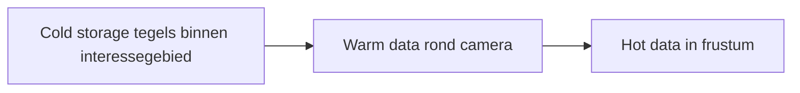

# Dataopslag

Tilekit is gebouwd op een gelaagd opslagmodel waarin tegels zich in drie hoofdcondities kunnen bevinden: **koud**, 
**warm** en **heet**. Deze drie lagen gebruiken hetzelfde tile-begrip, maar verschillen in hoeveel informatie er is 
opgeslagen en welke resources zijn gekoppeld.

Op hoog niveau kun je de opslaglagen zo zien:

* **Cold storage** bevat de minimale gegevens om tegels te herkennen en te selecteren binnen een interessegebied.
* **Warm data** voegt verwijzingen naar inhoud toe, zoals textures of meshes, voor tegels rond de camera.
* **Hot data** zijn de tegels waarvan de inhoud daadwerkelijk gevisualiseerd wordt omdat ze in beeld zijn.

De rest van dit hoofdstuk werkt deze drie lagen verder uit.

--- 

## Ruimte, Tijd en Resolutie: Waarom Tegels Vijf Dimensies Hebben

Voordat we verder gaan met de inhoud, eerst even een moment om wat context te geven over de selectie van ruimtelijke
"objecten".

Objecten — tegels én features — hebben een "omvang" in vijf dimensies: 

- de drie ruimtelijke dimensies (X, Y, Z), 
- het tijdsbereik waarin ze bestaan, en 
- het resolutiebereik waarin ze zichtbaar -of zinvol- zijn. 

Dat betekent dat elk object niet één punt is, maar een _5-dimensionale volume_: op welke plek met welke breedte, diepte en hoogte, 
wanneer het bestaat, en in welk detailniveau het betekenisvol is.

De camera definieert een 4-dimensionaal zichtbaar gebied in de wereld: de ruimtelijke zone die via de viewport 
zichtbaar is, plus het tijdstip waarin de gebruiker kijkt. Binnen dat zichtbare gebied geldt: elk punt bepaalt zijn eigen
resolutiedimensie, omdat de benodigde resolutie voortkomt uit de screen space error van dat punt — een directe afgeleide
van de afstand tussen het punt en de camera.

Een voorbeeld maakt dit direct duidelijk: 

!!! example "Voorbeeld: De Windmolen"
    Stel je voor dat de camera op een vast punt in de wereld gericht is en er een windmolen als object is. Dan is deze 
    windmolen zichtbaar (in beeld) als zijn positie op de X-, Y- of Z-as binnen camerabeeld valt. Dat is zichtbaarheid 
    in 3 dimensies.

    Stel je nu voor dat tijd een factor is en het beeld van de camera genomen is op een specifieke datum. Dan is de 
    windmolen alleen zichtbaar als deze gebouwd is voor deze datum, en gesloopt is na deze datum. Dit is zichtbaarheid in 
    4 dimensies. Want de windmolen zijn bestaansduur moet overlap hebben met dat moment in tijd.

    Stel je nu voor dat we naar hetzelfde punt blijven kijken - maar dat we uitzoomen. Dan gaat er een moment zijn waarop de
    windmolen niet meer zichtbaar is omdat je zover bent uitgezoomd dat deze te klein is geworden. Dit is zichtbaarheid in 
    5 dimensies, waarbij de 5de dimensie resolutie is. Het object is onzichtbaar als de resolutie van het beeldpunt niet 
    meer binnen het resolutiebereik van die windmolen ligt.

Zo bepaalt Tilekit voor elke tegel: is hij _op deze plek_, _op dit moment_, én _op deze resolutie_ **relevant**?

