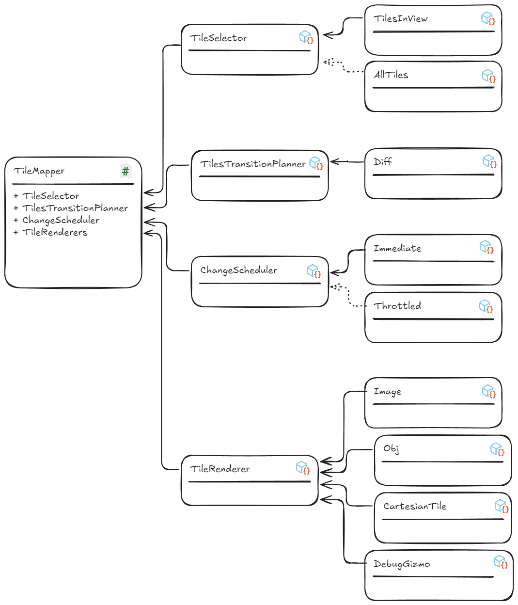
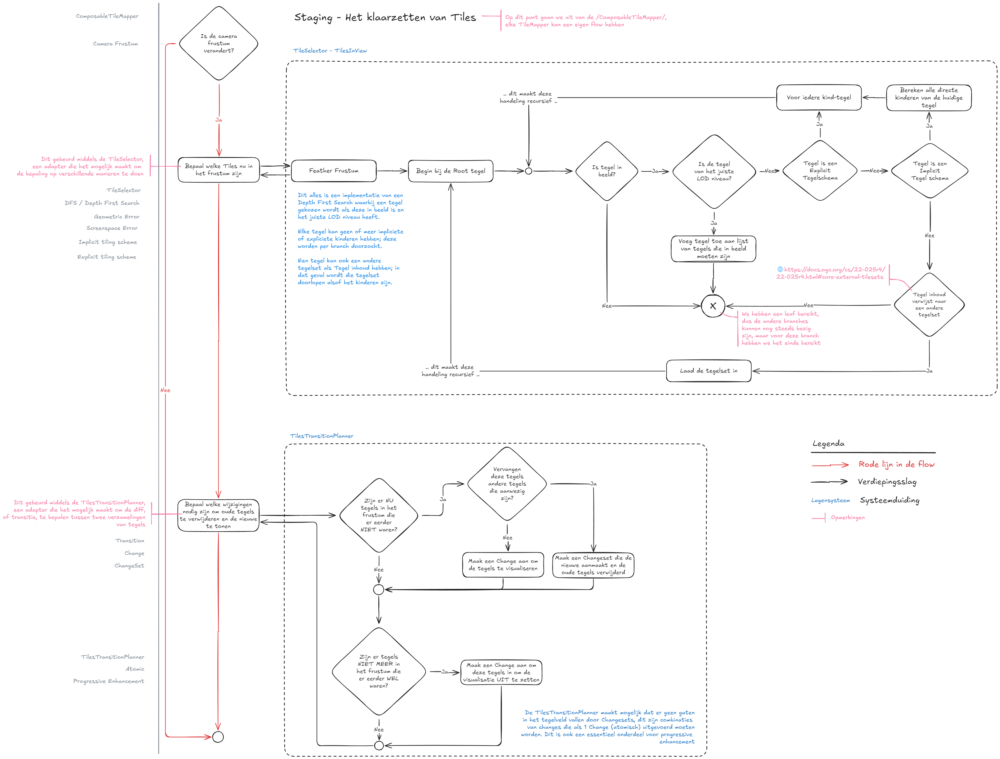
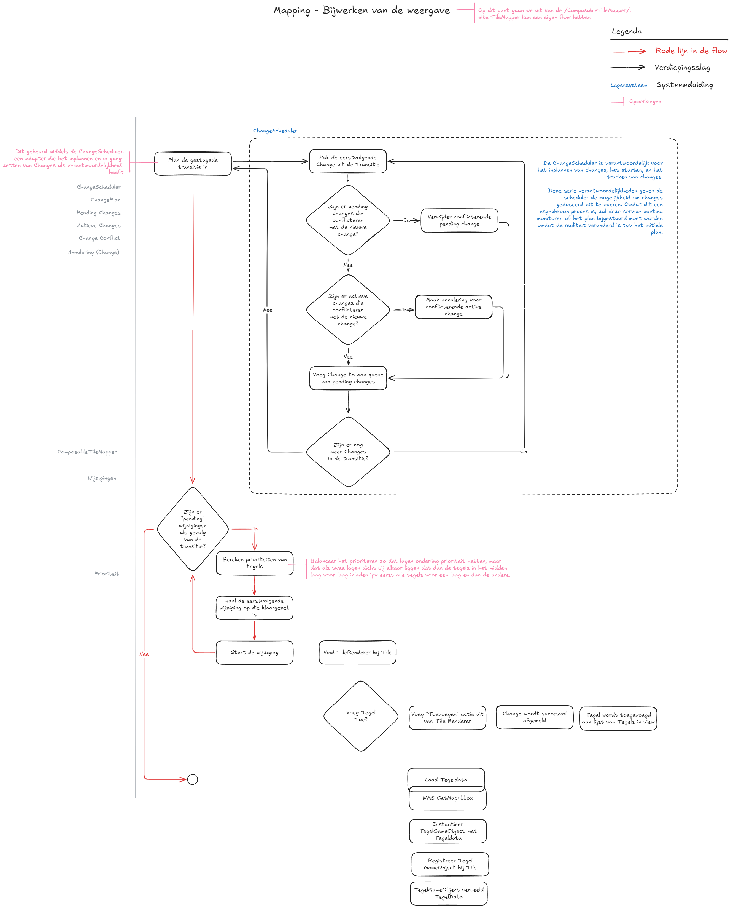
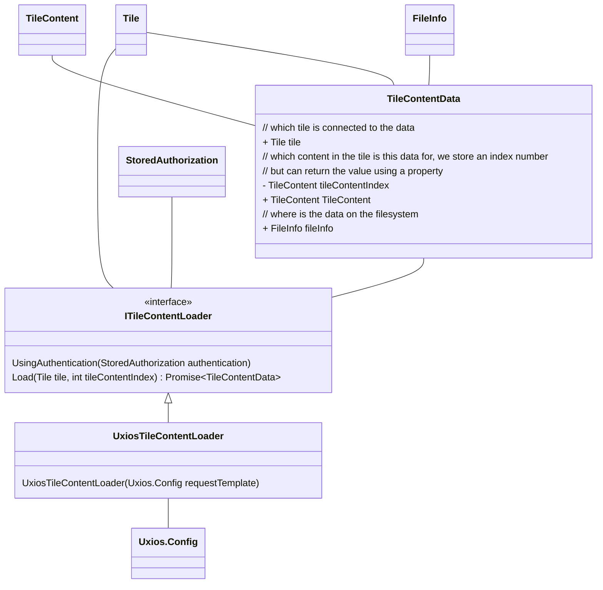
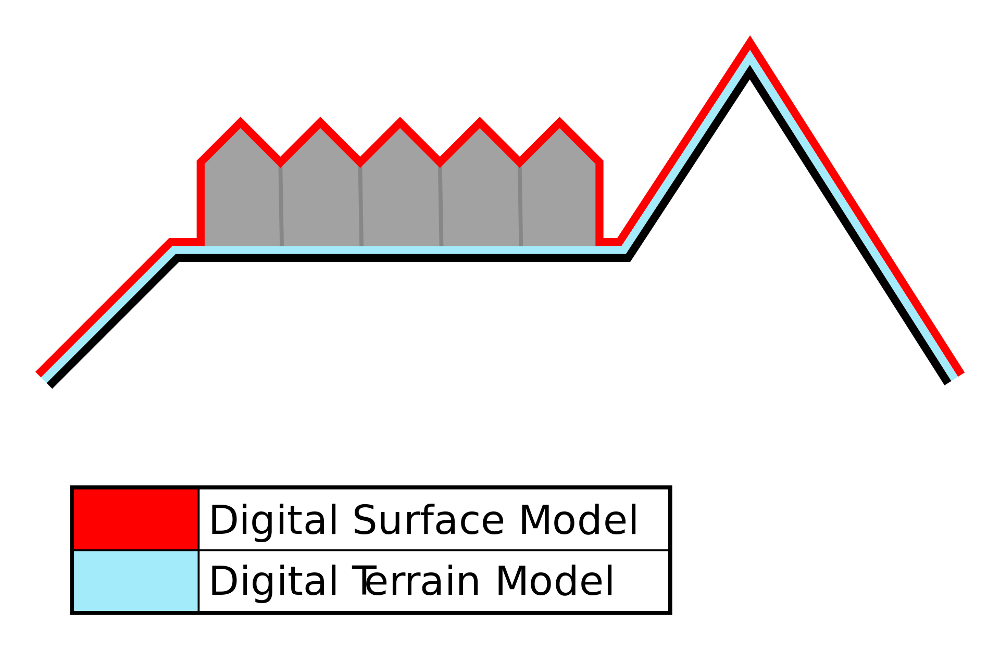

# Tilekit

## 1. Visie

Tilekit is een raamwerk om geospatiale datasets te visualiseren, inclusief de mogelijkheid om deze data te bevragen.

## 2. Synopsis

Een geospatiale dataset is een dataset die getegeld aangeboden wordt -zoals 3D Tiles, Webmapper en WMTS-, of een
verzameling van geospatiale features -zoals WFS, OGC API Features of GeoJSON-. Tilekit is ontworpen om deze datasets
op een getegelde manier te visualiseren.

Dit betekent dat Tilekit uit twee aparte maar nauw verbonden delen bestaat:

- Het opbouwen en bevragen van een of meer verzamelingen van features
- Het efficient opdelen van de geospatiale wereld in een verzameling van tegels die features visualiseren

Afhankelijk van de databron kan de volgorde van de processen variëren, wat leidt tot een soort kip-of-ei-probleem.
Systemen die van nature tegel-georiënteerd zijn – zoals WMTS of 3D Tiles – zullen doorgaans eerst tegels genereren en
tegelijkertijd bepalen welke features aanwezig zijn in die tegels. Het is echter ook mogelijk om te starten met een
verzameling features, waarna een deel ervan wordt geselecteerd om bijbehorende tegels van te maken, zoals het geval is
bij GeoJSON-bestanden of WFS.

!!!tip
    Hoewel je genegen zou zijn om bij raster of 3D Data gebaseerde datasets aan te nemen dat er geen features zijn, is 
    het praktisch om de verbeelding -raster of mesh data- van een tegel als één feature te beschouwen.

## 3. Doelen

Tilekit heeft ten doel om een raamwerk te bieden voor het visualiseren van alle geospatiale content, deze flexibiliteit
vereist een ontwerp waar bij de volgende doelen gesteld zijn:

- **Raamwerk** om, getegeld, geospatiale data in te laden en visualiseren.
- **Makkelijk om onderdelen te vervangen** zonder het hele systeem aan te hoeven te passen, 
  zie [Pluggable Architectuur](#5-pluggable-architectuur).
- **Asynchroon-first** middels Promises
- **Ondersteunt publieke en afgeschermde bronnen** middels authenticatie.
- **Live linken (remote datasets) of importeren (lokale datasets)** van data moet mogelijk zijn 

## 4. Filosofie

Tilekit is gebouwd rondom het principe dat als een legoset een tegelsysteem in elkaar kan worden geprikt. Daarbij kunnen
onderdelen vervangen worden als voortschrijdend inzicht dat vereist, of juist toegevoegd als er nieuwe databronnen
geimplementeerd worden.

## 5. Pluggable Architectuur

### 5.1. Kenmerken

- Er is één MonoBehaviour dat als orchestrator,
  of [context](https://unity.com/how-to/scriptableobjects-delegate-objects#pluggable-behavior), werkt - de 
  [TileMapper](#tilemapper).
- Een serie ScriptableObjects dat ieder 1 specifieke functie heeft, zoals de [TileSelector](#tileselector), ChangeScheduler,
  TilesTransitionPlanner.
- Elke van deze ScriptableObjects representeert een [Strategy](https://refactoring.guru/design-patterns/strategy).
- Elke functie kan hiermee makkelijk vervangen worden door een andere implementatie

*Voorbeeld*:


> Zie [https://unity.com/how-to/scriptableobjects-delegate-objects#pluggable-behavior](https://unity.com/how-to/scriptableobjects-delegate-objects#pluggable-behavior) 
> voor een beschrijving van Unity, en [https://refactoring.guru/design-patterns/strategy](https://refactoring.guru/design-patterns/strategy)
> voor meer informatie over het Strategy Design Pattern.

### 5.2. Waarom?

- **Vertegeling is complex** - door opsplitsen in kleine verantwoordelijkheden is het makkelijk om van elk onderdeel te
  zien wat het moet doen
- **Toekomstbestendig** - door een aantal functionaliteiten te maken met duidelijke boundaries kan ieder onderdeel
  individueel vervangen worden zonder grote refactorings
- **Modulair** - functionaliteiten, zoals WMS en WFS, kunnen specifieke implementaties van functies bijdragen -zoals
  maken van de [TileSet](#tileset) op basis van GetCapabilities- zonder dat het de rest hoeft te raken
- **Minder uitzonderingen** - code doet maar een ding en heeft daarmee ook minder uitzonderingen; als een
  functionaliteit een bijzonderheid heeft die niet gevangen wordt in de bestaande implementaties, dan kan je een
  specifieke implementatie maken voor die functionaliteit.

## 6. Tegelsysteem

### 6.1. Doelen

- Progressive enhancement, laad eerst de goedkoopste delen en vervang dan ter verbetering
- Prioritisatiemechanisme, tegels die dichtbij het zichtpunt zijn moeten eerst geladen worden, en dan steeds verder daarbuiten
- Gemakkelijk uit te breiden met ondersteuning voor nieuwe GIS formaten
- Gemakkelijk uit te breiden om extra bestandsformaten te tonen (PNG, Rasterdata, GLB, FBX, OBJ, etc)
- TileSets kunnen 1 laag met een gedeelde datadata bron zijn - bijvoorbeeld WMS waarbij een selectie aan kaarten ieder zijn eigen laag is
- Ondersteunt authenticatie
- (H)LOD tegelsysteem om in de verte lagere resolutie en/of grotere tegels te renderen
    - 2 varianten:
        - varierende tegelgrootte over afstand (3D Tiles)
        - varierende databron tbv LOD over afstand (Cartesian Tiles)
        - Combinatie van de 2 (WMS, kleine hoge resolutie tegels dichtbij, grotere lage resolutie tegels ver af)
- Op basis van instelbare Geometric error om ook kwaliteitsinstellingen te ondersteunen
- Ondersteunt impliciete en expliciete tegelsets
    - Impliciet ondersteunt QuadTree, OcTree _en_ Uniform Grid
- Pathfinding? A*
- Ondersteuning voor features
    - Features kunnen in meerdere tegels voorkomen, ze moeten 1x gerendered worden maar wel meermaals getracked worden i.v.m. querying
    - Is ReactiveProgramming interessant? Omdat de lijst met features een observable list kan worden?
- Event systeem om invloed uit te oefenen op tegels, zoals styling toepassen na het aanmaken van een tegel
    - Hoe gaan we om met runtime styling wijzigen, en dan de tegels verversen?
- Coordinaten / posities in datamodel is in een Abstract Coordinate System - wat betekent dat Tilekit geen betekenis toewijst aan het coordinaten systeem maar een Projectie mechanisme gemaakt moet zijn waarin de gebruiker van Tilekit kan aangeven hoe databronnen te projecteren naar een eigen gekozen canonical CRS. Aangeraden is om EPSG:4978 (xyz in meters) aan te houden, net zoals 3D Tiles.
    - Bounding Volumes zijn in EPSG:4979 (latlongheight) - onderzoek hoe dat moet werken met een agnostisch systeem
- Werkt goed samen met het Floating Origin systeem - bij voorkeur zonder coupling
- **Gebruiksvriendelijkheid**: Ontwikkel een intuïtieve monobehaviour en scriptable object structuur voor het beheer en de configuratie van tegelsets, zodat ontwikkelaars gemakkelijk hun eigen datasets kunnen toevoegen en beheren.
- **Prestatieoptimalisatie**: Implementeer caching-mechanismen om de prestaties te verbeteren, vooral bij het laden van grote datasets of tegels op hoge resoluties.
- Geoptimaliseerd voor geheugen, doordat de viewer in WebGL ontwikkeld is moet zo min mogelijk informatie in geheugen staan
    - Opruimen van resources op letten, of mechanisme eromheen
- **Foutafhandeling en Robuustheid**: Zorg voor een robuuste foutafhandeling, zodat het systeem stabiel blijft werken, zelfs bij problemen met externe databronnen of netwerkverbindingen.
- Visuele debugging tools

### 6.3. Flow

#### 6.3.1. Levenscyclus


De levenscyclus van een kaartlaag bestaat uit de volgende stappen:

1. **Inladen van een laag**: in dit stadium wordt de definitie van een tegelset opgehaald van de gekozen databron, en
   omgezet in Tilekit zijn eigen tegelset definitie. Dit garandeert dat het klaarzetten van de tegels en het bijwerken
   van de weergave altijd dezelfde informatie hebben, ongeacht de bron.
2. **Klaarzetten van tegels ([Staging](#staging))**: Bij het klaarzetten van tegels wordt bepaald welke tegels ingeladen
   en ontladen moeten worden; hierbij wordt gekeken naar de actuele situatie, een gewenste situatie en lopende
   wijzigingen om te bepalen welke wijzigingen in de wachtrij gezet moeten worden.
3. **Bijwerken van de weergave ([Mapping](#mapping))**: In dit stadium wordt de wachtrij van wijzigingen afgelopen en
   wijzigingen ingestart en gemonitored.

Het klaarzetten van de tegels ([Staging](#staging)) en het bijwerken van de weergave ([Mapping](#mapping)) is een
herhalend proces. De standaard aanname van Tilekit is dat een Timer klasse geimplementeerd is die beide stadia in
volgorde afhandeld; maar Tilekit ondersteunt ook dat het stagen en mappen door andere processen worden uitgevoerd.

!!!warning
    Bovenstaande betekent staging en mapping geen afhankelijkheid mogen hebben en dat beide
    handelingen [Idempotent](#idempotent) zijn. Staging mag meermaals uitgevoerd kunnen worden voordat mapping wordt
    uitgevoerd en andersom.

    Deze ontwerpkeuze is fundamenteel om asynchrone handelingen te ondersteunen omdat de mapping fase alleen een change
    kan starten, maar de change zelf meerdere frames en cycli van staging zou kunnen duren.

#### 6.3.2. Inladen van een TileSet

In hoofdstuk [7.4. Datamodel](#74-datamodel) is beschreven welke elementen de definitie van een TileSet heeft. Hiermee
kan je flexibel een breed scala aan tegelsystemen mee weergeven, maar dit van begin af aan inrichten is een uitdaging
zonder de effecten te weten van alle knoppen waar je aan kan draaien.

Om dit proces te versimpelen zijn er 2 ondersteunende services die gebruikt kunnen worden om op een simpele manier een
TileSet te kunnen configureren:

1. **TileSetBuilder**, een [Builder](https://refactoring.guru/design-patterns/builder) service waarmee je met een paar
   korte instructies tiles kan builden en een TileSet valideren.
2. **TileSetFactory**, een [Factory](https://refactoring.guru/design-patterns/factory-method) service waarmee je in een
   keer een gehele TileSet instantieert met een specifieke configuratie.

##### 6.3.2.1. TileSetBuilder

De TileBuilder biedt een aantal gemaksfuncties waarmee een TileSet gemakkelijk opgebouwd kan worden. Aangezien een
TileSet zelf bestaat uit een paar korte instructies en vervolgens een boomstructuur aan Tile objecten zal de TileBuilder

Voorbeeld:

```csharp
quadTreeTileBuilder = TileSetBuilder.QuadTree(bounds);

```

#### 6.3.3. Staging

De Staging fase in de [TileMapper](#tilemapper) is bedoeld om te bepalen welke tegels in- en
uitgeladen moeten worden om in de [7.3.4. Mapping](#734-mapping) fase dit in gang te kunnen zetten. De staging fase, net
als de mapping fase is bedoeld om [idempotent](#idempotent) uitgevoerd te worden. Dit betekent dat het mogelijk is om 
meermaals deze stap uit te kunnen voeren en dat de uitkomst altijd 1-op-1 toegepast kan worden in de mapping fase.



Het staging proces is verdeeld in 3 stappen:

1. Welke tegels zijn er nu in beeld middels de `TilesInView` verzameling
2. Welke tegels moeten er in beeld komen middels een `TileSelector` service
3. Welke wijzigingen moeten worden uitgevoerd om van de huidige naar de nieuwe situatie te komen -genaamd
   een [Transition](#transition) - middels een [TilesTransitionPlanner](#tilestransitionplanner).

#### 6.3.4. Mapping



- Tegels mogen pas "InView" als een change succesvol afgemeld is
- Tegel GameObjecten kunnen er al zijn voordat een Tegel in view is; dan kan een Change nog pending zijn
- Als een dergelijke change geannuleerd wordt; dan moet het gameobject opgeruimd worden
    - Ergo: Changes moeten een Cancel mogelijkheid hebben, die een contra actie/opruim actie uitvoert
- Een Tegel kent een aantal dingen
    - de "Tile" definitie uit de TileSet
    - de Tegeldata - zoals de GeoJSON - die uit een WFS ingeladen is
    - een visualisatie - zoals een GameObject of PolygonVisualiser?

### 6.4. Datamodel

!!!todo
    Kijk naar https://github.com/CesiumGS/3d-tiles/blob/main/specification/ImplicitTiling/README.adoc#availability om na 
    te gaan of er een betere manier is om de ID van een tegel te bepalen middels de Morton Z-order curve.


- TileContent mag ook verwijzen naar een externe tileset: https://docs.ogc.org/cs/22-025r4/22-025r4.html#core-external-tilesets

### 6.5. Services


Projector has been omitted from the scheme above because I need to think about it

Middlewares for styling need to be added

## 7. Features

!!!question
    Moeten we wel een systeem voor features introduceren, of is dit een gevolg? Dat een WFS bevraagd kan worden door 
    bbox's aan te brengen en de features op dit tegel een bij-effect zijn en gebeuren door observers?

### Wat is een feature?

Een abstractie van reële wereldverschijnselen. Een digitale representatie van een echt bestaande entiteit of een
abstractie van de reële wereld. Voorbeelden van features zijn bijna alles wat in tijd en ruimte geplaatst kan worden,
waaronder bureaus, gebouwen, steden, bomen, bospercelen, ecosystemen, bezorgvoertuigen, sneeuwruimroutes, oliebronnen,
oliepijpleidingen, olielekkage, enzovoort. De termen feature en object worden vaak door elkaar gebruikt.

Bronnen: 

- [ISO-19101-1-2014 - Geographic information -- Reference model -- Part 1: Fundamentals](https://www.w3.org/TR/sdw-bp/#bib-iso-19101-1-2014) 
- [W3C-SDW#feature](https://www.w3.org/TR/sdw-bp/#dfn-feature)

!!!info
    Een van de beste vertalingen naar het Nederlands is het woord "Kenmerk"; hoewel een exacte vertaling van het woord
    Feature niet in het Nederlands voorkomt. Als gevolg daarvan zal in dit document het woord Feature gebruikt worden.

### Doelen

- Ondersteunt 3D en 2D data
- Gemakkelijk uit te breiden met ondersteuning voor nieuwe GIS formaten
- Vergemakkelijkt implementaties van WFS en [OGC API : Features](https://ogcapi.ogc.org/features) omdat deze formaten
  feature-first zijn en niet tegel-first
- Spatial querying
    - Important: Datasets have features - real or not
    - https://www.youtube.com/watch?v=vxZx_PXo-yo&t=2s
    - Jobs/Burst - een findAll doet een Depth First Search; elke branch in de tree kan in parallel; werkt mogelijk niet
      in WebGL - experiment nodig
    - Promise-based? Dat een search in basis asynchroon is en over frames uitgesmeerd kan worden in WebGL
    - Search in this area - Google Maps zoekt op features in het huidige zoekgebied
    - Querying kan als geheel - maar ook in een tile. Als het een tile is, dan kan een lijst gelooped worden
        - Of kunnen we bij het inlezen van een tile deze onderverdelen middels een grid of quadtree en de features
          spatial onderverdelen zodat we hier ook een Depth First Search kunnen doen?
    - Map/Reduce patroon om te filteren?
        - https://www.youtube.com/watch?v=gX5nD2LeAvQ - ZLinq
- https://portal.ogc.org/files/96288 CQL
- Temporele ondersteuning - als de tijd wijzigt van de applicatie kan de URL beinvloed worden
    - WFS: Queryen op tijdgebaseerde attributen - Zie https://docs.ogc.org/is/17-069r4/17-069r4.html#_identifiers
    - Hele URL, zoals Amsterdam Time Machine
    - https://docs.ogc.org/is/20-057/20-057.html#toc52
- Zijn sensor metingen ook features? Check SensorThings

### Datamodel

### Services

## 8. Changes

!!!important
    Dit hoofdstuk is nog in ontwikkeling en moet gaan beschrijven hoe changes los staan van de tegels zelf of features, 
    en ook hoe we het Change subsysteem agnostisch houden van concrete implementaties

### 8.1. Prioritering

In ons tegelsysteem willen we ervoor zorgen dat de belangrijkste informatie zo snel mogelijk zichtbaar is. Daarom
gebruiken we een prioriteitssysteem dat bepaalt welke tegels het eerst worden ingeladen. Dit systeem werkt op basis van
twee belangrijke factoren:

1. **Laagprioriteit**: Sommige lagen zijn belangrijker dan anderen. Elke laag heeft een gewicht dat aangeeft hoe
   belangrijk de informatie in die laag is.
2. **Positie op het scherm**: Tegels die dichter bij het midden van het scherm liggen, zijn belangrijker dan tegels die
   verder weg liggen.

#### Hoe werkt het?

- **Gewichten en afstanden**: We kijken naar het gewicht van elke laag en de afstand van elke tegel tot
  het [Midden van het Scherm](#midden-van-het-scherm).
- **Tegels in volgorde inladen**: Als de gewichten van de lagen dicht bij elkaar liggen, laden we de tegels eerst in
  vanaf het midden van het scherm, dan op basis van de laag. Dit betekent dat tegels in het midden altijd het eerst
  worden ingeladen, gevolgd door tegels die verder van het midden af liggen.
- **Hele lagen in volgorde inladen**: Als de gewichten van de lagen ver uit elkaar liggen, laden we eerst alle tegels
  van de hoogste laag in, voordat we doorgaan naar de volgende laag. Dit betekent dat we eerst een complete laag inladen
  voordat we naar de volgende laag gaan.

#### Voorbeeld

Stel je voor dat je naar een kaart kijkt met drie lagen: maaiveld, gebouwen en WMS. De maaiveld en gebouwen liggen dicht
bij elkaar qua gewicht, en de WMS laag niet.

1. Begin in het midden van het scherm.
    1. Laad eerst de maaiveld-tegel in omdat deze de hoogste prioriteit heeft,
    2. Gevolgd door de gebouwen-tegel omdat deze zijn prioriteit dichtbij de vorige ligt
2. Ga naar de volgende tegelpositie vanaf het midden en herhaal stap 1.
3. Zodra alle maaiveld- en gebouwen-tegels zijn ingeladen, begin dan met het inladen van de WMS-tegels, ook vanaf het
   midden van het scherm.

## 9. Metadata

!!!important
    Dit hoofdstuk is nog in ontwikkeling en moet gaan beschrijven wat de invloed van Metadata kan zijn, en hoe metadata 
    ook gestructureerd kan zijn in "classes".
    Daarbij moet uitgezocht worden welke rol metadata wel of niet gaat spelen in de selectie van het bestandstype voor 
    de Tegel inhoud; sommige bestanden hebben een mimetype die je hier zou kunnen opgeven als de bestandsextensie niet 
    afdoende is.

## 10. Ophalen van data

- Moet Asynchroon middels promises
- Network requests moeten gethrottled kunnen worden opgehaald (per host)
    - Is dit een verantwoordelijkheid van de ChangeScheduler?
- Er moet er een retry mechanisme in komen
    - Is dat iets voor Uxios? https://dev.to/scrapfly_dev/how-to-retry-in-axios-5e87
    - Kijk naar https://cesium.com/learn/cesiumjs/ref-doc/Resource.html
- Injecteren van een sjabloon-request (Uxios.Config) voor, bijv, authenticatie en custom headers.
- Zowel remote als bestanden uit de persistent data storage kan worden opgehaald op een eenduidige manier
    - middels de HTTP Client Uxios.
    - Zie https://kind-men.github.io/uxios/guides/working-with-persistent-data/ voor bestanden in de Persistent Data Storage, en https://kind-men.github.io/uxios/guides/fetching-pokemon-using-get/ voor URLs.
- Filesystem abstractie?
    - Kunnen we hergebruiken wat er al is in het projectsysteem en daar een systeem van maken?
    - Dit zijn nu verschillende manieren; ik doel vooral op de `project://` prefix en het inladen daarvan
- Als we hier een aparte adapter van maken, dan kunnen we itereren op dit stuk en hoeft bovenstaande niet in een keer.
    - Gaan we met `project://` werken, of met `unity+persistent://`? Die laatste is Uxios, die eerste is onze eigen manier. Met de laatste kunnen we ook bestanden openen die niet in het project zijn maar wel in de persistent storage; nadeel is dat je je bestandslokaties moet weten
- Gaan we abstraheren, of juist op Uxios leunen? Dat eerste is flexibeler, dat tweede minder complex.
- TileContentLoader moet aan begin meegegeven worden
- Elke TileRenderer of de GameObject die geinstantieerd wordt wil toegang hebben tot de TileContentLoader? Of tot de TileContentData?

## Flow

Vraag: moeten we een TileRenderer en TileContentRenderer hebben? Of is een Tile een algemene prefab die als container gebruikt kan worden maar de TileRenderer eigenlijk een TileContentRenderer?

1. Een Change voor het toevoegen van een tegel wordt gestart
2. De change zoekt de juiste TileRenderer op en initieert het aanmaken van de tegel
3. De TileRenderer bevraagt de TileContents (meervoud) en voor elke TileContent gebruikt de TileContentLoader om
    1. een Request samen te stellen op basis van het Sjabloon request en de TileContent zijn URI, en
    2. het bestand te downloaden, en
    3. Zodra de download klaar is, de TileRenderer te informeren
4. Zodra alle TileContentData ingeladen is, dan
5. Gaat de TileRenderer de visualisatie aanmaken (PolygonVisualisation, Prefabs, etc)
6. Gaat de visualisatie de gedownloadde informatie toepassen (voorbeeld: Texture aan de nieuw aangemaakte DecalProjector koppelen)
7. Meld de TileRenderer de Change af als geslaagd

## Services



## Appendix A. Casussen

### A.1. WMS

#### A.1.1. Doel

De casus van het herimplementeren van WMS in het nieuwe tegelsysteem is bedoeld om te demonstreren hoe een vertegeling
op basis van [HLOD](#hlod) kan helpen om nabij de camera gedetailleerde tegels te tonen, en verder weg steeds grotere
onnauwkeurige tegels.

#### A.1.2. Demonstreert

- Inladen Capaciteiten en omzetten naar TileSet definitie
- Impliciete vertegeling van een ongetegelde bron
- Inladen van een externe databron
- Verbeelden van remote tegels met afbeeldingen
- Dynamische aanpassing tegelgrootte en resolutie afhankelijk van afstand camera

#### A.1.3. Requirements

- Middels de Tileset definitie van dit systeem moet
    - binnen de bounding box van een WMS laag een tegelset getoond worden
    - een implicit quadtree gebaseerde vertegeling gedefinieerd kunnen worden
    - Meerdere sublevels mogelijk zijn om kleinere en grotere tegels te tonen afhankelijk van de afstand tot het 
    - [zichtpunt](#zichtpunt).
    - TBC

### A.2. GeoJSON

#### A.2.1. Doel

#### A.2.2. Demonstreert

- Impliciete vertegeling van een ongetegelde bron
- Inladen van een lokale databron
- Inladen van een externe databron


#### A.2.3. Requirements

## Appendix B. Bronvermeldingen

### B.1. Bronnen

- [Use ScriptableObjects as delegate objects](https://unity.com/how-to/scriptableobjects-delegate-objects#pluggable-behavior)
- [Refactoring Guru - Strategy Design Pattern](https://refactoring.guru/design-patterns/strategy)
- [OGC API - Tiles](https://ogcapi.ogc.org/tiles/)
- [OGC API - Features](https://ogcapi.ogc.org/features/)
    - [Specificatie](https://docs.ogc.org/is/17-069r4/17-069r4.html)
- https://www.w3.org/TR/sdw-bp/#bib-iso-19101-1-2014
- [OGC 3D Tiles](https://docs.ogc.org/cs/22-025r4/22-025r4.html)
    - [3D Tiles - Implicit tiling in detail](https://github.com/CesiumGS/3d-tiles/blob/main/specification/ImplicitTiling/README.adoc)
- [OGC CQL](https://portal.ogc.org/files/96288)

### B.2. Videos

<iframe width="560" height="315" src="https://www.youtube-nocookie.com/embed/vxZx_PXo-yo?si=pgOyWeNfyCOwaNDJ" title="YouTube video player" frameborder="0" allow="accelerometer; autoplay; clipboard-write; encrypted-media; gyroscope; picture-in-picture; web-share" referrerpolicy="strict-origin-when-cross-origin" allowfullscreen></iframe>

## Appendix C. Begrippen

// TODO: https://github.com/CesiumGS/3d-tiles/blob/main/specification/README.adoc uitkammen en de begrippen hierin zetten, zoals refinement

### Capabilities

### Change

Een Change is een handeling die nodig is om een tegel van begin tot einde - inclusief visualisatie - toe te voegen of te verwijderen uit de wereld.

Changes kunnen geannuleerd worden, in welk geval de Status Quo behouden blijft.

### Changeset

Een Changeset is een set aan Changes die als 1 geheel uitgevoerd moeten worden - als een ChangeSet geannuleerd wordt, dan wordt de status quo behouden.

Toevoegen altijd voor verwijderen, zodra verwijderen loopt mag niet meer geannuleerd

### Databron

### Design Pattern: Builder

### Design Pattern: Factory

### Design Pattern: Strategy

### Digitaal Terrein Model (DTM)

**Aliassen**: Maaiveld, Grondoppervlak, Digital Terrain Model

Een Digitaal Terrein Model (DTM) is een digitale representatie van het aardoppervlak, inclusief de natuurlijke terreinvormen, **exclusief** bovengrondse objecten zoals gebouwen en vegetatie. Het model bestaat uit een reeks gegevenspunten die hoogte-informatie bevatten, waardoor een driedimensionaal beeld van het terrein kan worden gecreëerd.



Meer informatie:

- https://www.eea.europa.eu/help/glossary/eea-glossary/digital-terrain-model
- https://nl.wikipedia.org/wiki/Digitaal_hoogtemodel

### Digitaal Oppervlakte Model (DSM)

**Aliassen**: Digitaal Hoogtemodel, Digital Surface Model

Omvat het [[#Digitaal Terrein Model (DTM)]] **plus** alle bovengrondse objecten op het aardoppervlak zoals gebouwen en vegetatie. Het model bestaat uit een reeks gegevenspunten die hoogte-informatie bevatten, waardoor een driedimensionaal beeld van het terrein kan worden gecreëerd.


Meer informatie:

- https://www.eea.europa.eu/help/glossary/eea-glossary/digital-terrain-model
- https://nl.wikipedia.org/wiki/Digitaal_hoogtemodel

### Geoide

**Aliassen**: NAP (soort van)

De **geoïde** is het oppervlak op gemiddeld zeeniveau, waar dezelfde [zwaartekrachtspotentiaal](https://nl.wikipedia.org/wiki/Zwaartekrachtspotentiaal "Zwaartekrachtspotentiaal") (inclusief de potentiaal van de middelpuntvliedende kracht door de draaiing van de Aarde) heerst: het [equipotentiaalvlak](https://nl.wikipedia.org/wiki/Equipotentiaalvlak "Equipotentiaalvlak"). Zonder getijden, wind en verschillen in watertemperatuur en zoutgehalte zou het waterniveau in zee dit oppervlak volgen.

Geoïdehoogten zijn de hoogten tussen de geoïde en een [referentie-ellipsoïde](https://nl.wikipedia.org/wiki/Referentie-ellipso%C3%AFde "Referentie-ellipsoïde") van een [geodetisch coördinatensysteem](https://nl.wikipedia.org/wiki/Geodetisch_co%C3%B6rdinatensysteem "Geodetisch coördinatensysteem"), bijvoorbeeld [WGS84](https://nl.wikipedia.org/wiki/WGS_84 "WGS 84"), [ETRS89](https://nl.wikipedia.org/wiki/European_Terrestrial_Reference_System_1989 "European Terrestrial Reference System 1989").

Meer informatie:

- https://nl.wikipedia.org/wiki/Geo%C3%AFde

### HLOD

### Getegelde laag

### Lagensysteem

### LayerData

### Idempotent

**Idempotentie** is de eigenschap van een object (of systeem) en/of een operatie daarop dat het object niet meer verandert als de operatie nogmaals wordt uitgevoerd.

Bron: https://nl.wikipedia.org/wiki/Idempotentie

### Mapping

### Midden van het Scherm

Het midden van het scherm betekent concreet het punt in de viewport waar de camera naar kijkt, op de hoogte van het [digitale terreinmodel (DTM)](https://en.wikipedia.org/wiki/Digital_elevation_model), en als er geen digitaal terrein model aanwezig voor de gegeven lokatie: de hoogte van de [[#Geoide]].

### NAP hoogte

**Zie**: [[Orthometrische hoogte]]

### Orthometrische hoogte


### Pluggable Architectuur

### Staging

### Tick

### Tile

**Aliassen**: Tegel

Een tegel is een beschrijving van een voorgedefinieerd geografisch gebied, inclusief een verzameling van nul of meer [[#Feature|features]] en een of meer representaties in de vorm van 3D Data, raster of vector informatie.

Officiele OGC Definitie:

> [!quote] Bron: https://docs.ogc.org/is/20-057/20-057.html#term-tile
> Geometrische vorm met bekende eigenschappen die al dan niet het resultaat zijn van een betegelingsproces (
> tessellatie). Een tegel bestaat uit een enkel samenhangend “stuk” zonder “gaten” of “lijnen” (topologische schijf).
>
> In de context van een 2D-tegelmatrix is een tegel een van de rechthoekige gebieden in de ruimte, die uniek
> geïdentificeerd kan worden door rij- en kolomindices, welke samen de tegelmatrix vormen.
>
> In de context van een geospatiale data-tegelset bevat een tegel gegevens voor een dergelijke ruimtelijke indeling als
> onderdeel van een overkoepelende set tegels voor die betegelde geospatiale data.

### TileMapper

### TileSelector

### TileSet

### TileSetBuilder

### TileSetFactory

### TilesTransitionPlanner

### Transition

### Visualisatie

### Zichtpunt

De lokatie in de wereld waar de camera naar kijkt; in tegenstelling tot de camerapositie is deze lokatie waarschijnlijk middenin de viewport en de lokatie met het hoogste detailniveau en prioriteit van inladen.

Deze lokatie representeert datgeen waar de aandacht van de gebruiker naartoe gaat.
