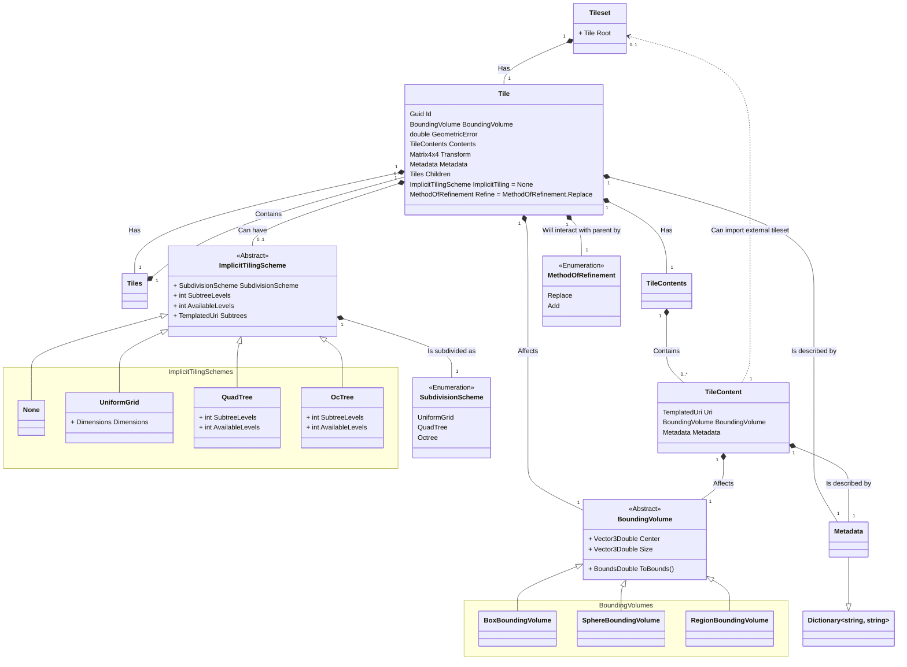
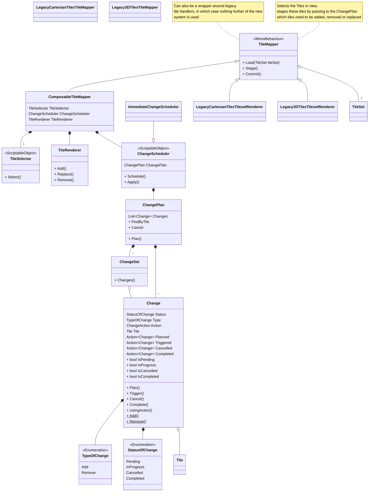
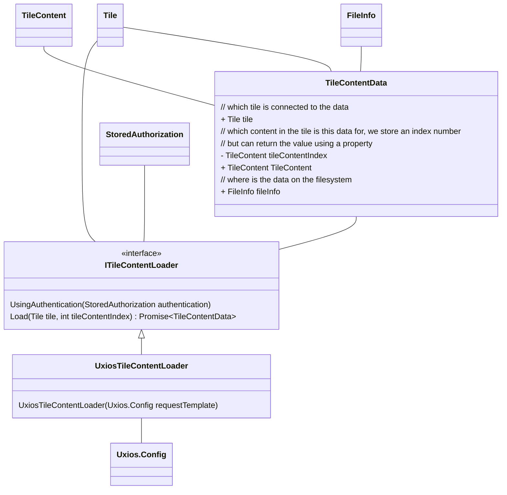
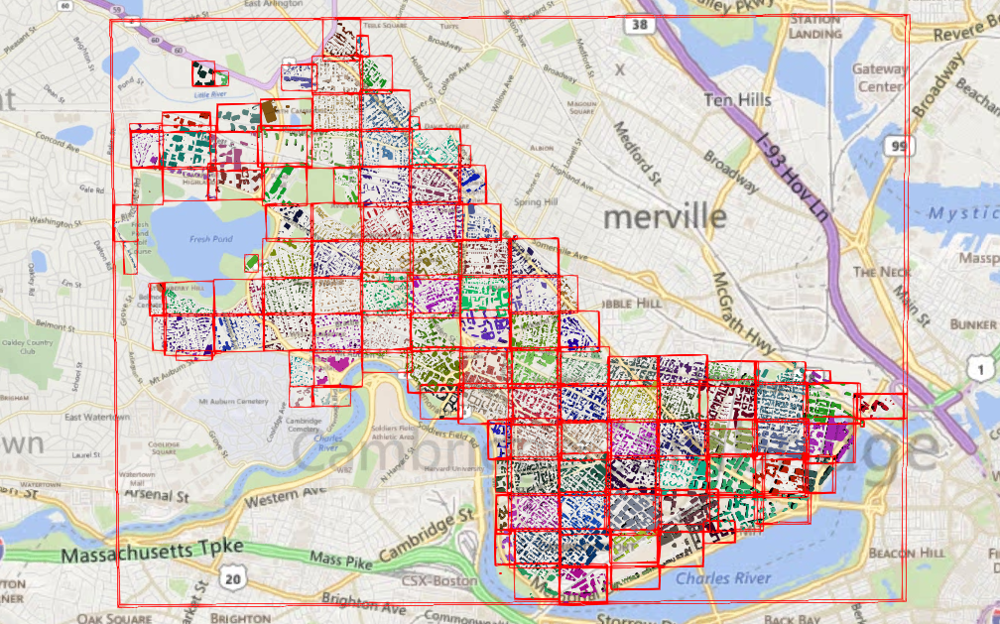
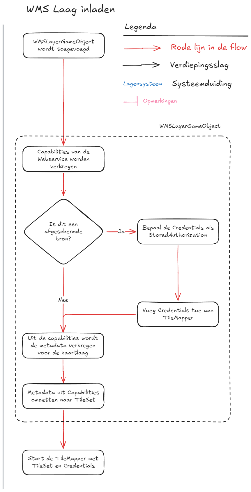

# Tilekit

## 1. Visie

Tilekit is een raamwerk om geospatiale datasets te visualiseren, inclusief de mogelijkheid om deze data te bevragen.

## 2. Synopsis

Een geospatiale dataset is een dataset die getegeld aangeboden wordt -zoals 3D Tiles, Webmapper en WMTS-, of een
verzameling van geospatiale features -zoals WFS, OGC API Features of GeoJSON-. Tilekit is ontworpen om deze datasets
op een getegelde manier te visualiseren.

Dit betekent dat Tilekit uit twee aparte maar nauw verbonden delen bestaat:

- Het opbouwen en bevragen van een of meer verzamelingen van features
- Het efficient opdelen van de geospatiale wereld in een verzameling van tegels die features visualiseren

Afhankelijk van de databron kan de volgorde van de processen variëren, wat leidt tot een soort kip-of-ei-probleem.
Systemen die van nature tegel-georiënteerd zijn – zoals WMTS of 3D Tiles – zullen doorgaans eerst tegels genereren en
tegelijkertijd bepalen welke features aanwezig zijn in die tegels. Het is echter ook mogelijk om te starten met een
verzameling features, waarna een deel ervan wordt geselecteerd om bijbehorende tegels van te maken, zoals het geval is
bij GeoJSON-bestanden of WFS.

!!!tip
    Hoewel je genegen zou zijn om bij raster of 3D Data gebaseerde datasets aan te nemen dat er geen features zijn, is 
    het praktisch om de verbeelding -raster of mesh data- van een tegel als één feature te beschouwen.

## 3. Doelen

Tilekit heeft ten doel om een raamwerk te bieden voor het visualiseren van alle geospatiale content, deze flexibiliteit
vereist een ontwerp waar bij de volgende doelen gesteld zijn:

- **Raamwerk** om, getegeld, geospatiale data in te laden en visualiseren.
- **Makkelijk om onderdelen te vervangen** zonder het hele systeem aan te hoeven te passen, 
  zie [Pluggable Architectuur](#5-pluggable-architectuur).
- **Asynchroon-first** middels Promises
- **Ondersteunt publieke en afgeschermde bronnen** middels authenticatie.
- **Live linken (remote datasets) of importeren (lokale datasets)** van data moet mogelijk zijn 

## 4. Filosofie

Tilekit is gebouwd rondom het principe dat als een legoset een tegelsysteem in elkaar kan worden geprikt. Daarbij kunnen
onderdelen vervangen worden als voortschrijdend inzicht dat vereist, of juist toegevoegd als er nieuwe databronnen
geimplementeerd worden.

## 5. Pluggable Architectuur

### 5.1. Kenmerken

- Er is één MonoBehaviour dat als orchestrator,
  of [context](https://unity.com/how-to/scriptableobjects-delegate-objects#pluggable-behavior), werkt - de 
  [TileMapper](#tilemapper).
- Een serie ScriptableObjects dat ieder 1 specifieke functie heeft, zoals de [TileSelector](#tileselector), ChangeScheduler,
  TilesTransitionPlanner.
- Elke van deze ScriptableObjects representeert een [Strategy](https://refactoring.guru/design-patterns/strategy).
- Elke functie kan hiermee makkelijk vervangen worden door een andere implementatie

*Voorbeeld*:


> Zie [https://unity.com/how-to/scriptableobjects-delegate-objects#pluggable-behavior](https://unity.com/how-to/scriptableobjects-delegate-objects#pluggable-behavior) 
> voor een beschrijving van Unity, en [https://refactoring.guru/design-patterns/strategy](https://refactoring.guru/design-patterns/strategy)
> voor meer informatie over het Strategy Design Pattern.

### 5.2. Waarom?

- **Vertegeling is complex** - door opsplitsen in kleine verantwoordelijkheden is het makkelijk om van elk onderdeel te
  zien wat het moet doen
- **Toekomstbestendig** - door een aantal functionaliteiten te maken met duidelijke boundaries kan ieder onderdeel
  individueel vervangen worden zonder grote refactorings
- **Modulair** - functionaliteiten, zoals WMS en WFS, kunnen specifieke implementaties van functies bijdragen -zoals
  maken van de [TileSet](#tileset) op basis van GetCapabilities- zonder dat het de rest hoeft te raken
- **Minder uitzonderingen** - code doet maar een ding en heeft daarmee ook minder uitzonderingen; als een
  functionaliteit een bijzonderheid heeft die niet gevangen wordt in de bestaande implementaties, dan kan je een
  specifieke implementatie maken voor die functionaliteit.

## 6. Tegelsysteem

### 6.1. Doelen

#### 6.1.1. Functionaliteit

- **Uitbreidbaarheid**

    - Ondersteuning voor nieuwe GIS-standaarden (WFS, OGC API Features, WMS)  
    - Ondersteuning voor extra bestandsformaten (PNG, Raster, GLB, FBX, OBJ)

- **Laagstructuur & Databronnen**  

    - Eén TileSet kan meerdere lagen visualiseren vanuit gedeelde bron (bijv. WMS)
    - Eén TileSet kan tegels uit andere TileSets bevatten als remote TileSet

- **Authenticatie**  

    - Ondersteuning voor afgeschermde bronnen met authenticatie

- **Featurebeheer**  
 
    - Features kunnen in meerdere tegels voorkomen, maar worden slechts eenmaal gerenderd; zie [Features](#7-features).  
    - Features moeten bevraagd kunnen worden middels querying.

- **Styling & Events**  

    - Event-systeem voor beïnvloeding van tegels (bijv. styling bij creatie)  
    - Mechanisme voor verversen van tegels bij runtime-styling

#### 6.1.2. Tilingstructuur

- **LOD-ondersteuning (HLOD)**  

    - Variabele tegelgrootte (zoals 3D Tiles)  
    - Variabele databron (zoals Cartesian Tiles)  
    - Combinatie van beide (bijv. WMS op afstand/lokaal)

- **Tilingmodellen**  

    - *Impliciet tiling* voor wereld-dekkende datasets  
    - *Expliciet tiling* voor vooraf gedefinieerde hiërarchieën

- **Geometric Error Threshold**  

    - Instelbare fouttolerantie voor LOD-keuze

#### 6.1.3. Architectuur & Techniek

- **Op basis van field-tested concepten**

    - 3D Tiles
    - GeoJSON
    - OGC API
      - Tiles
      - Maps
      - Features
    - OGC WMS
    - OGC WMS
    - OGC WFS

- **Coördinaten & Projectie**  

    - Abstract Coordinate System; projectie door developers configureerbaar.  
    - Aanbevolen: EPSG:4978 (XYZ)  
    - Ondersteuning voor EPSG:4979 (lat/lon/height) in bounding volumes

- **Floating Origin**  

    - Compatibel zonder directe koppeling

- **Unity-integratie**

    - Intuïtieve structuur met MonoBehaviours & ScriptableObjects voor configuratie

#### Niet-functionele aspecten

- **Performance**

    - Caching van tegels en datasets  
    - Minimaliseren van geheugenverbruik (WebGL-geschikt)  
    - Actieve resource-opruiming vereist

- **Robuustheid**  

    - Fouttolerantie bij netwerkproblemen of externe fouten

- **Gebruiksvriendelijkheid**  

    - Eenvoudig beheer en uitbreiding van datasets

- **Debugging**  

    - Visuele tools voor tile-analyse en debugging

- **Laadstrategie**

    - *Progressive enhancement*: eerst goedkope, daarna detail  
    - *Prioritering*: nabijgelegen tegels eerst laden

### 6.3. Expliciete en impliciete TileSets

Bij het ontwerpen van een tegelsysteem maken we onderscheid tussen **expliciete** en **impliciete**
tegelsystemen. Beide benaderingen beschrijven hoe tegels binnen een (hiërarchische) structuur worden georganiseerd en
aangesproken, maar ze verschillen fundamenteel in hoe deze wordt gedefinieerd.

#### 6.3.1. Expliciet Tegelsysteem

Een expliciet tegelsysteem beschrijft elke tegel individueel, inclusief zijn positie, relatie tot andere tegels en
metadata. Hierbij maken we gebruik van een vooraf gedefinieerde lijst van tegels in de TileSet. Elke tegel kent zijn 
kinderen expliciet, inclusief verwijzingen naar onderliggende tegels.

**Kenmerken**

- Structuur is volledig gespecificeerd.
- Onderlinge relaties (ouder-kind) zijn expliciet gedefinieerd.
- Geschikt voor complexe hiërarchieën of geoptimaliseerde datastructuren.
- Maakt vaak gebruik van LOD's (Levels of Detail) per tegel.

**Voordeel:** Volledige controle en flexibiliteit over de positie, hiërarchie en metadata per tegel.  
**Nadeel:** Grotere initiële payload en ongeschikt voor grootschalige datasets.

#### 6.3.2. Impliciet Tegelsysteem

Een impliciet tegelsysteem beschrijft geen individuele tegels, maar maakt gebruik van een algoritme om tegels
af te leiden op basis van een vaste structuur. Dit systeem is schaalbaar en efficiënt, omdat de hiërarchie en locatie
van een tegel volledig kunnen worden afgeleid uit de tegel-ID.

Netherlands3D ondersteunt binnen het impliciete systeem drie hoofdstructuren:

**1. Quadtree** De quadtree-structuur deelt de ruimte op in vier gelijke kwadranten per niveau. Elke tegel heeft 
    maximaal vier kinderen (NO, NW, ZO, ZW). Deze structuur is ideaal voor tweedimensionale datasets of geografische 
    informatie.

**2. Octree** De octree is de driedimensionale tegenhanger van de quadtree. Elke tegel wordt opgesplitst in acht 
    kinderen, waarbij de ruimte langs de x-, y- en z-as wordt gehalveerd. Deze structuur is geschikt voor volumetrische 
    datasets of 3D-scènes met LOD.

**3. Uniform Grid** Bij een uniform grid worden tegels op een vlak verdeeld in een vast raster, zonder hiërarchie. Dit 
    type wordt meestal gebruikt wanneer elke tegel gelijkwaardig is en er geen behoefte is aan dynamische detaillering 
    of LOD.

**Kenmerken van impliciete systemen:**

- Hiërarchie wordt bepaald door een patroon (bijv. depth en tile indices).
- Geen beschrijving van elke individuele tegel nodig: structuur is afleidbaar.
- Lichtgewicht en geschikt voor grote datasets.
- Relaties worden bepaald door index-berekening in plaats van expliciete verwijzingen.

**Voordeel:** Hoge schaalbaarheid en lage overhead.  
**Nadeel:** Minder flexibiliteit voor per-tegel metadata of uitzonderingen.

Zie https://github.com/CesiumGS/3d-tiles/blob/main/specification/ImplicitTiling/README.adoc voor details hoe de 3D Tiles
specificatie omgaat met Impliciete Tiling, Tilekit zijn ontwerp is gebaseerd op deze principes met extra ondersteuning 
voor uniforme grids.

### 6.4. Levenscyclus van een kaartlaag


De levenscyclus van een kaartlaag bestaat uit de volgende stappen:

1. **Inladen van een laag**: in dit stadium worden de capabilities opgehaald van de gekozen databron, en
   omgezet in Tilekit zijn eigen tegelset definitie. Dit garandeert dat het klaarzetten van de tegels en het bijwerken
   van de weergave altijd dezelfde informatie hebben, ongeacht de bron.
2. **Klaarzetten van tegels ([Staging](#staging))**: Bij het klaarzetten van tegels wordt bepaald welke tegels ingeladen
   en ontladen moeten worden; hierbij wordt gekeken naar de actuele situatie, een gewenste situatie en lopende
   wijzigingen om te bepalen welke wijzigingen in de wachtrij gezet moeten worden.
3. **Bijwerken van de weergave ([Mapping](#mapping))**: In dit stadium wordt de wachtrij van wijzigingen afgelopen en
   wijzigingen ingestart en gemonitored.

Het klaarzetten van de tegels ([Staging](#staging)) en het bijwerken van de weergave ([Mapping](#mapping)) is een
herhalend proces. De standaard aanname van Tilekit is dat een Timer klasse geimplementeerd is die beide stadia in
volgorde afhandeld; maar Tilekit ondersteunt ook dat het stagen en mappen door andere processen worden uitgevoerd.

!!!tip "Staging en mapping zijn idempotent"
    Bovenstaande betekent staging en mapping geen afhankelijkheid mogen hebben en dat beide
    handelingen [Idempotent](#idempotent) zijn. Staging mag meermaals uitgevoerd kunnen worden voordat mapping wordt
    uitgevoerd en andersom.

    Deze ontwerpkeuze is fundamenteel om asynchrone handelingen te ondersteunen omdat de mapping fase alleen een change
    kan starten, maar de change zelf meerdere frames en cycli van staging zou kunnen duren.

#### 6.4.1. Inladen van een TileSet

In hoofdstuk [7.4. Datamodel](#74-datamodel) is beschreven welke elementen de definitie van een TileSet heeft. Hiermee
kan je flexibel een breed scala aan tegelsystemen mee weergeven, maar dit van begin af aan inrichten is een uitdaging
zonder de effecten te weten van alle knoppen waar je aan kan draaien.

Om dit proces te versimpelen zijn er 2 ondersteunende services die gebruikt kunnen worden om op een simpele manier een
TileSet te kunnen configureren:

1. **TileSetBuilder**, een [Builder](https://refactoring.guru/design-patterns/builder) service waarmee je met een paar
   korte instructies tiles kan builden en een TileSet valideren.
2. **TileSetFactory**, een [Factory](https://refactoring.guru/design-patterns/factory-method) service waarmee je in een
   keer een gehele TileSet instantieert met een specifieke configuratie.

Middels dit proces kunnen willekeurige databronnen omgezet worden in TileSet definities, en uniform afgehandeld worden 
in de rest van het systeem.

##### 6.4.1.1. Voorwaarden voor een valide TileSet

**Spatial Coherence** 

Bij het omzetten van de data van een databron naar expliciete tegels is van belang dat de bounding volume van alle 
tegels [Spatial Coherence](#spatial-coherence) hebben. Deze beperking zorgt ervoor dat tegels benaderd kunnen worden als
een R-tree datastructuur en geeft optimalisatiemogelijkheden, zoals het volledig overslaan van een complete branch aan
tegels als de applicatie niet eens in de buurt is.

!!!info "Voorbeeld"
    Als we ergens in Nederland naar een lokatie kijken dan kunnen we alle tegels -van elk LOD niveau- overslaan buiten 
    Nederland, zoals Duitsland of geheel Afrika. Dit kan alleen als de tegels in Nederland Spatial Coherence hebben.

**Aanwezigheid van een Geometrische Error**

Elke tegel moet een geometricError waarde bevatten. Deze waarde, uitgedrukt in meters, geeft aan hoeveel detail er
verloren gaat als deze tegel wordt weergegeven in plaats van zijn fijnmazigere kindtegels. Zonder deze waarde
is automatische LOD-switching niet mogelijk.

**Oplopende Detailniveaus (Geometrische Hiërarchie)**

Kindtegels moeten altijd een lagere geometricError hebben dan hun ouder. Dit weerspiegelt de hiërarchische structuur van
het tegelsysteem, waarbij lagere niveaus (meer gedetailleerde tegels) nauwkeuriger zijn.

Als deze relatie niet klopt, kan de applicatie verkeerde beslissingen nemen over welke tegel in beeld moet komen, met
visuele artefacten of onnauwkeurigheden als gevolg. Het afdwingen van deze regel zorgt ervoor dat LOD-logica zoals
Screen Space Error correct werkt.

##### 6.4.1.2. TileSetBuilder

De TileBuilder biedt een aantal gemaksfuncties waarmee een TileSet gemakkelijk opgebouwd kan worden. Aangezien een
TileSet zelf bestaat uit een paar korte instructies en vervolgens een boomstructuur aan Tile objecten zal de TileBuilder

Voorbeeld:

```csharp
quadTreeTileBuilder = TileSetBuilder.QuadTree(bounds);

```

##### 6.4.1.3. TileSetFactory


#### 6.4.2. Staging

De Staging fase in de [TileMapper](#tilemapper) is bedoeld om te bepalen welke tegels in- en
uitgeladen moeten worden om in de [7.3.4. Mapping](#734-mapping) fase dit in gang te kunnen zetten. De staging fase, net
als de mapping fase is bedoeld om [idempotent](#idempotent) uitgevoerd te worden. Dit betekent dat het mogelijk is om 
meermaals deze stap uit te kunnen voeren en dat de uitkomst altijd 1-op-1 toegepast kan worden in de mapping fase.


Het staging proces is verdeeld in 3 stappen:

1. Welke tegels zijn er nu in beeld middels de `TilesInView` verzameling
2. Welke tegels moeten er in beeld komen middels een `TileSelector` service
3. Welke wijzigingen moeten worden uitgevoerd om van de huidige naar de nieuwe situatie te komen -genaamd
   een [Transition](#transition) - middels een [TilesTransitionPlanner](#tilestransitionplanner).

##### Tegel selectie

De TileSelector is een service die bepaald welke tegels er in beeld zouden moeten zijn. Van de TileSelector kunnen
meerdere strategieen zijn, degene die standaard toegepast wordt is de "TilesInView" tile selector.

De TilesInView tile selector zal middels een "Depth First Search" de TileSet definitie doorlopen. Depth First Search
is een recursief zoek algoritme waarbij je begint met een enkele "root" tegel, en vervolgens de volgende vragen stelt:

1. Is deze tegel in beeld? 
   1. Als de tegel **niet** in beeld is, dan eindigt onze zoektocht. Deze tegel wordt niet geladen en we negeren zijn
      kinderen, 
   2. Anders:
2. Is het type van refinement "Add" of "Replace"?
    1. is het type "Replace", dan starten we een serie van geselecteerde tegels
    2. is het type "Add", dan voegen we deze tegel toe aan de serie van geselecteerde tegels
3. Is dit het juiste LOD voor deze tegel? 
   1. Als de juiste LOD van een tegel gevonden dan onthouden we de serie aan geselecteerde tegels, 
   2. Anders: herhaal deze stappen voor elke kind-tegel van deze tegel

Aan het einde van deze handeling zouden we een lijst moeten hebben van tegels die in beeld moeten gaan zijn. In stap 2
is dus van belang dat we niet altijd op zoek zijn naar 1 tegel in een aftakking van de R-tree. Het is ook mogelijk 
een reeks aan kinderen te verkrijgen omdat bij een ADD de kind tegel niet de ouder tegel vervangt, maar juist in 
combinatie met een ouder tegel wordt ingeladen.

// TODO Update schema, en controleer de exacte werking als afwisselend ADD en REPLACE door elkaar gebruikt worden

**Wat is "de juiste LOD"?**

Tegels moeten een "Geometric Error" hebben. De geometric error is een maat (in meters) die zegt hoe "grof" een tegel is 
in vergelijking met zijn fijnere kinderen. Het komt neer op: hoeveel detail je mist als je deze tegel toont in plaats 
van zijn onderliggende (meer gedetailleerde) tegels.

Tijdens het draaien van de app gebruiken we deze geometricError om te bepalen of een tegel voldoende detail geeft op het
scherm. Dat doen we door het om te rekenen naar screen space error (SSE) – dat is de fout uitgedrukt in pixels op je
scherm.

Bijvoorbeeld:

- Stel: een tegel heeft een geometricError van 50 meter.
- Als die 50 meter visueel overeenkomt met 10 pixels op het scherm, dan is de SSE = 10.
- Als je een maximum SSE van bijvoorbeeld 8 pixels hanteert, dan weet je: deze tegel moet worden vervangen door zijn 
  kinderen, want hij is niet precies genoeg.

**Bepalen van de juiste LOD**

De `TileSelector` gebruikt onderstaande logica om te bepalen of een tegel voldoende detail biedt:

1. **Bepaal het dichtstbijzijnde punt** van de bounding volume van de tegel ten opzichte van de camera.
2. **Bereken de afstand** van de camera tot dit punt, aangeduid als `distanceToCamera`.
3. **Bereken de screen space error (SSE)** met de formule:

   ```
   SSE = (geometricError / distanceToCamera) * schermProjectieFactor
   ```

   In ons systeem is de `schermProjectieFactor` altijd **1**. Dit betekent dat deze vermenigvuldiging in de praktijk kan
   worden weggelaten, waardoor de vereenvoudigde formule in code vaak als volgt wordt gebruikt:

   ```
   SSE = geometricError / distanceToCamera
   ```

4. **Vergelijk met de ingestelde drempelwaarde** `maximumScreenSpaceError`:
    - Als `SSE > maximumScreenSpaceError`: de tegel is niet gedetailleerd genoeg → *zoom in* naar kindtegels.
    - Als `SSE <= maximumScreenSpaceError`: deze tegel is voldoende → *toon deze* en stop het inzoomen.

!!! warning "**Let op**: als `distanceToCamera` bijna nul is (bijvoorbeeld als de camera zich binnen de bounding volume van een tegel bevindt), dan wordt de SSE oneindig groot. In dat geval wordt de SSE behandeld als `float.MaxValue`."


#### 6.4.3. Mapping

!!! danger "Dit hoofdstuk is nog in ontwikkeling."


- Tegels mogen pas "InView" als een change succesvol afgemeld is
- Tegel GameObjecten kunnen er al zijn voordat een Tegel in view is; dan kan een Change nog pending zijn
- Als een dergelijke change geannuleerd wordt; dan moet het gameobject opgeruimd worden
    - Ergo: Changes moeten een Cancel mogelijkheid hebben, die een contra actie/opruim actie uitvoert
- Een Tegel kent een aantal dingen
    - de "Tile" definitie uit de TileSet
    - de Tegeldata - zoals de GeoJSON - die uit een WFS ingeladen is
    - een visualisatie - zoals een GameObject of PolygonVisualiser?

### 6.5. Verversen van tegels

Externe factoren, zoals styling of filtering, kunnen reeds ingeladen tegels beïnvloeden. Wanneer dit gebeurd is het 
nodig om tegels te kunnen verversen.

Om dit te kunnen doen, is het nodig dat een tegel gemarkeerd kan worden als 
**[Dirty](https://gameprogrammingpatterns.com/dirty-flag.html)**. Dit geeft aan dat een tegel zijn staat moet 
terugbrengen naar de "primaire staat" - zoals deze ontvangen was van de brondata - en dan opnieuw alle aanpassingen
toepast, zoals Styling of Filtering.

De volgende voorwaarden zijn hierbij van belang:

* Dit gebeurt niet onmiddellijk, maar op zijn minst 1 frame later -of zelfs langer- zodat niet 
  onnodig bewerkingen uitgevoerd worden.
* Het verversen van een enkele tegel is een synchroon proces zodat er geen verstoring voor de gebruikersbeleving.

Als een ingrijpendere wijziging nodig is, dan moet de tegel vervangen worden middels een [ChangeSet](#changeset) zodat
de oude tegel in beeld blijft en een nieuwe tegel asynchroon wordt aangemaakt.

### 6.5. Datamodel

!!!todo
    Kijk naar https://github.com/CesiumGS/3d-tiles/blob/main/specification/ImplicitTiling/README.adoc#availability om na 
    te gaan of er een betere manier is om de ID van een tegel te bepalen middels de Morton Z-order curve.




- TileContent mag ook verwijzen naar een externe tileset: https://docs.ogc.org/cs/22-025r4/22-025r4.html#core-external-tilesets

### 6.6. Services



Projector has been omitted from the scheme above because I need to think about it

Middlewares for styling need to be added

## 7. Features

!!!question
    Moeten we wel een systeem voor features introduceren, of is dit een gevolg? Dat een WFS bevraagd kan worden door 
    bbox's aan te brengen en de features op dit tegel een bij-effect zijn en gebeuren door observers?

### Wat is een feature?

Een abstractie van reële wereldverschijnselen. Een digitale representatie van een echt bestaande entiteit of een
abstractie van de reële wereld. Voorbeelden van features zijn bijna alles wat in tijd en ruimte geplaatst kan worden,
waaronder bureaus, gebouwen, steden, bomen, bospercelen, ecosystemen, bezorgvoertuigen, sneeuwruimroutes, oliebronnen,
oliepijpleidingen, olielekkage, enzovoort. De termen feature en object worden vaak door elkaar gebruikt.

Bronnen: 

- [ISO-19101-1-2014 - Geographic information -- Reference model -- Part 1: Fundamentals](https://www.w3.org/TR/sdw-bp/#bib-iso-19101-1-2014) 
- [W3C-SDW#feature](https://www.w3.org/TR/sdw-bp/#dfn-feature)

!!!info
    Een van de beste vertalingen naar het Nederlands is het woord "Kenmerk"; hoewel een exacte vertaling van het woord
    Feature niet in het Nederlands voorkomt. Als gevolg daarvan zal in dit document het woord Feature gebruikt worden.

### Doelen

- Ondersteunt 3D en 2D data
- Gemakkelijk uit te breiden met ondersteuning voor nieuwe GIS formaten
- Vergemakkelijkt implementaties van WFS en [OGC API : Features](https://ogcapi.ogc.org/features) omdat deze formaten
  feature-first zijn en niet tegel-first
- Spatial querying
    - Important: Datasets have features - real or not
    - https://www.youtube.com/watch?v=vxZx_PXo-yo&t=2s
    - Jobs/Burst - een findAll doet een Depth First Search; elke branch in de tree kan in parallel; werkt mogelijk niet
      in WebGL - experiment nodig
    - Promise-based? Dat een search in basis asynchroon is en over frames uitgesmeerd kan worden in WebGL
    - Search in this area - Google Maps zoekt op features in het huidige zoekgebied
    - Querying kan als geheel - maar ook in een tile. Als het een tile is, dan kan een lijst gelooped worden
        - Of kunnen we bij het inlezen van een tile deze onderverdelen middels een grid of quadtree en de features
          spatial onderverdelen zodat we hier ook een Depth First Search kunnen doen?
    - Map/Reduce patroon om te filteren?
        - https://www.youtube.com/watch?v=gX5nD2LeAvQ - ZLinq
- https://portal.ogc.org/files/96288 CQL
- Temporele ondersteuning - als de tijd wijzigt van de applicatie kan de URL beinvloed worden
    - WFS: Queryen op tijdgebaseerde attributen - Zie https://docs.ogc.org/is/17-069r4/17-069r4.html#_identifiers
    - Hele URL, zoals Amsterdam Time Machine
    - https://docs.ogc.org/is/20-057/20-057.html#toc52
- Zijn sensor metingen ook features? Check SensorThings
- Wat te doen met overlappende features, zoals gebouwen die kort op elkaar zitten? die kunnen dubbel voor gaan komen
  of we moeten bijhouden op welke tegels (meervoud) een feature kan voorkomen. Die moet dan ook pas opgeruimd worden 
  zodra alle gerelateerde tegels uit beeld zijn. Maar hoe bepalen we of een feature dubbel is?

### Datamodel

### Services

## 8. Changes

!!!important
    Dit hoofdstuk is nog in ontwikkeling en moet gaan beschrijven hoe changes los staan van de tegels zelf of features, 
    en ook hoe we het Change subsysteem agnostisch houden van concrete implementaties

Een [Change](#change) is het proces om een tegel toe te voegen of te verwijderen. Elke change gebeurd als _transactie_, 
wat betekent dat de change als geheel moet slagen of falen, en dat deze geannuleerd kan worden. Deze handelswijze is 
essentieel om bij het [mappen](#643-mapping) om te kunnen gaan met snelle bewegingen in de viewer, waarbij het laden
van tegels onderbroken moet kunnen worden zonder dat er gaten in het vlak vallen

### 8.1. Prioritering

In ons tegelsysteem willen we ervoor zorgen dat de belangrijkste informatie zo snel mogelijk zichtbaar is. Daarom
gebruiken we een prioriteitssysteem dat bepaalt welke tegels het eerst worden ingeladen. Dit systeem werkt op basis van
twee belangrijke factoren:

1. **Laagprioriteit**: Sommige lagen zijn belangrijker dan anderen. Elke laag heeft een gewicht dat aangeeft hoe
   belangrijk de informatie in die laag is.
2. **Positie op het scherm**: Tegels die dichter bij het midden van het scherm liggen, zijn belangrijker dan tegels die
   verder weg liggen.

#### Hoe werkt het?

- **Gewichten en afstanden**: We kijken naar het gewicht van elke laag en de afstand van elke tegel tot
  het [Midden van het Scherm](#midden-van-het-scherm).
- **Tegels in volgorde inladen**: Als de gewichten van de lagen dicht bij elkaar liggen, laden we de tegels eerst in
  vanaf het midden van het scherm, dan op basis van de laag. Dit betekent dat tegels in het midden altijd het eerst
  worden ingeladen, gevolgd door tegels die verder van het midden af liggen.
- **Hele lagen in volgorde inladen**: Als de gewichten van de lagen ver uit elkaar liggen, laden we eerst alle tegels
  van de hoogste laag in, voordat we doorgaan naar de volgende laag. Dit betekent dat we eerst een complete laag inladen
  voordat we naar de volgende laag gaan.

#### Voorbeeld

Stel je voor dat je naar een kaart kijkt met drie lagen: maaiveld, gebouwen en WMS. De maaiveld en gebouwen liggen dicht
bij elkaar qua gewicht, en de WMS laag niet.

1. Begin in het midden van het scherm.
    1. Laad eerst de maaiveld-tegel in omdat deze de hoogste prioriteit heeft,
    2. Gevolgd door de gebouwen-tegel omdat deze zijn prioriteit dichtbij de vorige ligt
2. Ga naar de volgende tegelpositie vanaf het midden en herhaal stap 1.
3. Zodra alle maaiveld- en gebouwen-tegels zijn ingeladen, begin dan met het inladen van de WMS-tegels, ook vanaf het
   midden van het scherm.

## 9. Metadata

!!!important
    Dit hoofdstuk is nog in ontwikkeling en moet gaan beschrijven wat de invloed van Metadata kan zijn, en hoe metadata 
    ook gestructureerd kan zijn in "classes".
    Daarbij moet uitgezocht worden welke rol metadata wel of niet gaat spelen in de selectie van het bestandstype voor 
    de Tegel inhoud; sommige bestanden hebben een mimetype die je hier zou kunnen opgeven als de bestandsextensie niet 
    afdoende is.

## 10. Ophalen van data

- Moet Asynchroon middels promises
- Network requests moeten gethrottled kunnen worden opgehaald (per host)
    - Is dit een verantwoordelijkheid van de ChangeScheduler?
- Er moet er een retry mechanisme in komen
    - Is dat iets voor Uxios? https://dev.to/scrapfly_dev/how-to-retry-in-axios-5e87
    - Kijk naar https://cesium.com/learn/cesiumjs/ref-doc/Resource.html
- Injecteren van een sjabloon-request (Uxios.Config) voor, bijv, authenticatie en custom headers.
- Zowel remote als bestanden uit de persistent data storage kan worden opgehaald op een eenduidige manier
    - middels de HTTP Client Uxios.
    - Zie https://kind-men.github.io/uxios/guides/working-with-persistent-data/ voor bestanden in de Persistent Data Storage, en https://kind-men.github.io/uxios/guides/fetching-pokemon-using-get/ voor URLs.
- Filesystem abstractie?
    - Kunnen we hergebruiken wat er al is in het projectsysteem en daar een systeem van maken?
    - Dit zijn nu verschillende manieren; ik doel vooral op de `project://` prefix en het inladen daarvan
- Als we hier een aparte adapter van maken, dan kunnen we itereren op dit stuk en hoeft bovenstaande niet in een keer.
    - Gaan we met `project://` werken, of met `unity+persistent://`? Die laatste is Uxios, die eerste is onze eigen manier. Met de laatste kunnen we ook bestanden openen die niet in het project zijn maar wel in de persistent storage; nadeel is dat je je bestandslokaties moet weten
- Gaan we abstraheren, of juist op Uxios leunen? Dat eerste is flexibeler, dat tweede minder complex.
- TileContentLoader moet aan begin meegegeven worden
- Elke TileRenderer of de GameObject die geinstantieerd wordt wil toegang hebben tot de TileContentLoader? Of tot de TileContentData?

### 10.1. Authenticatie en Autorisatie

Het bepalen van de juiste credentials voor een databron gebeurt vóór het inladen van een laag met Tilekit. Tilekit 
voorziet hierin geen interactief loginmechanisme of eigen authenticatieflow.

In plaats daarvan gaat Tilekit ervan uit dat credentials reeds bekend zijn. Deze credentials worden vervolgens
geïnjecteerd in het sjabloon van alle HTTP-verzoeken die de [TileContentLoader](#tilecontentloader) gebruikt om tegels 
op te halen.

Deze aanpak biedt de volgende voordelen:

- **Scheidt verantwoordelijkheden**: authenticatie wordt volledig uitbesteed aan een bovenliggende laag of reeds 
  bestaand authenticatiemechanisme zoals het `Netherlands3D.Credentials` systeem.

- **Maakt Tilekit eenvoudiger en modulair**: er is geen noodzaak voor ingebouwde ondersteuning van verschillende
  authenticatieprotocollen binnen Tilekit zelf.

- **Ondersteunt variabele autorisatie-eisen per databron**: omdat elke TileContentLoader zijn eigen verzoek-sjabloon kan
  krijgen, kunnen per laag of bron andere headers, tokens of endpoints gebruikt worden.

Voorbeeld: een WFS-bron met een OAuth2-authenticatie kan door een aparte module een access token laten ophalen. Dit
token wordt vervolgens in de Authorization-header geplaatst van het HTTP-sjabloon waarmee de TileContentLoader tegels
ophaalt. Tilekit is hier volledig agnostisch in — zolang het sjabloon correct is ingevuld, zal de bron benaderd worden
met de juiste credentials.

In situaties waarin authenticatie moet worden hernieuwd (zoals bij vervallen tokens), ligt de verantwoordelijkheid bij
de bovenliggende laag om het sjabloon te vernieuwen of de TileContentLoader opnieuw te initialiseren met bijgewerkte
credentials.

### 10.2. Flow

Vraag: moeten we een TileRenderer en TileContentRenderer hebben? Of is een Tile een algemene prefab die als container
gebruikt kan worden maar de TileRenderer eigenlijk een TileContentRenderer?

1. Een Change voor het toevoegen van een tegel wordt gestart
2. De change zoekt de juiste TileRenderer op en initieert het aanmaken van de tegel
3. De TileRenderer bevraagt de TileContents (meervoud) en voor elke TileContent gebruikt de TileContentLoader om
    1. een Request samen te stellen op basis van het Sjabloon request en de TileContent zijn URI, en
    2. het bestand te downloaden, en
    3. Zodra de download klaar is, de TileRenderer te informeren
4. Zodra alle TileContentData ingeladen is, dan
5. Gaat de TileRenderer de visualisatie aanmaken (PolygonVisualisation, Prefabs, etc)
6. Gaat de visualisatie de gedownloadde informatie toepassen (voorbeeld: Texture aan de nieuw aangemaakte DecalProjector koppelen)
7. Meld de TileRenderer de Change af als geslaagd

### 10.3. Services



## Appendix A. Casussen

### A.1. WMS

#### A.1.1. Doel

De casus van het herimplementeren van WMS in het nieuwe tegelsysteem is bedoeld om te demonstreren hoe een vertegeling
op basis van [HLOD](#hlod) kan helpen om nabij de camera gedetailleerde tegels te tonen, en verder weg steeds grotere
onnauwkeurige tegels.

#### A.1.2. Demonstreert

- Inladen Capaciteiten en omzetten naar TileSet definitie
- Impliciete vertegeling van een ongetegelde bron
- Inladen van een externe databron
- Verbeelden van remote tegels met afbeeldingen
- Dynamische aanpassing tegelgrootte en resolutie afhankelijk van afstand camera

#### A.1.3. Requirements

- Middels de Tileset definitie van dit systeem moet
    - binnen de bounding box van een WMS laag een tegelset getoond worden
    - een implicit quadtree gebaseerde vertegeling gedefinieerd kunnen worden
    - Meerdere sublevels mogelijk zijn om kleinere en grotere tegels te tonen afhankelijk van de afstand tot het 
    - [zichtpunt](#zichtpunt).
    - TBC

### A.2. GeoJSON

#### A.2.1. Doel

#### A.2.2. Demonstreert

- Impliciete vertegeling van een ongetegelde bron
- Inladen van een lokale databron
- Inladen van een externe databron

#### A.2.3. Requirements

## Appendix B. Bronvermeldingen

### B.1. Bronnen

- [OGC 3D Tiles](https://docs.ogc.org/cs/22-025r4/22-025r4.html)
    - [3D Tiles - Implicit tiling in detail](https://github.com/CesiumGS/3d-tiles/blob/main/specification/ImplicitTiling/README.adoc)
- [OGC API - Tiles](https://ogcapi.ogc.org/tiles/)
- [OGC API - Features](https://ogcapi.ogc.org/features/)
    - [Specificatie](https://docs.ogc.org/is/17-069r4/17-069r4.html)
- https://www.w3.org/TR/sdw-bp/#bib-iso-19101-1-2014
- [OGC CQL](https://portal.ogc.org/files/96288)
- [Use ScriptableObjects as delegate objects](https://unity.com/how-to/scriptableobjects-delegate-objects#pluggable-behavior)
- [Refactoring Guru - Strategy Design Pattern](https://refactoring.guru/design-patterns/strategy)

### B.2. Videos

<iframe width="560" height="315" src="https://www.youtube-nocookie.com/embed/vxZx_PXo-yo?si=pgOyWeNfyCOwaNDJ" title="YouTube video player" frameborder="0" allow="accelerometer; autoplay; clipboard-write; encrypted-media; gyroscope; picture-in-picture; web-share" referrerpolicy="strict-origin-when-cross-origin" allowfullscreen></iframe>

## Appendix C. Begrippen

// TODO: https://github.com/CesiumGS/3d-tiles/blob/main/specification/README.adoc uitkammen en de begrippen hierin zetten, zoals refinement

### Bounding Volume

**Aliassen**: Begrenzingsvolume.

Een begrenzingsvolume is een geometrisch volume dat wordt gebruikt om de ruimtelijke omvang van een object of een
verzameling objecten te beschrijven. Het wordt vaak gebruikt voor optimalisaties zoals zichtbaarheid, selectie en
hiërarchische structuren (zoals tile trees).

Er zijn drie standaardtypen begrenzingsvolumes:

- Box (doosvormig volume): een rechthoekige doos in 3D-ruimte (axis-aligned of georiënteerd).

- Sphere (bolvormig volume): een bol met een middelpunt en straal.

- Region (regiovormig volume): een complexere beschrijving die een geografisch gebied aanduidt, vaak gedefinieerd door 
  een rechthoekige uitsnede in lengte- en breedtegraden, met een minimale en maximale hoogte (bijvoorbeeld voor gebruik 
  op een globe).

Begrenzingsvolumes worden voornamelijk gebruikt om snel te kunnen bepalen of een object zichtbaar is of moet worden
ingeladen, zonder alle details van het object zelf te hoeven analyseren.

### Capabilities

### Change

Een Change is een handeling die nodig is om een tegel van begin tot einde - inclusief visualisatie - toe te voegen of te verwijderen uit de wereld.

Changes kunnen geannuleerd worden, in welk geval de Status Quo behouden blijft.

### Changeset

Een Changeset is een set aan Changes die als 1 geheel uitgevoerd moeten worden - als een ChangeSet geannuleerd wordt, dan wordt de status quo behouden.

Toevoegen altijd voor verwijderen, zodra verwijderen loopt mag niet meer geannuleerd

### Databron

### Design Pattern: Builder

### Design Pattern: Factory

### Design Pattern: Strategy

### Digitaal Terrein Model (DTM)

**Aliassen**: Maaiveld, Grondoppervlak, Digital Terrain Model

Een Digitaal Terrein Model (DTM) is een digitale representatie van het aardoppervlak, inclusief de natuurlijke terreinvormen, **exclusief** bovengrondse objecten zoals gebouwen en vegetatie. Het model bestaat uit een reeks gegevenspunten die hoogte-informatie bevatten, waardoor een driedimensionaal beeld van het terrein kan worden gecreëerd.


Meer informatie:

- https://www.eea.europa.eu/help/glossary/eea-glossary/digital-terrain-model
- https://nl.wikipedia.org/wiki/Digitaal_hoogtemodel

### Digitaal Oppervlakte Model (DSM)

**Aliassen**: Digitaal Hoogtemodel, Digital Surface Model

Omvat het [[#Digitaal Terrein Model (DTM)]] **plus** alle bovengrondse objecten op het aardoppervlak zoals gebouwen en vegetatie. Het model bestaat uit een reeks gegevenspunten die hoogte-informatie bevatten, waardoor een driedimensionaal beeld van het terrein kan worden gecreëerd.


Meer informatie:

- https://www.eea.europa.eu/help/glossary/eea-glossary/digital-terrain-model
- https://nl.wikipedia.org/wiki/Digitaal_hoogtemodel

### Geoide

**Aliassen**: NAP (soort van)

De **geoïde** is het oppervlak op gemiddeld zeeniveau, waar dezelfde [zwaartekrachtspotentiaal](https://nl.wikipedia.org/wiki/Zwaartekrachtspotentiaal "Zwaartekrachtspotentiaal") (inclusief de potentiaal van de middelpuntvliedende kracht door de draaiing van de Aarde) heerst: het [equipotentiaalvlak](https://nl.wikipedia.org/wiki/Equipotentiaalvlak "Equipotentiaalvlak"). Zonder getijden, wind en verschillen in watertemperatuur en zoutgehalte zou het waterniveau in zee dit oppervlak volgen.

Geoïdehoogten zijn de hoogten tussen de geoïde en een [referentie-ellipsoïde](https://nl.wikipedia.org/wiki/Referentie-ellipso%C3%AFde "Referentie-ellipsoïde") van een [geodetisch coördinatensysteem](https://nl.wikipedia.org/wiki/Geodetisch_co%C3%B6rdinatensysteem "Geodetisch coördinatensysteem"), bijvoorbeeld [WGS84](https://nl.wikipedia.org/wiki/WGS_84 "WGS 84"), [ETRS89](https://nl.wikipedia.org/wiki/European_Terrestrial_Reference_System_1989 "European Terrestrial Reference System 1989").

Meer informatie:

- https://nl.wikipedia.org/wiki/Geo%C3%AFde

### Geometric Error

De geometricError is een maat (in meters) die zegt hoe "grof" een tegel is in vergelijking met zijn fijnere kinderen.
Het komt neer op: hoeveel detail je mist als je deze tegel toont in plaats van zijn onderliggende (meer gedetailleerde)
tegels.

Tijdens het draaien van de app gebruiken we deze geometricError om te bepalen of een tegel voldoende detail geeft op het
scherm. Dat doen we door het om te rekenen naar screen space error (SSE) – dat is de fout uitgedrukt in pixels op je
scherm.

Bijvoorbeeld:

- Stel: een tegel heeft een geometricError van 50 meter.
- Als die 50 meter visueel overeenkomt met 10 pixels op het scherm, dan is de SSE = 10.
- Als je een maximum SSE van bijvoorbeeld 8 pixels hanteert, dan weet je: deze tegel moet worden vervangen door zijn
  kinderen, want hij is niet precies genoeg.

Waarom dit belangrijk is? Dit helpt het systeem beslissen wanneer het moet inzoomen naar meer detail (kindtegels laden),
of wanneer een grove weergave prima is (ouders tonen).

### HLOD

### Getegelde laag

### Lagensysteem

### LayerData

### Idempotent

**Idempotentie** is de eigenschap van een object (of systeem) en/of een operatie daarop dat het object niet meer verandert als de operatie nogmaals wordt uitgevoerd.

Bron: https://nl.wikipedia.org/wiki/Idempotentie

### Mapping

### Midden van het Scherm

Het midden van het scherm betekent concreet het punt in de viewport waar de camera naar kijkt, op de hoogte van het [digitale terreinmodel (DTM)](https://en.wikipedia.org/wiki/Digital_elevation_model), en als er geen digitaal terrein model aanwezig voor de gegeven lokatie: de hoogte van de [[#Geoide]].

### NAP hoogte

**Zie**: [[Orthometrische hoogte]]

### Orthometrische hoogte


### Pluggable Architectuur

### Screen Space Error (SSE)

De *screen space error* is een maat voor hoe zichtbaar een geometrische afwijking is op het scherm, uitgedrukt in
pixels. Het wordt gebruikt om te bepalen of een object (zoals een tegel in een hiërarchie) voldoende detail heeft op
basis van de afstand tot de camera. Een hogere SSE betekent dat het detailverlies zichtbaar is voor de gebruiker, wat
aangeeft dat een meer gedetailleerde versie (bijvoorbeeld kindtegels) ingeladen moet worden.

De berekening is gebaseerd op de `geometricError` (een waarde in meters die de detailafwijking beschrijft) en de afstand
tot de camera. De standaardformule is:

```
SSE = (geometricError / distanceToCamera) * schermProjectieFactor
```

Waarbij:

- `geometricError` de maximale fout in wereldcoördinaten is (bijvoorbeeld 50 meter),
- `distanceToCamera` de afstand tot de camera is in meters,
- `schermProjectieFactor` een constante factor is die afhangt van het schermformaat en de field of view.

!!!info "schermProjectieFactor is 1"

    In onze situatie is `schermProjectieFactor` gelijk aan 1, dus de formule wordt vereenvoudigd tot:

    ```
    SSE = geometricError / distanceToCamera
    ```
 
    De keuze voor deze constante is omwille van performance en omdat een dergelijke mate van accuraatheid niet nodig is. 

Deze waarde wordt vergeleken met een ingestelde grenswaarde (`maximumScreenSpaceError`). Als de SSE groter is dan deze
grens, moet een meer gedetailleerde versie worden geladen.

### Spatial Coherence

De gezamenlijke inhoud van alle kindtegels valt volledig binnen het begrenzingsvolume van de oudertegel.

Dat betekent niet dat het hele begrenzingsvolume (zie [Bounding Volume](#bounding-volume)) van de oudertegel opgevuld 
moet zijn, maar wel dat de kindtegels niet buiten de grenzen van hun ouder mogen uitsteken.

Kindtegels mogen elkaar onderling wel overlappen, zoals te zien is in deze afbeelding:



Zie [https://portal.ogc.org/files/102132#core-bounding-volume-spatial-coherence](https://portal.ogc.org/files/102132#core-bounding-volume-spatial-coherence)
voor meer informatie.

### Staging

### Tick

### Tile

**Aliassen**: Tegel

Een tegel is een beschrijving van een voorgedefinieerd geografisch gebied, inclusief een verzameling van nul of meer [[#Feature|features]] en een of meer representaties in de vorm van 3D Data, raster of vector informatie.

Officiele OGC Definitie:

> [!quote] Bron: https://docs.ogc.org/is/20-057/20-057.html#term-tile
> Geometrische vorm met bekende eigenschappen die al dan niet het resultaat zijn van een betegelingsproces (
> tessellatie). Een tegel bestaat uit een enkel samenhangend “stuk” zonder “gaten” of “lijnen” (topologische schijf).
>
> In de context van een 2D-tegelmatrix is een tegel een van de rechthoekige gebieden in de ruimte, die uniek
> geïdentificeerd kan worden door rij- en kolomindices, welke samen de tegelmatrix vormen.
>
> In de context van een geospatiale data-tegelset bevat een tegel gegevens voor een dergelijke ruimtelijke indeling als
> onderdeel van een overkoepelende set tegels voor die betegelde geospatiale data.

### TileContentLoader

### TileMapper

### TileSelector

### TileSet

### TileSetBuilder

### TileSetFactory

### TilesTransitionPlanner

### Transition

### Visualisatie

### Zichtpunt

De lokatie in de wereld waar de camera naar kijkt; in tegenstelling tot de camerapositie is deze lokatie waarschijnlijk middenin de viewport en de lokatie met het hoogste detailniveau en prioriteit van inladen.

Deze lokatie representeert datgeen waar de aandacht van de gebruiker naartoe gaat.

## Appendix D. Frequently Asked Questions

### D.1. Databronnen met meerdere lagen

{width=300 align=right}

Tilekit zelf biedt geen faciliteit om iets te doen met databronnen met meerdere lagen, in Tilekit wordt aangenomen dat
dit in de functionaliteit zelf gebeurd. 

In de afbeelding hiernaast kan je een voorbeeld flow zien waarbij de WMS functionaliteit de een TileSet definitie 
opbouwt vanuit de capabilities van de WMS service zelf.

In deze zelfde afbeelding is ook te zien hoe Tilekit omgaat met authenticatie, ook hierbij maken we gebruik van de 
bestaande authenticatie systemen en kan je Tilekit een sjabloon request -inclusief credentials- aanmaken. 

Door deze scheiding van verantwoordelijkheden kan Tilekit flexibel omgaan met allerlei vormen van services.

## Appendix E. Notities en TODO

- Screenspace error en Geometrische error beschrijven
- Meer uitleg over wat we niet doen
- Uitleg over datastructuur als structs/values en waarom
- Postprocessing van tegels verder toelichten, mogelijk met clipping en masking als voorbeeld
- Herzien of laden vanaf zichtpunt wel een goede beslissing is
- Laadvolgorde tegels beter beschrijven
- Beter beschrijven hoe het tegelsysteem een tussenlaag is en dat het 'werk' door monobehaviours gebeurd
- Beschrijving hoe hoogte wisselingen te kunnen doen (FAQ?)