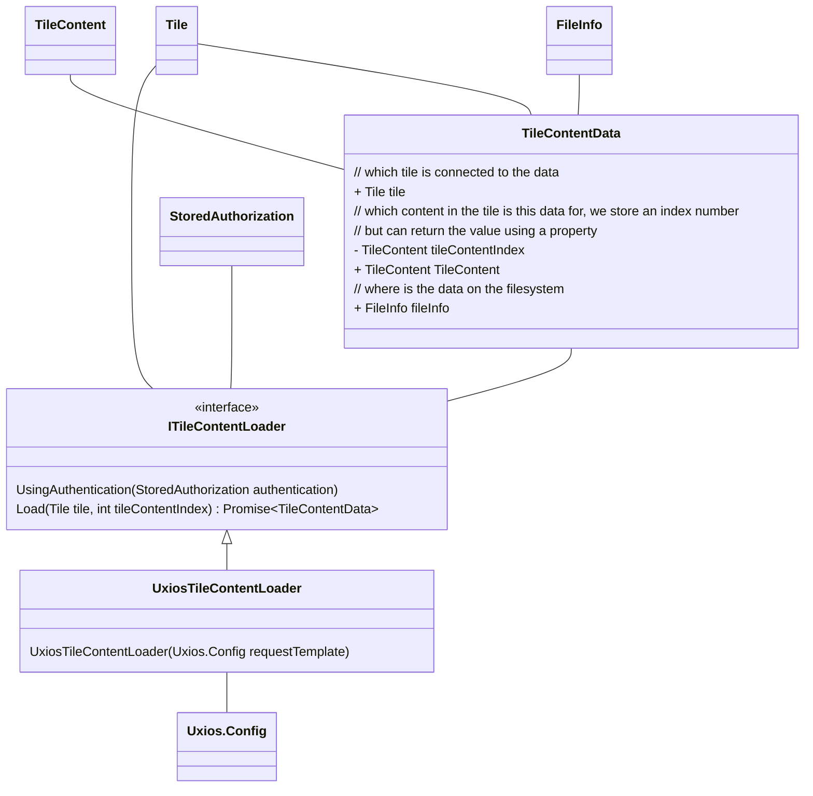

## Ophalen van data

- Moet Asynchroon middels promises
- Network requests moeten gethrottled kunnen worden opgehaald (per host)
    - Is dit een verantwoordelijkheid van de ChangeScheduler?
- Er moet er een retry mechanisme in komen
    - Is dat iets voor Uxios? https://dev.to/scrapfly_dev/how-to-retry-in-axios-5e87
    - Kijk naar https://cesium.com/learn/cesiumjs/ref-doc/Resource.html
- Injecteren van een sjabloon-request (Uxios.Config) voor, bijv, authenticatie en custom headers.
- Zowel remote als bestanden uit de persistent data storage kan worden opgehaald op een eenduidige manier
    - middels de HTTP Client Uxios.
    - Zie https://kind-men.github.io/uxios/guides/working-with-persistent-data/ voor bestanden in de Persistent Data Storage, en https://kind-men.github.io/uxios/guides/fetching-pokemon-using-get/ voor URLs.
- Filesystem abstractie?
    - Kunnen we hergebruiken wat er al is in het projectsysteem en daar een systeem van maken?
    - Dit zijn nu verschillende manieren; ik doel vooral op de `project://` prefix en het inladen daarvan
- Als we hier een aparte adapter van maken, dan kunnen we itereren op dit stuk en hoeft bovenstaande niet in een keer.
    - Gaan we met `project://` werken, of met `unity+persistent://`? Die laatste is Uxios, die eerste is onze eigen manier. Met de laatste kunnen we ook bestanden openen die niet in het project zijn maar wel in de persistent storage; nadeel is dat je je bestandslokaties moet weten
- Gaan we abstraheren, of juist op Uxios leunen? Dat eerste is flexibeler, dat tweede minder complex.
- TileContentLoader moet aan begin meegegeven worden
- Elke TileRenderer of de GameObject die geinstantieerd wordt wil toegang hebben tot de TileContentLoader? Of tot de TileContentData?

### Authenticatie en Autorisatie

Het bepalen van de juiste credentials voor een databron gebeurt vóór het inladen van een laag met Tilekit. Tilekit
voorziet hierin geen interactief loginmechanisme of eigen authenticatieflow.

In plaats daarvan gaat Tilekit ervan uit dat credentials reeds bekend zijn. Deze credentials worden vervolgens
geïnjecteerd in het sjabloon van alle HTTP-verzoeken die de [TileContentLoader](#tilecontentloader) gebruikt om tegels
op te halen.

Deze aanpak biedt de volgende voordelen:

- **Scheidt verantwoordelijkheden**: authenticatie wordt volledig uitbesteed aan een bovenliggende laag of reeds
  bestaand authenticatiemechanisme zoals het `Netherlands3D.Credentials` systeem.

- **Maakt Tilekit eenvoudiger en modulair**: er is geen noodzaak voor ingebouwde ondersteuning van verschillende
  authenticatieprotocollen binnen Tilekit zelf.

- **Ondersteunt variabele autorisatie-eisen per databron**: omdat elke TileContentLoader zijn eigen verzoek-sjabloon kan
  krijgen, kunnen per laag of bron andere headers, tokens of endpoints gebruikt worden.

Voorbeeld: een WFS-bron met een OAuth2-authenticatie kan door een aparte module een access token laten ophalen. Dit
token wordt vervolgens in de Authorization-header geplaatst van het HTTP-sjabloon waarmee de TileContentLoader tegels
ophaalt. Tilekit is hier volledig agnostisch in — zolang het sjabloon correct is ingevuld, zal de bron benaderd worden
met de juiste credentials.

In situaties waarin authenticatie moet worden hernieuwd (zoals bij vervallen tokens), ligt de verantwoordelijkheid bij
de bovenliggende laag om het sjabloon te vernieuwen of de TileContentLoader opnieuw te initialiseren met bijgewerkte
credentials.

### Flow

Vraag: moeten we een TileRenderer en TileContentRenderer hebben? Of is een Tile een algemene prefab die als container
gebruikt kan worden maar de TileRenderer eigenlijk een TileContentRenderer?

1. Een Change voor het toevoegen van een tegel wordt gestart
2. De change zoekt de juiste TileRenderer op en initieert het aanmaken van de tegel
3. De TileRenderer bevraagt de TileContents (meervoud) en voor elke TileContent gebruikt de TileContentLoader om
    1. een Request samen te stellen op basis van het Sjabloon request en de TileContent zijn URI, en
    2. het bestand te downloaden, en
    3. Zodra de download klaar is, de TileRenderer te informeren
4. Zodra alle TileContentData ingeladen is, dan
5. Gaat de TileRenderer de visualisatie aanmaken (PolygonVisualisation, Prefabs, etc)
6. Gaat de visualisatie de gedownloadde informatie toepassen (voorbeeld: Texture aan de nieuw aangemaakte DecalProjector koppelen)
7. Meld de TileRenderer de Change af als geslaagd

### Services

