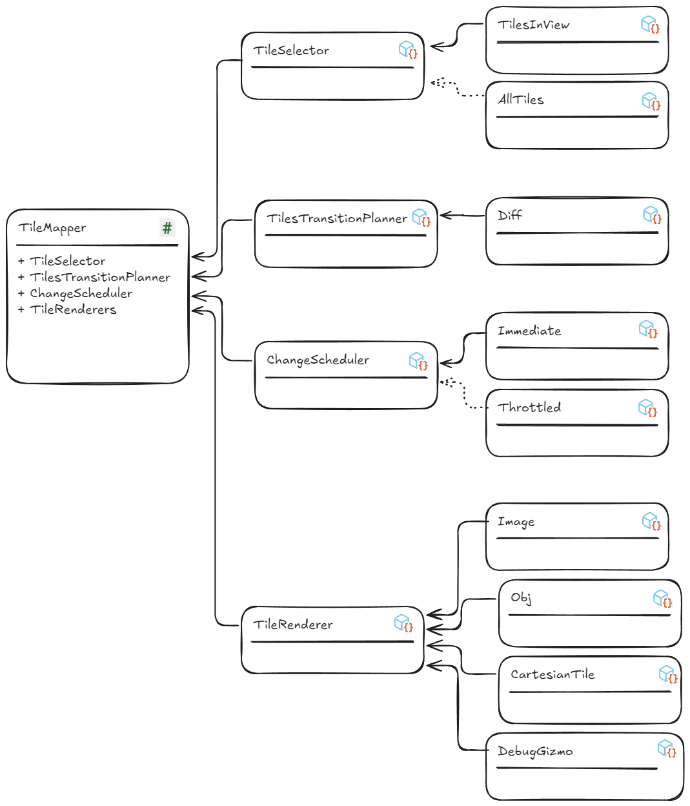

## Pluggable Architectuur

### Kenmerken

- Er is één MonoBehaviour dat als orchestrator,
  of [context](https://unity.com/how-to/scriptableobjects-delegate-objects#pluggable-behavior), werkt - de
  [TileMapper](#tilemapper).
- Een serie ScriptableObjects dat ieder 1 specifieke functie heeft, zoals de [TileSelector](#tileselector), ChangeScheduler,
  TilesTransitionPlanner.
- Elke van deze ScriptableObjects representeert een [Strategy](https://refactoring.guru/design-patterns/strategy).
- Elke functie kan hiermee makkelijk vervangen worden door een andere implementatie

*Voorbeeld*:

> Zie [https://unity.com/how-to/scriptableobjects-delegate-objects#pluggable-behavior](https://unity.com/how-to/scriptableobjects-delegate-objects#pluggable-behavior)
> voor een beschrijving van Unity, en [https://refactoring.guru/design-patterns/strategy](https://refactoring.guru/design-patterns/strategy)
> voor meer informatie over het Strategy Design Pattern.

### Waarom?

- **Vertegeling is complex** - door opsplitsen in kleine verantwoordelijkheden is het makkelijk om van elk onderdeel te
  zien wat het moet doen
- **Toekomstbestendig** - door een aantal functionaliteiten te maken met duidelijke boundaries kan ieder onderdeel
  individueel vervangen worden zonder grote refactorings
- **Modulair** - functionaliteiten, zoals WMS en WFS, kunnen specifieke implementaties van functies bijdragen -zoals
  maken van de [TileSet](#tileset) op basis van GetCapabilities- zonder dat het de rest hoeft te raken
- **Minder uitzonderingen** - code doet maar een ding en heeft daarmee ook minder uitzonderingen; als een
  functionaliteit een bijzonderheid heeft die niet gevangen wordt in de bestaande implementaties, dan kan je een
  specifieke implementatie maken voor die functionaliteit.
