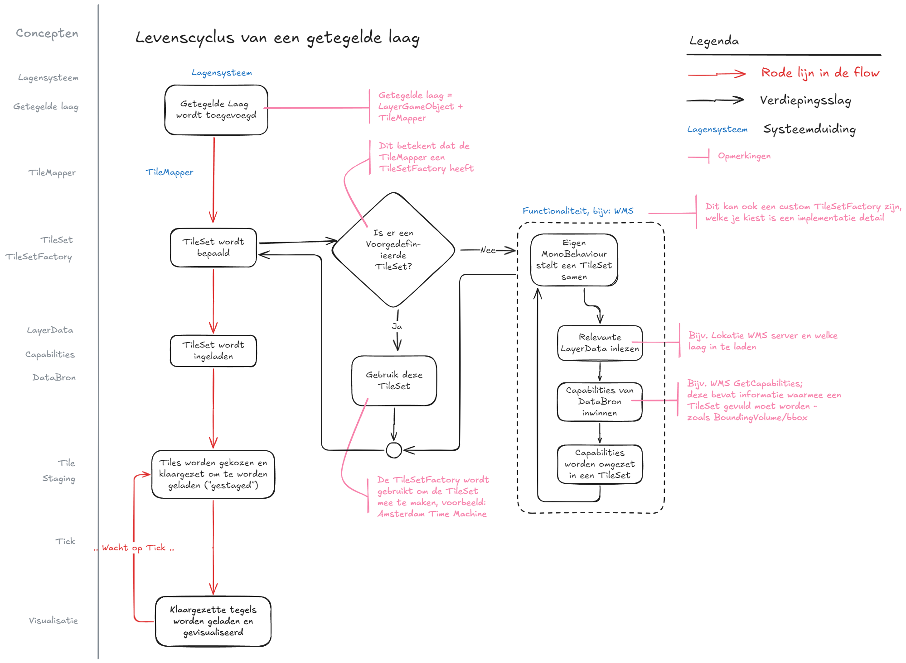
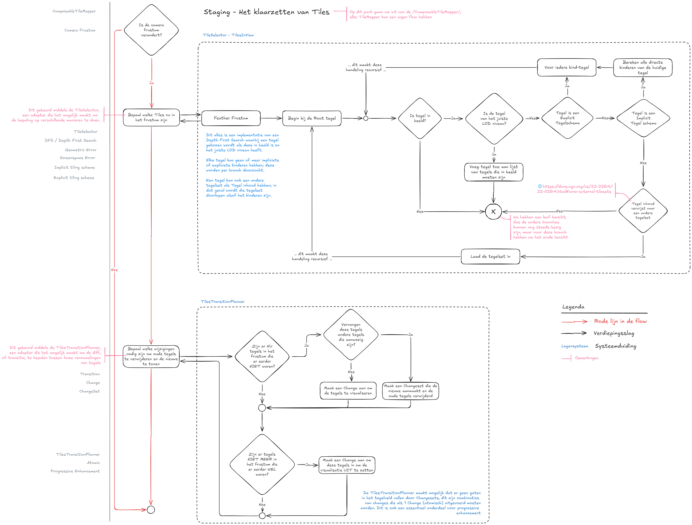
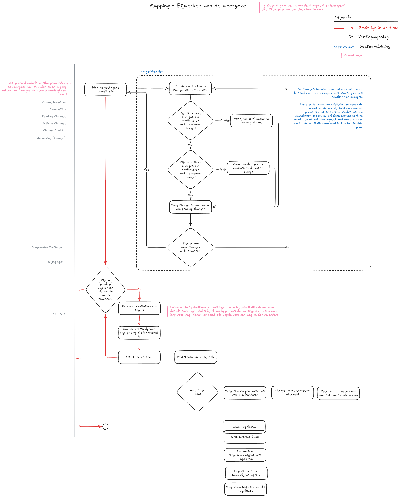
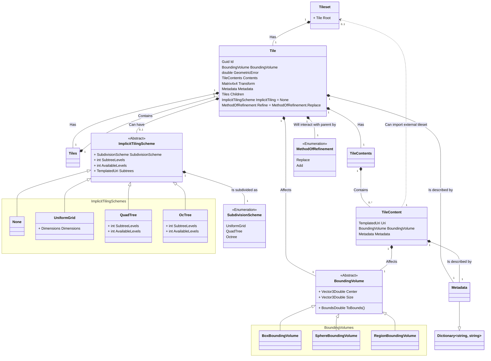
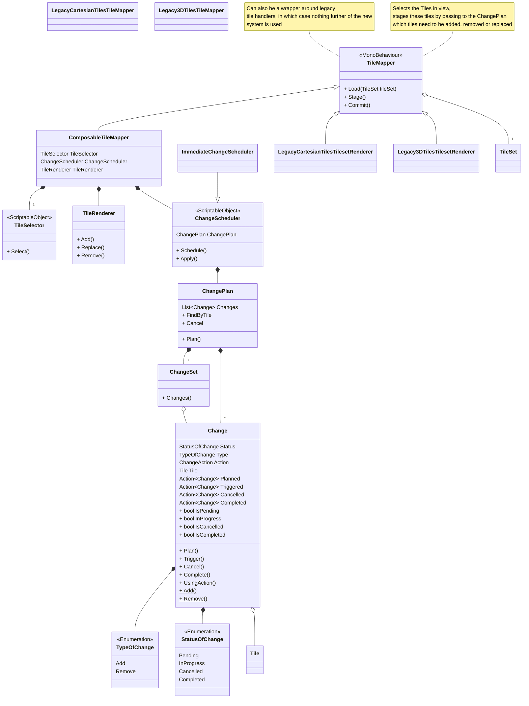

# Tegelsysteem

## Doelen

### Functionaliteit

- **Uitbreidbaarheid**

    - Ondersteuning voor nieuwe GIS-standaarden (WFS, OGC API Features, WMS)
    - Ondersteuning voor extra bestandsformaten (PNG, Raster, GLB, FBX, OBJ)

- **Laagstructuur & Databronnen**

    - Eén TileSet kan meerdere lagen visualiseren vanuit gedeelde bron (bijv. WMS)
    - Eén TileSet kan tegels uit andere TileSets bevatten als remote TileSet

- **Authenticatie**

    - Ondersteuning voor afgeschermde bronnen met authenticatie

- **Featurebeheer**

    - Features kunnen in meerdere tegels voorkomen, maar worden slechts eenmaal gerenderd; zie [Features](#7-features).
    - Features moeten bevraagd kunnen worden middels querying.

- **Styling & Events**

    - Event-systeem voor beïnvloeding van tegels (bijv. styling bij creatie)
    - Mechanisme voor verversen van tegels bij runtime-styling

### Tilingstructuur

- **LOD-ondersteuning (HLOD)**

    - Variabele tegelgrootte (zoals 3D Tiles)
    - Variabele databron (zoals Cartesian Tiles)
    - Combinatie van beide (bijv. WMS op afstand/lokaal)

- **Tilingmodellen**

    - *Impliciet tiling* voor wereld-dekkende datasets
    - *Expliciet tiling* voor vooraf gedefinieerde hiërarchieën

- **Geometric Error Threshold**

    - Instelbare fouttolerantie voor LOD-keuze

### Architectuur & Techniek

- **Gebaseerd op field-tested standaarden en concepten**

    - 3D Tiles
    - GeoJSON
    - OGC API
        - Tiles
        - Tile Matrix Sets
        - Maps
        - Features
    - OGC WMS
    - OGC WMTS
    - OGC WFS

- **Coördinaten & Projectie**

    - Abstract Coordinate System; projectie door developers configureerbaar.
    - Aanbevolen: EPSG:4978 (XYZ)
    - Ondersteuning voor EPSG:4979 (lat/lon/height) in bounding volumes

- **Floating Origin**

    - Compatibel zonder directe koppeling

- **Unity-integratie**

    - Intuïtieve structuur met MonoBehaviours & ScriptableObjects voor configuratie

### Niet-functionele aspecten

- **Performance**

    - Caching van tegels en datasets
    - Minimaliseren van geheugenverbruik (WebGL-geschikt)
    - Actieve resource-opruiming vereist

- **Robuustheid**

    - Fouttolerantie bij netwerkproblemen of externe fouten

- **Gebruiksvriendelijkheid**

    - Eenvoudig beheer en uitbreiding van datasets

- **Debugging**

    - Visuele tools voor tile-analyse en debugging

- **Laadstrategie**

    - *Progressive enhancement*: eerst goedkope, daarna detail
    - *Prioritering*: nabijgelegen tegels eerst laden

## Expliciete en impliciete TileSets

Bij het ontwerpen van een tegelsysteem maken we onderscheid tussen **expliciete** en **impliciete**
tegelsystemen. Beide benaderingen beschrijven hoe tegels binnen een (hiërarchische) structuur worden georganiseerd en
aangesproken, maar ze verschillen fundamenteel in hoe deze wordt gedefinieerd.

### Expliciet Tegelsysteem

Een expliciet tegelsysteem beschrijft elke tegel individueel, inclusief zijn positie, relatie tot andere tegels en
metadata. Hierbij maken we gebruik van een vooraf gedefinieerde lijst van tegels in de TileSet. Elke tegel kent zijn
kinderen expliciet, inclusief verwijzingen naar onderliggende tegels.

**Kenmerken**

- Structuur is volledig gespecificeerd.
- Onderlinge relaties (ouder-kind) zijn expliciet gedefinieerd.
- Geschikt voor complexe hiërarchieën of geoptimaliseerde datastructuren.
- Maakt vaak gebruik van LOD's (Levels of Detail) per tegel.

**Voordeel:** Volledige controle en flexibiliteit over de positie, hiërarchie en metadata per tegel.  
**Nadeel:** Grotere initiële payload en ongeschikt voor grootschalige datasets.

### Impliciet Tegelsysteem

Een impliciet tegelsysteem beschrijft geen individuele tegels, maar maakt gebruik van een algoritme om tegels
af te leiden op basis van een vaste structuur. Dit systeem is schaalbaar en efficiënt, omdat de hiërarchie en locatie
van een tegel volledig kunnen worden afgeleid uit de tegel-ID.

Netherlands3D ondersteunt binnen het impliciete systeem drie hoofdstructuren:

**1. Quadtree** De quadtree-structuur deelt de ruimte op in vier gelijke kwadranten per niveau. Elke tegel heeft
maximaal vier kinderen (NO, NW, ZO, ZW). Deze structuur is ideaal voor tweedimensionale datasets of geografische
informatie.

**2. Octree** De octree is de driedimensionale tegenhanger van de quadtree. Elke tegel wordt opgesplitst in acht
kinderen, waarbij de ruimte langs de x-, y- en z-as wordt gehalveerd. Deze structuur is geschikt voor volumetrische
datasets of 3D-scènes met LOD.

**3. Uniform Grid** Bij een uniform grid worden tegels op een vlak verdeeld in een vast raster, zonder hiërarchie. Dit
type wordt meestal gebruikt wanneer elke tegel gelijkwaardig is en er geen behoefte is aan dynamische detaillering
of LOD.

**Kenmerken van impliciete systemen:**

- Hiërarchie wordt bepaald door een patroon (bijv. depth en tile indices).
- Geen beschrijving van elke individuele tegel nodig: structuur is afleidbaar.
- Lichtgewicht en geschikt voor grote datasets.
- Relaties worden bepaald door index-berekening in plaats van expliciete verwijzingen.

**Voordeel:** Hoge schaalbaarheid en lage overhead.  
**Nadeel:** Minder flexibiliteit voor per-tegel metadata of uitzonderingen.

Zie https://github.com/CesiumGS/3d-tiles/blob/main/specification/ImplicitTiling/README.adoc voor details hoe de 3D Tiles
specificatie omgaat met Impliciete Tiling, Tilekit zijn ontwerp is gebaseerd op deze principes met extra ondersteuning
voor uniforme grids.

## Levenscyclus van een kaartlaag



De levenscyclus van een kaartlaag bestaat uit de volgende stappen:

1. **Inladen van een laag**: in dit stadium worden de capabilities opgehaald van de gekozen databron, en
   omgezet in Tilekit zijn eigen tegelset definitie. Dit garandeert dat het klaarzetten van de tegels en het bijwerken
   van de weergave altijd dezelfde informatie hebben, ongeacht de bron.
2. **Klaarzetten van tegels ([Staging](#staging))**: Bij het klaarzetten van tegels wordt bepaald welke tegels ingeladen
   en ontladen moeten worden; hierbij wordt gekeken naar de actuele situatie, een gewenste situatie en lopende
   wijzigingen om te bepalen welke wijzigingen in de wachtrij gezet moeten worden.
3. **Bijwerken van de weergave ([Mapping](#mapping))**: In dit stadium wordt de wachtrij van wijzigingen afgelopen en
   wijzigingen ingestart en gemonitored.

Het klaarzetten van de tegels ([Staging](#staging)) en het bijwerken van de weergave ([Mapping](#mapping)) is een
herhalend proces. De standaard aanname van Tilekit is dat een Timer klasse geimplementeerd is die beide stadia in
volgorde afhandeld; maar Tilekit ondersteunt ook dat het stagen en mappen door andere processen worden uitgevoerd.

!!!tip "Staging en mapping zijn idempotent"

    Bovenstaande betekent staging en mapping geen afhankelijkheid mogen hebben en dat beide
    handelingen [Idempotent](#idempotent) zijn. Staging mag meermaals uitgevoerd kunnen worden voordat mapping wordt
    uitgevoerd en andersom.
    
    Deze ontwerpkeuze is fundamenteel om asynchrone handelingen te ondersteunen omdat de mapping fase alleen een change
    kan starten, maar de change zelf meerdere frames en cycli van staging zou kunnen duren.

### Inladen van een TileSet

In hoofdstuk [7.4. Datamodel](#74-datamodel) is beschreven welke elementen de definitie van een TileSet heeft. Hiermee
kan je flexibel een breed scala aan tegelsystemen mee weergeven, maar dit van begin af aan inrichten is een uitdaging
zonder de effecten te weten van alle knoppen waar je aan kan draaien.

Om dit proces te versimpelen zijn er 2 ondersteunende services die gebruikt kunnen worden om op een simpele manier een
TileSet te kunnen configureren:

1. **TileSetBuilder**, een [Builder](https://refactoring.guru/design-patterns/builder) service waarmee je met een paar
   korte instructies tiles kan builden en een TileSet valideren.
2. **TileSetFactory**, een [Factory](https://refactoring.guru/design-patterns/factory-method) service waarmee je in een
   keer een gehele TileSet instantieert met een specifieke configuratie.

Middels dit proces kunnen willekeurige databronnen omgezet worden in TileSet definities, en uniform afgehandeld worden
in de rest van het systeem.

#### Voorwaarden voor een valide TileSet

**Spatial Coherence**

Bij het omzetten van de data van een databron naar expliciete tegels is van belang dat de bounding volume van alle
tegels [Spatial Coherence](#spatial-coherence) hebben. Deze beperking zorgt ervoor dat tegels benaderd kunnen worden als
een R-tree datastructuur en geeft optimalisatiemogelijkheden, zoals het volledig overslaan van een complete branch aan
tegels als de applicatie niet eens in de buurt is.

!!!info "Voorbeeld"

    Als we ergens in Nederland naar een lokatie kijken dan kunnen we alle tegels -van elk LOD niveau- overslaan buiten
    Nederland, zoals Duitsland of geheel Afrika. Dit kan alleen als de tegels in Nederland Spatial Coherence hebben.

**Aanwezigheid van een Geometrische Error**

Elke tegel moet een geometricError waarde bevatten. Deze waarde, uitgedrukt in meters, geeft aan hoeveel detail er
verloren gaat als deze tegel wordt weergegeven in plaats van zijn fijnmazigere kindtegels. Zonder deze waarde
is automatische LOD-switching niet mogelijk.

**Oplopende Detailniveaus (Geometrische Hiërarchie)**

Kindtegels moeten altijd een lagere geometricError hebben dan hun ouder. Dit weerspiegelt de hiërarchische structuur van
het tegelsysteem, waarbij lagere niveaus (meer gedetailleerde tegels) nauwkeuriger zijn.

Als deze relatie niet klopt, kan de applicatie verkeerde beslissingen nemen over welke tegel in beeld moet komen, met
visuele artefacten of onnauwkeurigheden als gevolg. Het afdwingen van deze regel zorgt ervoor dat LOD-logica zoals
Screen Space Error correct werkt.

#### TileSetBuilder

De TileBuilder biedt een aantal gemaksfuncties waarmee een TileSet gemakkelijk opgebouwd kan worden. Aangezien een
TileSet zelf bestaat uit een paar korte instructies en vervolgens een boomstructuur aan Tile objecten zal de TileBuilder

Voorbeeld:

```csharp
quadTreeTileBuilder = TileSetBuilder.QuadTree(bounds);

```

#### TileSetFactory


### Staging

De Staging fase in de [TileMapper](#tilemapper) is bedoeld om te bepalen welke tegels in- en
uitgeladen moeten worden om in de [7.3.4. Mapping](#734-mapping) fase dit in gang te kunnen zetten. De staging fase, net
als de mapping fase is bedoeld om [idempotent](#idempotent) uitgevoerd te worden. Dit betekent dat het mogelijk is om
meermaals deze stap uit te kunnen voeren en dat de uitkomst altijd 1-op-1 toegepast kan worden in de mapping fase.



Het staging proces is verdeeld in 3 stappen:

1. Welke tegels zijn er nu in beeld middels de `TilesInView` verzameling
2. Welke tegels moeten er in beeld komen middels een `TileSelector` service
3. Welke wijzigingen moeten worden uitgevoerd om van de huidige naar de nieuwe situatie te komen -genaamd
   een [Transition](#transition) - middels een [TilesTransitionPlanner](#tilestransitionplanner).

#### Tegel selectie

De TileSelector is een service die bepaald welke tegels er in beeld zouden moeten zijn. Van de TileSelector kunnen
meerdere strategieen zijn, degene die standaard toegepast wordt is de "TilesInView" tile selector.

De TilesInView tile selector zal middels een "Depth First Search" de TileSet definitie doorlopen. Depth First Search
is een recursief zoek algoritme waarbij je begint met een enkele "root" tegel, en vervolgens de volgende vragen stelt:

1. Is deze tegel in beeld?
    1. Als de tegel **niet** in beeld is, dan eindigt onze zoektocht. Deze tegel wordt niet geladen en we negeren zijn
       kinderen,
    2. Anders:
2. Is het type van refinement "Add" of "Replace"?
    1. is het type "Replace", dan starten we een serie van geselecteerde tegels
    2. is het type "Add", dan voegen we deze tegel toe aan de serie van geselecteerde tegels
3. Is dit het juiste LOD voor deze tegel?
    1. Als de juiste LOD van een tegel gevonden dan onthouden we de serie aan geselecteerde tegels,
    2. Anders: herhaal deze stappen voor elke kind-tegel van deze tegel

Aan het einde van deze handeling zouden we een lijst moeten hebben van tegels die in beeld moeten gaan zijn. In stap 2
is dus van belang dat we niet altijd op zoek zijn naar 1 tegel in een aftakking van de R-tree. Het is ook mogelijk
een reeks aan kinderen te verkrijgen omdat bij een ADD de kind tegel niet de ouder tegel vervangt, maar juist in
combinatie met een ouder tegel wordt ingeladen.

// TODO Update schema, en controleer de exacte werking als afwisselend ADD en REPLACE door elkaar gebruikt worden

**Wat is "de juiste LOD"?**

Tegels moeten een "Geometric Error" hebben. De geometric error is een maat (in meters) die zegt hoe "grof" een tegel is
in vergelijking met zijn fijnere kinderen. Het komt neer op: hoeveel detail je mist als je deze tegel toont in plaats
van zijn onderliggende (meer gedetailleerde) tegels.

Tijdens het draaien van de app gebruiken we deze geometricError om te bepalen of een tegel voldoende detail geeft op het
scherm. Dat doen we door het om te rekenen naar screen space error (SSE) – dat is de fout uitgedrukt in pixels op je
scherm.

Bijvoorbeeld:

- Stel: een tegel heeft een geometricError van 50 meter.
- Als die 50 meter visueel overeenkomt met 10 pixels op het scherm, dan is de SSE = 10.
- Als je een maximum SSE van bijvoorbeeld 8 pixels hanteert, dan weet je: deze tegel moet worden vervangen door zijn
  kinderen, want hij is niet precies genoeg.

**Bepalen van de juiste LOD**

De `TileSelector` gebruikt onderstaande logica om te bepalen of een tegel voldoende detail biedt:

1. **Bepaal het dichtstbijzijnde punt** van de bounding volume van de tegel ten opzichte van de camera.
2. **Bereken de afstand** van de camera tot dit punt, aangeduid als `distanceToCamera`.
3. **Bereken de screen space error (SSE)** met de formule:

   ```
   SSE = (geometricError / distanceToCamera) * schermProjectieFactor
   ```

   In ons systeem is de `schermProjectieFactor` altijd **1**. Dit betekent dat deze vermenigvuldiging in de praktijk kan
   worden weggelaten, waardoor de vereenvoudigde formule in code vaak als volgt wordt gebruikt:

   ```
   SSE = geometricError / distanceToCamera
   ```

4. **Vergelijk met de ingestelde drempelwaarde** `maximumScreenSpaceError`:
    - Als `SSE > maximumScreenSpaceError`: de tegel is niet gedetailleerd genoeg → *zoom in* naar kindtegels.
    - Als `SSE <= maximumScreenSpaceError`: deze tegel is voldoende → *toon deze* en stop het inzoomen.

!!! warning "**Let op**: als `distanceToCamera` bijna nul is (bijvoorbeeld als de camera zich binnen de bounding volume van een tegel bevindt), dan wordt de SSE oneindig groot. In dat geval wordt de SSE behandeld als `float.MaxValue`."

### Mapping

!!! danger "Dit hoofdstuk is nog in ontwikkeling."



- Tegels mogen pas "InView" als een change succesvol afgemeld is
- Tegel GameObjecten kunnen er al zijn voordat een Tegel in view is; dan kan een Change nog pending zijn
- Als een dergelijke change geannuleerd wordt; dan moet het gameobject opgeruimd worden
    - Ergo: Changes moeten een Cancel mogelijkheid hebben, die een contra actie/opruim actie uitvoert
- Een Tegel kent een aantal dingen
    - de "Tile" definitie uit de TileSet
    - de Tegeldata - zoals de GeoJSON - die uit een WFS ingeladen is
    - een visualisatie - zoals een GameObject of PolygonVisualiser?

## Verversen van tegels

Externe factoren, zoals styling of filtering, kunnen reeds ingeladen tegels beïnvloeden. Wanneer dit gebeurd is het
nodig om tegels te kunnen verversen.

Om dit te kunnen doen, is het nodig dat een tegel gemarkeerd kan worden als
**[Dirty](https://gameprogrammingpatterns.com/dirty-flag.html)**. Dit geeft aan dat een tegel zijn staat moet
terugbrengen naar de "primaire staat" - zoals deze ontvangen was van de brondata - en dan opnieuw alle aanpassingen
toepast, zoals Styling of Filtering.

De volgende voorwaarden zijn hierbij van belang:

* Dit gebeurt niet onmiddellijk, maar op zijn minst 1 frame later -of zelfs langer- zodat niet
  onnodig bewerkingen uitgevoerd worden.
* Het verversen van een enkele tegel is een synchroon proces zodat er geen verstoring voor de gebruikersbeleving.

Als een ingrijpendere wijziging nodig is, dan moet de tegel vervangen worden middels een [ChangeSet](#changeset) zodat
de oude tegel in beeld blijft en een nieuwe tegel asynchroon wordt aangemaakt.

## Datamodel

!!!todo

    Kijk naar https://github.com/CesiumGS/3d-tiles/blob/main/specification/ImplicitTiling/README.adoc#availability om na
    te gaan of er een betere manier is om de ID van een tegel te bepalen middels de Morton Z-order curve.

!!!todo
    
    Dit ontwerp is niet optimaal voor memory, dit moet herzien worden. Vooral het gebruik van hierarchieen van tegels is
    vanuit OOP interessant - maar niet vanuit geheugen gezien. Een enkele lijst waarbij aan tegels wordt gerefereerd 
    met hun identifiers is veel interessanter




- TileContent mag ook verwijzen naar een externe tileset: https://docs.ogc.org/cs/22-025r4/22-025r4.html#core-external-tilesets

## Services



Projector has been omitted from the scheme above because I need to think about it

Middlewares for styling need to be added
