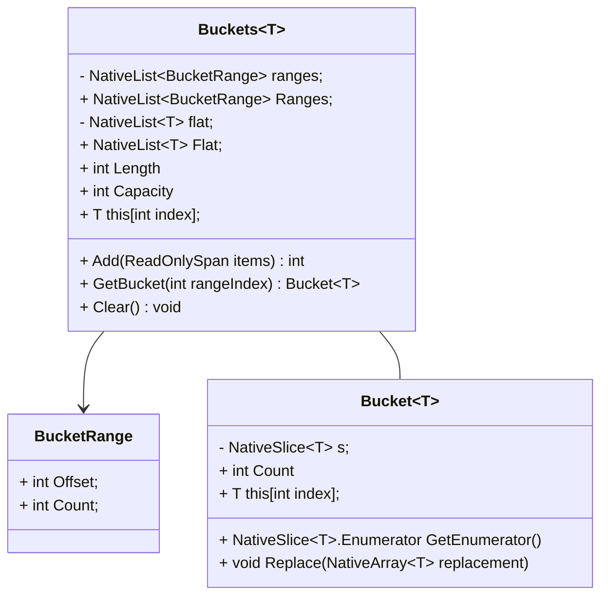
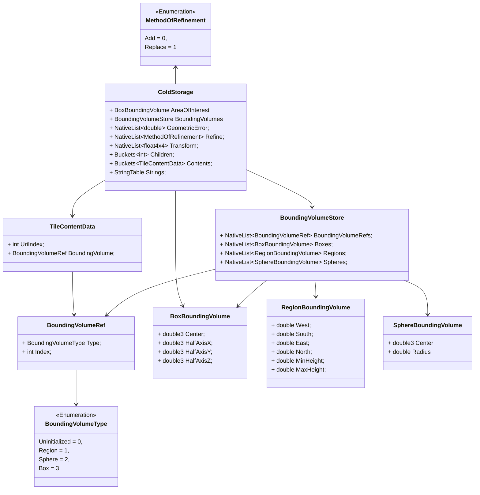

# Tegelsysteem

- **Coördinaten & Projectie**

    - Abstract Coordinate System; projectie door developers configureerbaar.
    - Aanbevolen: EPSG:4978 (XYZ)
    - Ondersteuning voor EPSG:4979 (lat/lon/height) in bounding volumes

- **Floating Origin**

    - Compatibel zonder directe koppeling

## Expliciete en impliciete TileSets

Bij het ontwerpen van een tegelsysteem maken we onderscheid tussen **expliciete** en **impliciete**
tegelsystemen. Beide benaderingen beschrijven hoe tegels binnen een (hiërarchische) structuur worden georganiseerd en
aangesproken, maar ze verschillen fundamenteel in hoe deze wordt gedefinieerd.

### Expliciet Tegelsysteem

Een expliciet tegelsysteem beschrijft elke tegel individueel, inclusief zijn positie, relatie tot andere tegels en
metadata. Hierbij maken we gebruik van een vooraf gedefinieerde lijst van tegels in de TileSet. Elke tegel kent zijn
kinderen expliciet, inclusief verwijzingen naar onderliggende tegels.

**Kenmerken**

- Structuur is volledig gespecificeerd.
- Onderlinge relaties (ouder-kind) zijn expliciet gedefinieerd.
- Geschikt voor complexe hiërarchieën.

**Voordeel:** Volledige controle en flexibiliteit over de positie, hiërarchie en metadata per tegel.  
**Nadeel:** Grotere initiële payload en ongeschikt voor grootschalige datasets.

### Impliciet Tegelsysteem

Een impliciet tegelsysteem beschrijft geen individuele tegels, maar maakt gebruik van een algoritme om tegels
af te leiden op basis van een vaste structuur. Dit systeem is schaalbaar en efficiënt, omdat de hiërarchie en locatie
van een tegel volledig kunnen worden afgeleid uit de tegel-ID.

Netherlands3D ondersteunt binnen het impliciete systeem drie hoofdstructuren:

**1. Quadtree** De quadtree-structuur deelt de ruimte op in vier gelijke kwadranten per niveau. Elke tegel heeft
maximaal vier kinderen (NO, NW, ZO, ZW). Deze structuur is ideaal voor tweedimensionale datasets of geografische
informatie.

**2. Octree** De octree is de driedimensionale tegenhanger van de quadtree. Elke tegel wordt opgesplitst in acht
kinderen, waarbij de ruimte langs de x-, y- en z-as wordt gehalveerd. Deze structuur is geschikt voor volumetrische
datasets of 3D-scènes met LOD.

**3. Uniform Grid** Bij een uniform grid worden tegels op een vlak verdeeld in een vast raster, zonder hiërarchie. Dit
type wordt meestal gebruikt wanneer elke tegel gelijkwaardig is en er geen behoefte is aan dynamische detaillering
of LOD.

**Kenmerken van impliciete systemen:**

- Hiërarchie wordt bepaald door een patroon (bijv. depth en tile indices).
- Geen beschrijving van elke individuele tegel nodig: structuur is afleidbaar.
- Lichtgewicht en geschikt voor grote datasets.
- Relaties worden bepaald door index-berekening in plaats van expliciete verwijzingen.

**Voordeel:** Hoge schaalbaarheid en lage overhead.  
**Nadeel:** Minder flexibiliteit voor per-tegel metadata of uitzonderingen.

Zie https://github.com/CesiumGS/3d-tiles/blob/main/specification/ImplicitTiling/README.adoc voor details hoe de 3D Tiles
specificatie omgaat met Impliciete Tiling, Tilekit zijn ontwerp is gebaseerd op deze principes met extra ondersteuning
voor uniforme grids.

## Levenscyclus van een kaartlaag

De levenscyclus van een kaartlaag bestaat uit de volgende stappen:

1. **Inladen van een laag**: in dit stadium worden de capabilities opgehaald van de gekozen databron, en
   omgezet in Tilekit zijn eigen tegelset definitie - de Cold Storage. Dit garandeert dat het klaarzetten van de 
   tegels en het bijwerken van de weergave altijd dezelfde informatie hebben, ongeacht de bron.
2. **Warm maken van tegels (verwarmen)**: 
3. **Hot maken van de tegels (verhitten)**: 

### Inladen van een TileSet

In hoofdstuk [7.4. Datamodel](#74-datamodel) is beschreven welke elementen de definitie van een TileSet heeft. Hiermee
kan je flexibel een breed scala aan tegelsystemen mee weergeven.

#### Voorwaarden voor een valide TileSet

**Spatial Coherence**

Bij het omzetten van de data van een databron naar expliciete tegels is van belang dat de bounding volume van alle
tegels [Spatial Coherence](#spatial-coherence) hebben. Deze beperking zorgt ervoor dat tegels benaderd kunnen worden als
een R-tree datastructuur en geeft optimalisatiemogelijkheden, zoals het volledig overslaan van een complete branch aan
tegels als de applicatie niet eens in de buurt is.

!!!info "Voorbeeld"

    Als we ergens in Nederland naar een lokatie kijken dan kunnen we alle tegels -van elk LOD niveau- overslaan buiten
    Nederland, zoals Duitsland of geheel Afrika. Dit kan alleen als de tegels in Nederland Spatial Coherence hebben.

**Aanwezigheid van een Geometrische Error**

Elke tegel moet een geometricError waarde bevatten. Deze waarde, uitgedrukt in meters, geeft aan hoeveel detail er
verloren gaat als deze tegel wordt weergegeven in plaats van zijn fijnmazigere kindtegels. Zonder deze waarde
is automatische LOD-switching niet mogelijk.

**Oplopende Detailniveaus (Geometrische Hiërarchie)**

Kindtegels moeten altijd een lagere geometricError hebben dan hun ouder. Dit weerspiegelt de hiërarchische structuur van
het tegelsysteem, waarbij lagere niveaus (meer gedetailleerde tegels) nauwkeuriger zijn.

Als deze relatie niet klopt, kan de applicatie verkeerde beslissingen nemen over welke tegel in beeld moet komen, met
visuele artefacten of onnauwkeurigheden als gevolg. Het afdwingen van deze regel zorgt ervoor dat LOD-logica zoals
Screen Space Error correct werkt.

#### Tegel selectie

De TileSelector is een service die bepaald welke tegels er in beeld zouden moeten zijn. Van de TileSelector kunnen
meerdere strategieen zijn, degene die standaard toegepast wordt is de "TilesInView" tile selector.

De TilesInView tile selector zal middels een "Depth First Search" de TileSet definitie doorlopen. Depth First Search
is een recursief zoek algoritme waarbij je begint met een enkele "root" tegel, en vervolgens de volgende vragen stelt:

1. Is deze tegel in beeld?
    1. Als de tegel **niet** in beeld is, dan eindigt onze zoektocht. Deze tegel wordt niet geladen en we negeren zijn
       kinderen,
    2. Anders:
2. Is het type van refinement "Add" of "Replace"?
    1. is het type "Replace", dan starten we een serie van geselecteerde tegels
    2. is het type "Add", dan voegen we deze tegel toe aan de serie van geselecteerde tegels
3. Is dit het juiste LOD voor deze tegel?
    1. Als de juiste LOD van een tegel gevonden dan onthouden we de serie aan geselecteerde tegels,
    2. Anders: herhaal deze stappen voor elke kind-tegel van deze tegel

Aan het einde van deze handeling zouden we een lijst moeten hebben van tegels die in beeld moeten gaan zijn. In stap 2
is dus van belang dat we niet altijd op zoek zijn naar 1 tegel in een aftakking van de R-tree. Het is ook mogelijk
een reeks aan kinderen te verkrijgen omdat bij een ADD de kind tegel niet de ouder tegel vervangt, maar juist in
combinatie met een ouder tegel wordt ingeladen.

!!!todo 
    Update schema, en controleer de exacte werking als afwisselend ADD en REPLACE door elkaar gebruikt worden

!!!todo
    Onderzoeken of een BEAM of BFS search beter werkt.

**Wat is "de juiste LOD"?**

Tegels moeten een "Geometric Error" hebben. De geometric error is een maat (in meters) die zegt hoe "grof" een tegel is
in vergelijking met zijn fijnere kinderen. Het komt neer op: hoeveel detail je mist als je deze tegel toont in plaats
van zijn onderliggende (meer gedetailleerde) tegels.

Tijdens het draaien van de app gebruiken we deze geometricError om te bepalen of een tegel voldoende detail geeft op het
scherm. Dat doen we door het om te rekenen naar screen space error (SSE) – dat is de fout uitgedrukt in pixels op je
scherm.

Bijvoorbeeld:

- Stel: een tegel heeft een geometricError van 50 meter.
- Als die 50 meter visueel overeenkomt met 10 pixels op het scherm, dan is de SSE = 10.
- Als je een maximum SSE van bijvoorbeeld 8 pixels hanteert, dan weet je: deze tegel moet worden vervangen door zijn
  kinderen, want hij is niet precies genoeg.

**Bepalen van de juiste LOD**

De `TileSelector` gebruikt onderstaande logica om te bepalen of een tegel voldoende detail biedt:

1. **Bepaal het dichtstbijzijnde punt** van de bounding volume van de tegel ten opzichte van de camera.
2. **Bereken de afstand** van de camera tot dit punt, aangeduid als `distanceToCamera`.
3. **Bereken de screen space error (SSE)** met de formule:

   ```
   SSE = (geometricError / distanceToCamera) * schermProjectieFactor
   ```

   In ons systeem is de `schermProjectieFactor` altijd **1**. Dit betekent dat deze vermenigvuldiging in de praktijk kan
   worden weggelaten, waardoor de vereenvoudigde formule in code vaak als volgt wordt gebruikt:

   ```
   SSE = geometricError / distanceToCamera
   ```

4. **Vergelijk met de ingestelde drempelwaarde** `maximumScreenSpaceError`:
    - Als `SSE > maximumScreenSpaceError`: de tegel is niet gedetailleerd genoeg → *zoom in* naar kindtegels.
    - Als `SSE <= maximumScreenSpaceError`: deze tegel is voldoende → *toon deze* en stop het inzoomen.

!!! warning "**Let op**: als `distanceToCamera` bijna nul is (bijvoorbeeld als de camera zich binnen de bounding volume van een tegel bevindt), dan wordt de SSE oneindig groot. In dat geval wordt de SSE behandeld als `float.MaxValue`."

## Verversen van tegels

Externe factoren, zoals styling of filtering, kunnen reeds ingeladen tegels beïnvloeden. Wanneer dit gebeurd is het
nodig om tegels te kunnen verversen.

Om dit te kunnen doen, is het nodig dat een tegel gemarkeerd kan worden als
**[Dirty](https://gameprogrammingpatterns.com/dirty-flag.html)**. Dit geeft aan dat een tegel zijn staat moet
terugbrengen naar de "primaire staat" - zoals deze ontvangen was van de brondata - en dan opnieuw alle aanpassingen
toepast, zoals Styling of Filtering.

De volgende voorwaarden zijn hierbij van belang:

* Dit gebeurt niet onmiddellijk, maar op zijn minst 1 frame later -of zelfs langer- zodat niet
  onnodig bewerkingen uitgevoerd worden.
* Het verversen van een enkele tegel is een synchroon proces zodat er geen verstoring voor de gebruikersbeleving.

## Datamodel

In het datamodel maken we onderscheid tussen drie niveau's:

- Ondersteunende data objecten, zoals Buckets in Memory management - deze objecten zijn bedoeld om in een schrijfmodel
  gebruikt te worden maar representeren technische concepten, in tegenstelling tot domein concepten in de 
  applicatie.
- Schrijf-model, zoals de Cold Storage - deze objecten vormen de geheugen-geoptimaliseerde maar complexe SoA kern van 
  Tilekit. Aanpassingen in deze classes zijn gevoelig en moeten goed geprofiled worden.
- Lees-model, zoals de Tile klasse of de BoundingVolume - dit is een laag bovenop het schrijf-model dat op een meer 
  begrijpelijke manier toegang geeft en meer lijkt op een Object Oriented Programming manier van omgaan met data. Wat
  hier van belang is, is dat het leesmodel zelf geen data heeft maar alleen verwijzingen naar waar de data in het 
  schrijf-model verkregen kan worden.

!!!todo

    Kijk naar https://github.com/CesiumGS/3d-tiles/blob/main/specification/ImplicitTiling/README.adoc#availability om na
    te gaan of er een betere manier is om de ID van een tegel te bepalen middels de Morton Z-order curve.

### Memory management

In Tilekit wordt geheugenbeheer geoptimaliseerd door gebruik te maken van compacte, vooraf gealloceerde buffers—ook wel
buckets genoemd. In plaats van traditionele dynamische datastructuren, die leiden tot frequente allocaties en
geheugenfragmentatie, werken deze buckets met ranges die verwijzen naar delen van een vaste buffer. Hierdoor kan het
systeem toch dynamische data opslaan en uitbreiden, zonder dat het onderliggende geheugen beweegt of opnieuw gealloceerd
hoeft te worden.

Deze aanpak vermindert fragmentatie, verhoogt cache-efficiëntie, en maakt het mogelijk om grote hoeveelheden tegels en
tile-metadata te beheren binnen strikte geheugenlimieten. Het klassediagram hieronder toont hoe de belangrijkste 
geheugenbeheer-klassen samenwerken om dit model te ondersteunen.



#### Buckets

De `Buckets`-class fungeert als een efficiënte wrapper rond twee NativeList-structuren:

1. Flat – een lineaire NativeList<T> waarin alle data compact achter elkaar wordt opgeslagen.
2. Ranges – een NativeList<BucketRange> waarin per bucket wordt bijgehouden waar in de Flat-buffer de data staat
   (startindex + lengte).

Met deze combinatie kunnen we dynamische datasets opslaan zonder dynamische datastructuren te hoeven gebruiken. Nieuwe
of groeiende datasets worden simpelweg achteraan de Flat-buffer geplaatst, en de bijbehorende BucketRange wijst naar het
relevante segment.

Dankzij deze ranges kan het systeem zeer snel een slice ophalen—een “bucket”—zonder kopiëren of extra allocaties. De
Flat blijft compact en fragmentatie wordt voorkomen.

#### Bucket

De `Bucket`-klasse is een dunne wrapper rond een `NativeSlice<T>`. Een `NativeSlice` verwijst rechtstreeks naar een deel 
van een onderliggende buffer — in dit geval het Flat-array van de `Buckets`-class — zonder eigen geheugen te bezitten.

Omdat een `Bucket` dus slechts een view is op bestaande data:

- Kan data direct worden gelezen alsof het een kleine, zelfstandige collectie is.
- Kan data ook worden overschreven of gemodificeerd, waarbij de wijzigingen meteen in het oorspronkelijke Flat-array
  terechtkomen.
- Hoeft er nooit een kopie gemaakt te worden, wat zowel allocaties als geheugenfragmentatie voorkomt.

### Schrijf-model

Het schrijf-model is een geheugen-geoptimaliseerde Structure of Array (SoA) opzet waarbij tegels niet als 
tegel-objecten, maar als arrays van velden worden opgeslagen - zie de ColdStorage klasse. Elk array representeert een 
veld van een tegel - zoals de geometrische error - en de index van elk array is gelijk aan de tegel index.

!!!example

    Stel dat je een tegel met id 42 hebt, dan kan van elk van deze arrays index 42 bevraagd worden en dan heb je de 
    data voor die tegel.

Om het gebruik te vergemakkelijken hiervan is een lees-model ingericht (zie volgende hoofdstuk) waar middels handles,
of referenties, een wrapper is gemaakt om een meer object-georienteerde, en daarmee herkenbare, manier van bevragen aan
te bieden.

De centrale klasse hierin is de `ColdStorage` klasse, deze bevat de data voor een verzameling tegels; veelal gebruikt 
voor een enkele laag in de applicatie.

Dit deel van Tilekit is heftig geoptimaliseerd voor geheugen (her)gebruik, en dit is ook te zien in hoe de data 
structuren zijn gemaakt. Elk van deze arrays is een NativeList met een vooraf ingestelde capaciteit die groot genoeg 
moet zijn om in 90% van de situaties niet te hoeven resizen. Hierdoor krijg je bij het toevoegen van een laag 1x 
meerdere allocaties maar vervolgens tijdens de levensduur van de laag geen nieuwe allocaties van tegel-data.

!!! note "Het kan wel gebeuren dat bij het laden van `Content` allocaties plaatsvindt. Dit kan gemitigeerd worden door middel van object pooling maar niet 100% voorkomen."

Voor het wijzigen van het schrijf-model gelden de volgende regels:

- **Allocatie van tegel-data mag alleen tijdens het aanmaken van een laag**, hiermee heb je een vast geheugenbudget om mee 
  te werken en beperkt fragmentatie.
    - _Uitzondering_: het resizen van een laag als blijkt dat er meer data nodig is, tune de applicatie dat dit nooit of 
      zelden gebeurd, en resize in vaste blokgroottes voor optimaal hergebruik van de geheugenruimte als een laag 
      gedisposed wordt.
- **Werk alleen met NativeLists of NativeArrays van data met een vooraf ingestelde grootte**. Door het gebruik van unmanaged
  memory verminder je de druk op de garbage collector en kan Unity bepaalde caching trucs uitvoeren die helpen.
- **Vermijd reference types zoveel mogelijk** - reference types kunnen niet gebruikt worden in NativeLists en NativeArrays 
  en kunnen een complete value type toch de managed heap in trekken.
- **Gebruik de kleinst mogelijke data structuren**, inclusief het voorzien van een `byte` type aan enums als deze een kleine
  set elementen gebruiken.
- Over enums gesproken - **alle enums in de write model moeten value-backed zijn**, dus een expliciete numerieke waarde toe-
  gewezen hebben. Dit maakt het gebruik hiervan voorspelbaarder.
- **Inheritance van objecten is niet mogelijk**, door het gebruik van structs kan je geen inheritance gebruiken en 
  inheritance nodigt boxing uit, waardoor extra allocaties plaatsvinden tijdens uitvoering.

Hieronder zie je een overzicht van de klassen die in de kern van het schrijf-model gebruikt worden:



#### Cold Storage

ColdStorage vormt de laagste trede in de tegel hiërarchie en is het minimale opslagpunt voor alle tegels. Waar warm en 
hot tiles daadwerkelijk materiaal, geometrie of rendering-gerelateerde data bevatten, bewaart ColdStorage uitsluitend de 
structurele en ruimtelijke metadata die nodig is om een tile te identificeren, selecteren en prioriteren.

##### Doel van de ColdStorage

Het doel van ColdStorage is om een volledig overzicht van alle potentiële tegels in een dataset te behouden, zonder
kostbare resources zoals texturen, meshes of decoded payloads in het geheugen te laden. 

Hierdoor kan Tilekit:

- grote tegelpiramides en diepe hiërarchieën ondersteunen
- snel bepalen welke tegels relevant zijn voor de camera
- soepele overgang naar warm/hot states realiseren (lifecycle-beheer)
- memory-fragmentatie minimaliseren door SoA-opslag

ColdStorage is ontworpen voor schaalbaarheid, vooral richting provinciale of nationale datasets, waarvele tiles in 
metadata-vorm beschikbaar moeten zijn.

##### Inhoud van ColdStorage

Een ColdStorage bevat voor elke tile:

- **BoundingVolume** — box, region of sphere
- **Geometric error** (of resolutiebereik)
- **Tijdsbereik** (optioneel, voor spatiotemporele datasets)
- **Verwijzingen naar kinderen** of informatie uit het tiling scheme
- **Contentinformatie** (zoals URL of index naar content mapping)

Cruciaal is dat deze data blittable en SoA-georiënteerd is opgeslagen in NativeArrays of NativeLists, zodat iteratie,
culling en selectie extreem goedkoop blijven — ook in WebGL.

##### Het interessegebied

ColdStorage wordt altijd gecreëerd voor een specifiek interessegebied (area of interest). Dit gebied bepaalt hoeveel van
de tile piramide wordt gematerialiseerd.

Het interessegebied:

- Bepaalt welke tiles geselecteerd worden bij ingestie - wanneer een dataset wordt ingelezen (bijvoorbeeld WMS, WMTS, 
  3D Tiles of GeoJSON), worden alleen die tiles opgenomen waarvan het bounding volume snijdt met het interessegebied. 
  Dit voorkomt dat ColdStorage onnodig groot wordt.
- Vermindert de diepte van de piramide - omdat tegels die volledig buiten het interessegebied vallen worden uitgesloten, 
  bevat ColdStorage alleen de relevante delen van de hiërarchie.

#### Bounding Volumes

Een tegel of content element, heeft een locatie en afmeting in de wereld. Dit wordt middels een bounding volume geduid.
De bounding volume komt in drie vormen (box, sphere en region) en worden in meer detail beschreven in de 3D Tiles 
specificatie.

Doordat het schrijf-model geheugen-geoptimaliseerd werkt, is het niet mogelijk om middels polymorfisme een abstracte 
bounding volume toe te wijzen aan een tegel en dan een kind-klasse daarvan op die plek te zetten. Dit breekt met 
geheugen alignment en zal fragmentatie en allocaties door boxing veroorzaken.

Als gevolg hiervan is er de `BoundingVolumeStore`, wat een Structure of Arrays is speciaal voor bounding volumes. Elk
element dat een bounding volume nodig heeft, heeft eigenlijk een `BoundingVolumeRef`. De `BoundingVolumeRef` is een 
verwijzing binnen de `BoundingVolumeStore` naar de juiste array en index in die array van het type bounding volume die 
je wil toepassen.

De impact hiervan is dat je 'teveel' geheugen gebruikt omdat voor elk type bounding volume een versie onthouden wordt,
dit is voor de complexiteit een acceptabele trade-off.

!!!todo

    We willen onderzoeken of de huidige bounding-volume opslag geoptimaliseerd kan worden. Momenteel slaan we voor elke 
    tile drie varianten op (box, sphere, region) terwijl er maar één actief is, wat onnodig veel geheugen kost.

    Voorstel om te onderzoeken:

    - Gebruik één platte NativeArray<double> als opslag voor alle bounding-volume data.
    - Gebruik daarnaast een NativeArray<BoundingVolumeIndex> met:
        - Kind (Box/Sphere/Region)
        - Offset naar de juiste positie in de double-array.
    - Definieer per volume-type een vaste lengte in doubles (bijv. Box = 12, Sphere = 4, Region = 6).
    - Maak read-model “views” (BoxView, SphereView, RegionView) die via offset + values het volume exposen, i.p.v. 
      volledige structs op te slaan.
    - Onderzoek of NativeSlice<double> of offset-gebaseerde toegang het meest efficiënt is in jobs.
    - Centraliseer de allocatie en het wegschrijven van volumes in één API, zodat type-lengtes en offsets foutloos blijven.
    
#### TileContentData

Elke tegel kent een of meer content elementen, de tile content data is een structuur waarin we bijhouden welke content
in welk deel van de tegel beschikbaar is.

!!!example

    Een voorbeeld is een omgevingsmodel waarbij elke tegel een maaiveld mesh heeft, een mesh met bomen en een mesh met 
    gebouwen. Dit zijn drie content elementen op dezelfde tegel. Zie de 3D Tiles specificatie voor meer informatie.

Content, in deze context, is data die gevisualiseerd kan worden als onderdeel van de tegel. Voorbeelden zijn textures 
en meshes. In de Cold Storage wordt niet de content zelf opgeslagen, maar alleen verwijzingen daarnaar middels de 
`UriIndex` - hetgeen een referentie is naar een element in een speciale string table.

!!!todo
    De string table voor het opslaan van uri's kan op verschillende manieren geoptimaliseerd worden, het is aan te raden
    om niet naar 1 op 1 string storage te kijken maar om de-duping mogelijk te maken van onderdelen in de url. Door
    een URL te splitsen op scheme, host, pad-segmenten en query parameters en elk van deze als losse strings met integer
    referenties op te slaan kan de hoeveelheid string, of character, data geoptimaliseerd worden.

Content in de tile content data kan ook beperkt zijn tot een bepaald gebied, of middels een bounding volume geplaatst 
zijn op een specifieke plek - hierbij is van belang dat spatial coherence gerespecteerd moet blijven en de bounding 
volume van de content spatially coherent is met die van de tegel.