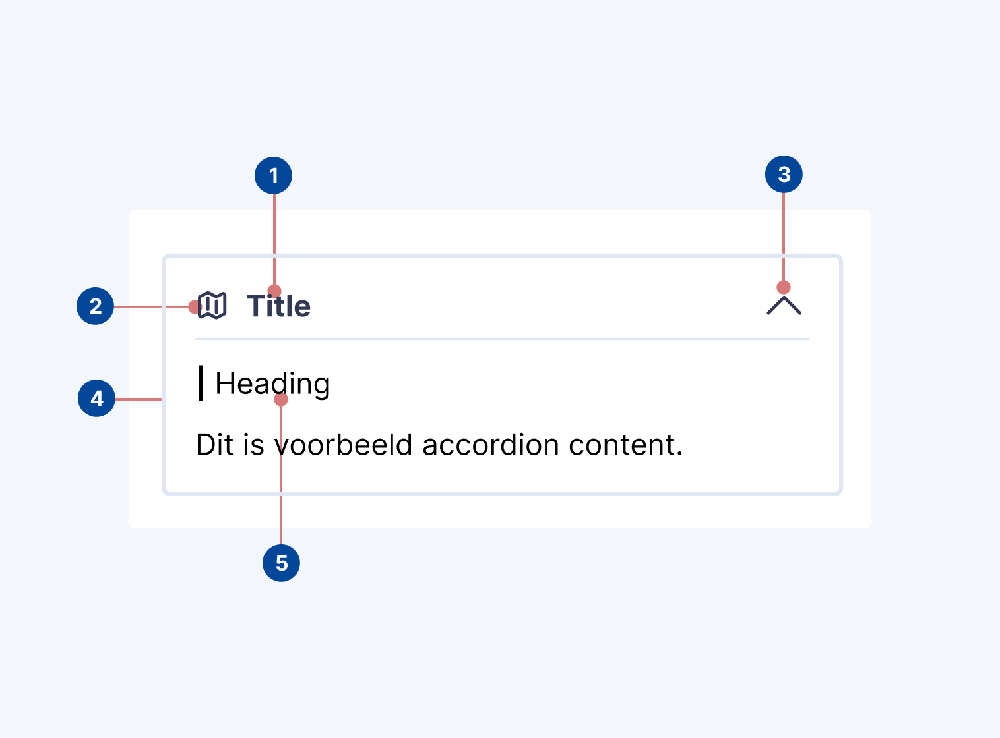

# Accordion

## Design

### Usage

The Accordion component in the Netherlands3D platform is a versatile UI element designed to efficiently manage and
display hierarchical content in a compact form. Featuring a title, an optional label, and a toggle mechanism indicated
by a chevron, the Accordion allows for an organized presentation of content sections, each with its dedicated header to
signify its integration within the Accordion. This component is ideal for:

* Settings Menus: Grouping related settings or options to streamline user navigation, such as layer property sections.

* Grouping Content: Grouping related content to focus on related information, such as quality indicator dossiers.

* Interactive FAQs: Presenting frequently asked questions in a concise, expandable format.

### Modes of Operation

1. Fixed Mode: This mode locks the Accordion in an always-open state, without the option to collapse or expand. The
   absence of a chevron signifies its static nature.

2. Multiple Open Mode: Allows for multiple Accordions within a group to be opened or closed independently. The chevron
   points up when opened, indicating a "roll-up" action, and down when closed, suggesting a "roll-down" action.

3. Single Open Mode: In a group of Accordions, only one can be open at a time. Opening another Accordion automatically
   closes the previously open one. This mode features a chevron pointing down when closed; and when open, the chevron is
   hidden, supplemented by an additional outline to highlight the Accordion is considered to be an active -or selected-
   Accordion.

### Anatomy

<figure markdown="span">
  
  <figcaption>Anatomical breakdown of the Accordion component</figcaption>
</figure>

1. **Title**: A text representative of the Accordion's content.

2. **Icon (Optional)**: Provides additional context or classification.

3. **Expand/Contract Toggle (Optional)**: A chevron-based toggle mechanism indicating the Accordion's state and 
   possible actions.

4. **Content Section**: The expandable area containing detailed content or components.

5. **Content Header**: A header within the content section styled specifically to emphasize its connection to the 
   Accordion.

### Design Principles

#### Title and Icon

The title provides a succinct summary of the content contained within the Accordion, while the optional icon offers 
additional context or categorization.

Both elements are designed to be immediately visible to enhance usability and guide the user's navigation through the 
content sections.

#### Expand/Contract Toggle

The Expand/Contract Toggle includes a chevron symbol that visually communicates the Accordion's state and possible 
actions to the user. The direction of the chevron indicates the effect of the interaction (down for roll-down, up for 
roll-up).

The toggle may be absent when there is no action available, as can be the case for the fixed mode of operation or when
no roll-up is provided because one element always needs to be open.

#### Content Section

The content section beneath each Accordion title is designed for expandability, housing detailed information or 
additional UI components.

Optionally, a specific header within the content section further emphasizes its association with the Accordion.

### Best Practices

* **Clarity**: Ensure the title and label (if used) are clear and informative, guiding the user's understanding of the
  content within.

* **Intuitive Interaction**: Design the Expand Toggle for easy recognition and interaction, with chevron icons that
  intuitively indicate the possible actions.

* **Consistency**: Maintain visual and functional consistency across all Accordion components, especially within groups
  operating in multiple or single open modes.

## Implementation

!!! info

    As of writing, there is no component in Unity available to provide the Accordion component. This part of the 
    documentation should be updated as soon as one is available.
