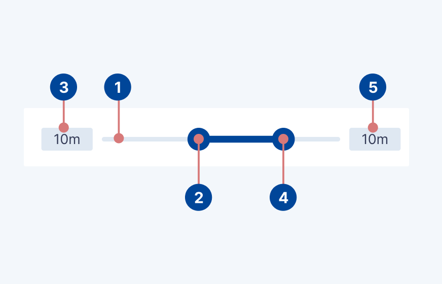

# Double Slider

## Design

### Usage

Similar to the slider component, the double slider component in the Netherlands3D platform provides 
a graphical interface element enabling users to select a range between two values from a predefined scale. 
Accompanied by two Text Fields, this component allows for both graphical adjustment
and direct numerical input, ensuring a versatile and user-friendly experience. The main difference between
the double slider and the regular slider is that the double slider has two handles and input fields,
defining the minimum and maximum value of the range.

#### Immediate effects

Changes made with double sliders are immediate, allowing the user to make slider adjustments while determining a selection.
Sliders shouldn’t be used to adjust settings with any delay in providing user feedback.

#### Current state

Sliders reflect the current state of the settings they control.

### Anatomy

<figure markdown="span">
  
  <figcaption>Anatomical breakdown of the double slider component</figcaption>
</figure>

1. Slider Track: The horizontal line along which the double slider thumb moves, representing the range of possible values.
2. Minimum Slider Thumb: The circular control that users drag to select the minimum value on the slider track.
3. Minimum Text Field (Optional): Adjacent to the double slider, this field displays the currently selected minimum value and allows for manual
   entry. It can be configured as readonly or omitted based on specific requirements.
4. Maximum Slider Thumb: The circular control that users drag to select the maximum value on the slider track.
5. Maximum Text Field (Optional): Adjacent to the double slider, this field displays the currently selected maximum value and allows for manual
   entry. It can be configured as readonly or omitted based on specific requirements.
## Implementation

This chapter guides you through adding the double slider prefab to your scene, configuring its behavior, and responding to user
input.

### Adding the Slider to Your Scene

1. **Prefab Placement:** Locate the double slider prefab in the project's asset directory. Drag and drop the prefab into your
   scene or hierarchy where you need the slider component to appear.

3. **Initial Setup:** By default, the double slider comes with linked Text Fields for numerical input. Together, they provide
   a cohesive component for value selection.

### Configuring the Slider

#### Listening to Value Changes

Use the Unity Editor to attach a listener function to the slider's `onMinValueChanged` and `onMaxValueChanged` events. These functions will be called
whenever the slider's minimum or maximum value changes, respectively, whether through direct manipulation of the double slider or numerical entry in the Text
Fields.

#### Customizing the Text Field

- **Readonly Option:** The `DoubleSlider` MonoBehaviour includes a `readonly` boolean. When set to true, the Text
  Fields becomes readonly, allowing users to see the value but preventing manual entry. This is useful in situations
  where you want to restrict input to slider manipulation only.

- **Omitting the Text Field:** If your use case does not require numerical input, you can deactivate the Text Fields
  entirely. Simply set the Text Field GameObjects to inactive, and the double slider will automatically expand to fill the
  space, maintaining the UI's visual continuity.
