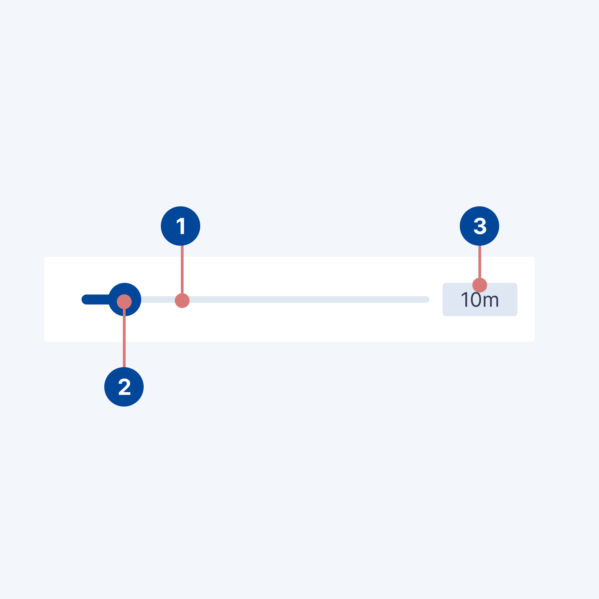

# Slider

## Design

### Usage

The slider component in the Netherlands3D platform provides a graphical interface element enabling users to select a
value or range from a predefined scale. Accompanied by a Text Field, this component allows for both graphical adjustment
and direct numerical input, ensuring a versatile and user-friendly experience.

#### Immediate effects

Changes made with sliders are immediate, allowing the user to make slider adjustments while determining a selection.
Sliders shouldn’t be used to adjust settings with any delay in providing user feedback.

#### Current state

Sliders reflect the current state of the settings they control.

### Anatomy

<figure markdown="span">
  
  <figcaption>Anatomical breakdown of the slider component</figcaption>
</figure>

1. Slider Track: The horizontal line along which the slider thumb moves, representing the range of possible values.
2. Slider Thumb: The circular control that users drag to select a value on the slider track.
3. Text Field (Optional): Adjacent to the slider, this field displays the currently selected value and allows for manual
   entry. It can be configured as readonly or omitted based on specific requirements.

## Implementation

This chapter guides you through adding the slider prefab to your scene, configuring its behavior, and responding to user
input.

### Adding the Slider to Your Scene

1. **Prefab Placement:** Locate the slider prefab in the project's asset directory. Drag and drop the prefab into your
   scene or hierarchy where you need the slider component to appear.

3. **Initial Setup:** By default, the slider comes with a linked Text Field for numerical input. Together, they provide
   a cohesive component for value selection.

### Configuring the Slider

#### Listening to Value Changes

Use the Unity Editor to attach a listener function to the slider's `onValueChanged` event. This function will be called
whenever the slider's value changes, whether through direct manipulation of the slider or numerical entry in the Text
Field.

#### Customizing the Text Field

- **Readonly Option:** The `PropertySlider` MonoBehaviour includes a `readonly` boolean. When set to true, the Text
  Field becomes readonly, allowing users to see the value but preventing manual entry. This is useful in situations
  where you want to restrict input to slider manipulation only.

- **Omitting the Text Field:** If your use case does not require numerical input, you can deactivate the Text Field
  entirely. Simply set the Text Field GameObject to inactive, and the slider will automatically expand to fill the
  space, maintaining the UI's visual continuity.
