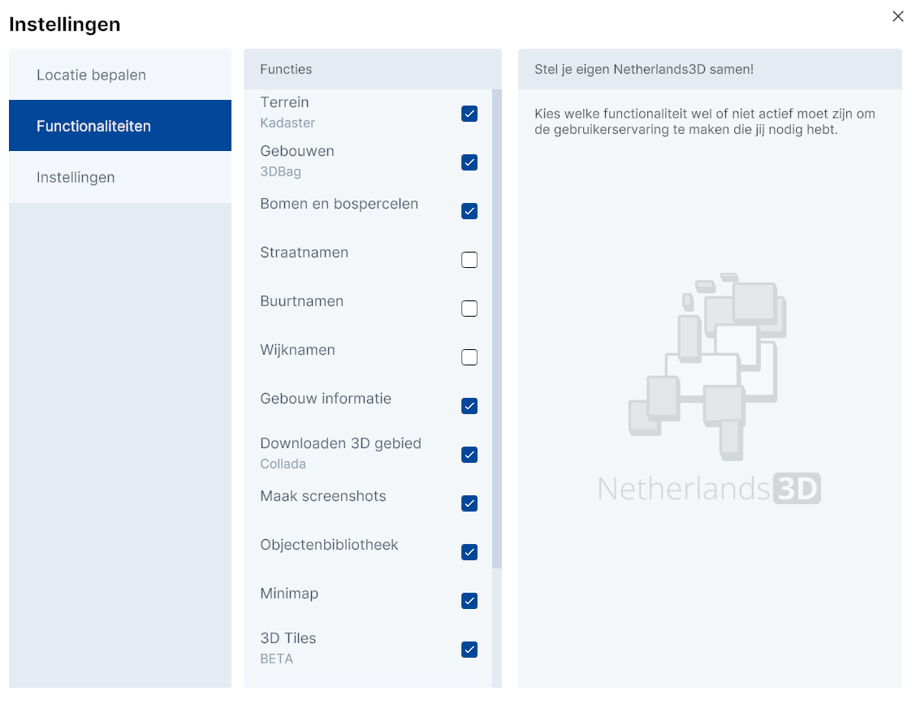

# Functionaliteiten
Stel je eigen Netherlands3D.eu samen!  
 
Met het submenu `Functionaliteiten` krijgt de gebruiker toegang tot het **aan-/uitzetten van de standaard datalagen en (menu)functies** die in de basis versie van Netherlands3d.eu wordt aangeboden.    

---

_(Afbeelding) Functionaliteiten - submenu_  
  
Klik in het `selectievakje` om de laag of functie aan of uit te zetten.   

---

## **Functies**

#### **Terreinen**
Met maaiveld, ofwel het 'oppervlak waarop we lopen' is weergegeven als 3D terrein. 
Voor het tonen van dit terrein is gebruik gemaakt van de 3D Basisvoorziening van het Kadaster. 
Visueel onderscheiden zijn gebouwen, terreinonderdelen (zoals wegen, groenvlakken en water) en bruggen, waarbij de 	gebouwen niet als 3D objecten worden getoond in deze laag. Op enkele onderdelen is een geometrische versimpeling 	toegepast om het maaiveld sneller in de viewer te tonen.
Bron: 3D Basisvoorziening, datum: 2019

#### **3DBag**
Alle objecten op de laag 'Gebouwen' komen uit de 3D BAG, een jaarlijks geactualiseerde dataset van alle gebouwen in 	Nederland. De set is ontwikkeld door de de 3D geoinformatie onderzoeksgroep van de Technische Universiteit Delft. Aan 	het gebruik van de 3D BAG zitten.
Bron: 3DBAG, datum: 2024, actualisatie: Jaarlijks

#### **Bomen en bospercelen**  
Deze kaartlaag toont alle individuele bomen en bospercelen van Nederland voor zover ze in de Basiskaart Grootschalige 	Topografie (BGT) zijn opgenomen. Binnen bospercelen wordt onderscheid gemaakt in loofbossen, naaldbossen en gemengde 	bossen, welke met een willekeurige hoogte en locatie zijn geplaatst. Bomen worden als 2D objecten op 3 vlakken 	geprojecteerd, waardoor het lijkt alsof ze 3D objecten zijn. 
Bron: Basiskaart Grootschalige Topografie (BGT), datum: december 2023

#### **Straatnamen**  
Deze kaartlaag toont alle straatnamen van Nederland. Afhankelijk van het zoomniveau worden straatnamen weergegeven. Bron: Nationaal Wegen Bestand (NWB)

#### **Buurtnamen**  
Deze kaartlaag toont alle buurtnamen van Nederland. Afhankelijk van het zoomniveau worden buurtnamen weergegeven. Bron: PDOK

#### **Wijknamen**  
Deze kaartlaag toont alle wijknamen van Nederland. Afhankelijk van het zoomniveau worden wijknamen weergegeven. Bron: PDOK

#### **Gebouw informatie**  
Maakt een koppeling tussen pandobjecten in de 3D viewer en administratieve data uit de Basisadministratie Adressen en Gebouwen (BAG) waardoor het mogelijk is gedetailleerde informatie over het pand, enkele pandkenmerken en de adressen daarbinnen op te vragen. Bron: Kadaster

#### **Downloaden 3D gebied (Collada en DXF)**  
Maakt het mogelijk alle 3D modellen uit de viewer te downloaden als een los 3D Collada (.dae) bestand of DXF (.dxf). Downloaden kan per tegel van 100x100m met een maximum van 16 tegels tegelijk.

#### **Maak screenshots**  
Maakt het mogelijk om van elke willekeurige camerapositie die actief is een schermafbeelding te maken, deze wordt opgeslagen als .png bestand.

#### **Objectenbibliotheek**  
Een aantal voorgedefinieerde objecten kunnen in de viewer worden geladen. Denk aan windmolens of verschillende type bomen. Objecten kunnen op willekeurige locaties geplaatst worden en bij sommige objecten zijn extra instellingen mogelijk.

#### **Minimap**  
Er wordt een minimap getoond waarin je als gebruiker snel naar een andere locatie kunt navigeren. Binnen de minimap geeft een selectiegebied of 'field of sight' aan welk deel van Nederland in het hoofdscherm in 3D wordt weergegeven.

#### **3D tiles**  
Maakt het mogelijk om gebouwen en maaiveld 3D Tiles lagen toe te voegen. Bron: PDOK

#### **Google RealityMesh**  
Toont voor delen van Nederland een foto-realistisch beeld van de omgeving.
Met de kaartlaag 'Google Reality Mesh' komt een fotorealistische laag beschikbaar in de 3D viewer. Voor grote delen van Nederland heeft Google een 3D model beschikbaar gesteld waar objecten in 3D herkenbaar worden weergegeven. Deze laag, die in 3D Tiles formaat wordt aangeboden, maakt het mogelijk om nog beter inzicht te krijgen in de werkelijke situatie.

#### **Zonnestand simuleren** 
Hiermee kan je de Zonnestand simuleren door tijd en datum aan te passen, of de zon in de slider op te pakken en te bewegen. Daarnaast kan je een schaduwstudie maken die de dan actieve camerapositie en geladen lagen opneemt in 12 png bestanden.

#### **UrbanReLeaf Sensor Data (BETA voor stad Utrecht)**  
Deze kaartlaag toont alle UrbanReLeaf sensor temperatuur data. Bron: PDOK

---