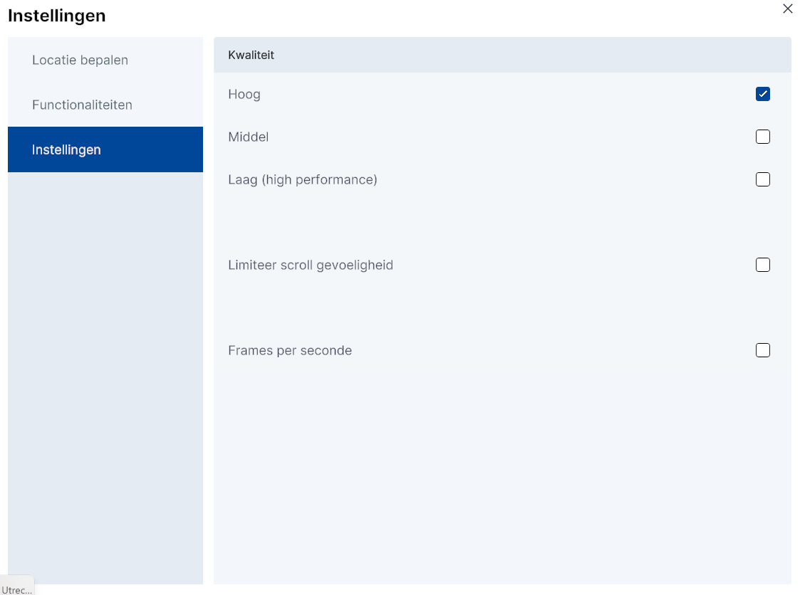

# Applicatie instellingen

/// caption
(Afbeelding) Applicatie instellingen  
///

## (Beeld)kwaliteit

Als standaard wordt de ingesteld op basis van de gebruikte computer. Daarnaast kan je in dit menu  de **performance van de 3D viewer** handmatig afstemmen op je persoonlijke situatie (snelheid internet, etc.). Door te kiezen voor `Hoog`, `Middel` of `Laag`, kan de (beeld)kwaliteit worden aangepast van resp.
hoge, middelmatige of lage kwaliteit. De optie `laag` biedt de snelste performance, maar geeft de minste grafische kwaliteit.

## Limiteer scroll gevoeligheid

In sommige gevallen reageert de 3D-viewer niet optimaal op de muisbewegingen van de gebruiker. Door de optie
`Limiteer scroll gevoeligheid` aan te vinken kan dit worden verbeterd.

## Frames per seconde
Als je deze instelling aanvinkt dan zie je rechtsboven in je scherm het aantal frames per seconde van de viewer. Dit kan helpen te bepalen welke beeldkwaliteits instelling te kiezen

---

Klik op `x` (rechtsboven) om het instellingenmenu af te sluiten. Hierna toont de 3D-viewer het [default] startpunt; het
centrum van Amersfoort.
