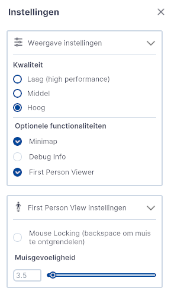

/// caption
(Afbeelding) 3D-Viewer startscherm
///

Het instellingenmenu is onderverdeeld in de functies;  

* [Locatie bepalen (Link)](../3D-viewer-locatie-bepalen/)
* [Functionaliteiten (Link)](../3D-viewer-functionaliteiten/)
* [Instellingen-submenu (Link)](../3D-viewer-instellingen-sub/)

---