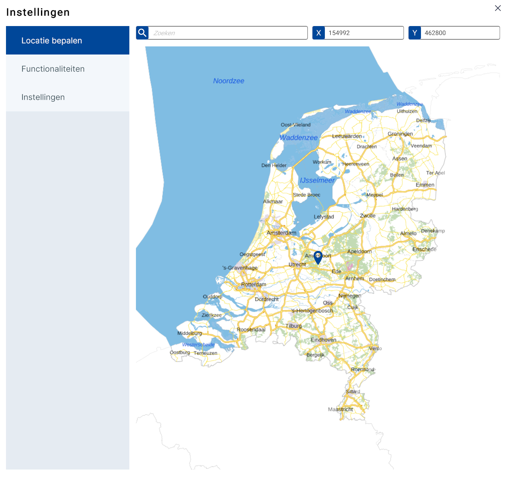

# Locatie bepalen
  
_(Afbeelding) Locatie bepalen - submenu_  
 
Met deze functie kun je de **locatie invoeren**. Dit kan op drie manieren;
<ol>
<li>Door met de muis op een locatie in de map te klikken</li>   
<li>Door het invoeren van een plaats-, straatnaam en/of postcode</li>   
<li>Door bij X, Y een coördinaat* in te voeren</li>
</ol>  

!!! tip "Waarom kan ik geen gps-coördinaten invoeren?"

	(*) Het coördinatenstelsel van Netherlands3d.eu is gebaseerd op het RD-coördinatenstelsel.  
	Lees [hier](https://www.kadaster.nl/zakelijk/registraties/basisregistraties/rijksdriehoeksmeting/rijksdriehoeksstelsel) (externe link) meer over het RD-coördinatenstelsel.

---