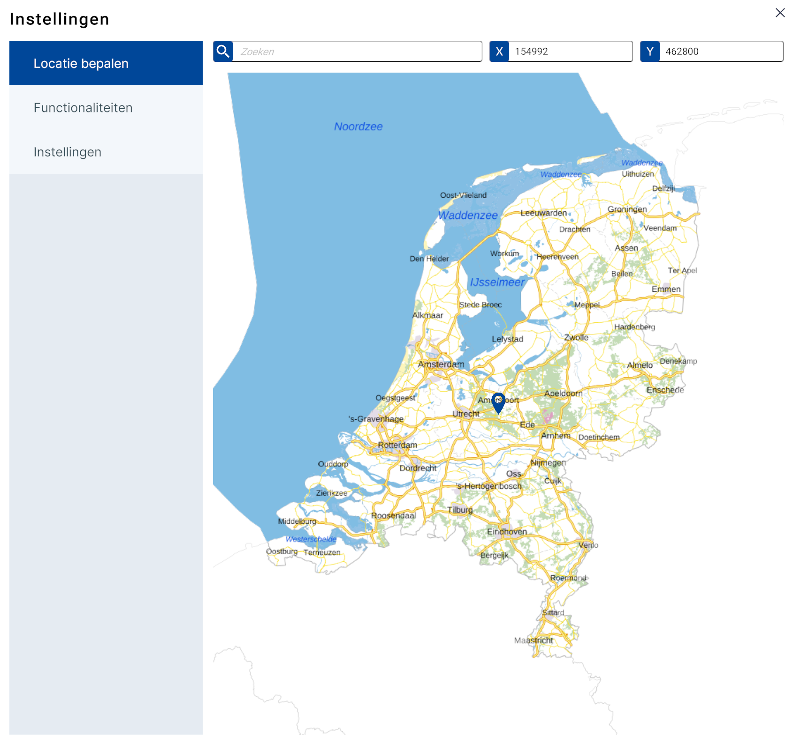
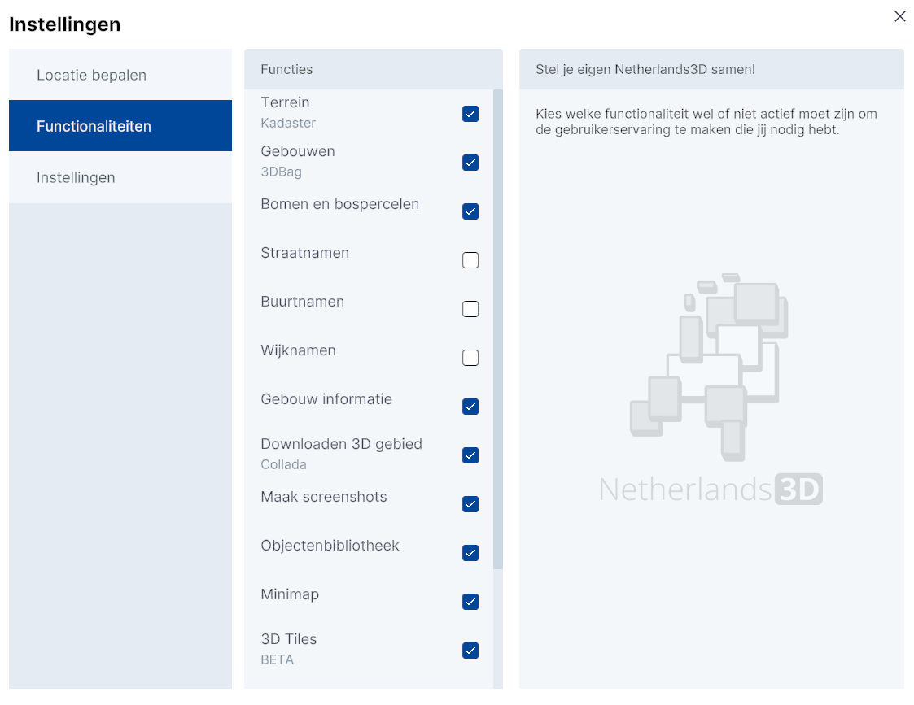
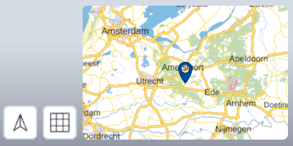

De 3D-viewer is de **hoofdfunctionaliteit van Netherlands3D.eu.** De interface biedt toegang tot de verschillende functionaliteiten. De 3D-viewer wordt geactiveerd na het klikken op `Bekijk de viewer op de homepage in de Headline.  
 
Dit hoofdstuk beschrijft de belangrijkste functionaliteiten van de 3D-viewer en de instellingen.   

---

## Gedetailleerde beschrijving van de functionaliteiten

### **Startscherm**

_(Afbeelding) 3D-Viewer startscherm_

Na het opstarten van de 3D viewer is het instellingen menu actief. Het instellingenmenu is onderverdeeld in de functies; **Locatie  bepalen, Functionaliteiten en Instellingen (submenu).**   

---

### **Locatie bepalen**

  
_(Afbeelding) Locatie bepalen - submenu_  
 
Met deze functie kun je de **locatie invoeren**. Dit kan op drie manieren;
<ol>
<li>Door met de muis op een locatie in de map te klikken</li>   
<li>Door het invoeren van een plaats-, straatnaam en/of postcode</li>   
<li>Door bij X, Y een coördinaat* in te voeren</li>
</ol>  

!!! tip "Waarom kan ik geen gps-coördinaten invoeren?"

	(*) Het coördinatenstelsel van Netherlands3d.eu is gebaseerd op het RD-coördinatenstelsel.  
	Lees [hier](https://www.kadaster.nl/zakelijk/registraties/basisregistraties/rijksdriehoeksmeting/rijksdriehoeksstelsel) (externe link) meer over het RD-coördinatenstelsel.

---

### **Functionaliteiten (submenu)**

_(Afbeelding) Functionaliteiten - submenu_  
 
Met het submenu `Functionaliteiten` krijgt de gebruiker toegang tot het **aan-/uitzetten van de standaard datalagen en (menu)functionaliteiten** die in de basis versie van Netherlands3d.eu wordt aangeboden.  
  
Klik in het `selectievakje` om de laag of functionaliteit aan of uit te zetten.   

---

### **Functies**

#### **Terrein (Kadaster)**
Met maaiveld, ofwel het 'oppervlak waarop we lopen' is weergegeven als 3D terrein. 
Voor het tonen van dit terrein is gebruik gemaakt van de 3D Basisvoorziening van het Kadaster. 
Visueel onderscheiden zijn gebouwen, terreinonderdelen (zoals wegen, groenvlakken en water) en bruggen, waarbij de 	gebouwen niet als 3D objecten worden getoond in deze laag. Op enkele onderdelen is een geometrische versimpeling 	toegepast om het maaiveld sneller in de viewer te tonen.
Bron: 3D Basisvoorziening
Datum: 2020, Actualisatie: Jaarlijks

#### **Gebouwen (3DBag)**
Alle objecten op de laag 'Gebouwen' komen uit de 3D BAG, een jaarlijks geactualiseerde dataset van alle gebouwen in 	Nederland. De set is ontwikkeld door de de 3D geoinformatie onderzoeksgroep van de Technische Universiteit Delft. Aan 	het gebruik van de 3D BAG zitten.
Bron: 3D BAG
Datum: 2023, Actualisatie: Jaarlijks

#### **Bomen en bospercelen**  
Deze kaartlaag toont alle individuele bomen en bospercelen van Nederland voor zover ze in de Basiskaart Grootschalige 	Topografie (BGT) zijn opgenomen. Binnen bospercelen wordt onderscheid gemaakt in loofbossen, naaldbossen en gemengde 	bossen, welke met een willekeurige hoogte en locatie zijn geplaatst. Bomen worden als 2D objecten op 3 vlakken 	geprojecteerd, waardoor het lijkt alsof ze 3D objecten zijn. 
Bron: Basiskaart Grootschalige Topografie (BGT)
Datum: december 2023, Actualisatie: jaarlijks

#### **Straatnamen**  
Deze kaartlaag toont alle straatnamen van Nederland. Afhankelijk van het zoomniveau worden straatnamen weergegeven. Bron: PDOK

#### **Buurtnamen**  
Deze kaartlaag toont alle buurtnamen van Nederland. Afhankelijk van het zoomniveau worden buurtnamen weergegeven. Bron: PDOK

#### **Wijknamen**  
Deze kaartlaag toont alle wijknamen van Nederland. Afhankelijk van het zoomniveau worden wijknamen weergegeven. Bron: PDOK

#### **Gebouw informatie**  
Maakt een koppeling tussen pandobjecten in de 3D viewer en administratieve data uit de Basisadministratie Adressen en Gebouwen (BAG) waardoor het mogelijk is gedetailleerde informatie over het pand, enkele pandkenmerken en de adressen daarbinnen op te vragen. Bron: PDOK

#### **Downloaden 3D gebied (Collada)**  
Maakt het mogelijk alle 3D modellen uit de viewer te downloaden als losse 3D Collada DAE objecten (per kaartlaag). Downloaden kan per tegel van 100x100m met een maximum van 16 tegels tegelijk.

#### **Maak screenshots**  
Naast het maken van schermafbeeldingen met verschillende resolutie, is het ook mogelijk verschillende onderdelen uit de interface wel of niet op te nemen in de afbeelding.

#### **3D modellen toevoegen (OBJ)**  
Maak het mogelijk jouw eigen .obj modellen in de 3D wereld te plaatsen. Je kunt ook direct een .mtl bestand toevoegen om materialen te koppelen.   
Zorg dat het 3D model aan de volgende eisen voldoet:  
- Wavefront OBJ formaat  
- Maximaal 300MB bestandsgrootte  
- Triangulated faces  
Vanuit SketchUp:  
File > Export > 3D Model  
Selecteer OBJ File (*.obj)  
- Zorg dat 'Triangulate all faces' is aangevinkt onder Options  
- Zorg dat 'Swap YZ coördinates' is aangevinkt onder Options

#### **Indicatoren (Tygron)**  
NB. Tygron inlog vereist
Maakt het mogelijk dossiers vanuit Tygron in te laden en de indicatoren in de 3D viewer weer te geven.

#### **Gebouwen kleuren (Op basis van BAG id)**  
Maakt het mogelijk een CSV bestand in te laden met daarin een kolom BAG-Pand id's en een kolom kenmerken. De BAG Pand id's uit de CSV worden gebruikt om een koppeling met de 3D BAG panden uit de viewer te maken om vervolgens het bijbehorende kenmerk te gebruiken om panden te kleuren. Aan elk onderscheidend kenmerk wordt een kleur toegewezen welke zichtbaar wordt gemaakt in de viewer.

#### **Objectenbibliotheek**  
Een aantal voorgedefinieerde objecten kunnen in de viewer worden geladen. Denk aan windmolens of verschillende type bomen. Objecten kunnen op willekeurige locaties geplaatst worden en bij sommige objecten zijn extra instellingen mogelijk.

#### **Minimap**  
Er wordt een minimap getoond waarin je als gebruiker snel naar een andere locatie kunt navigeren. Binnen de minimap geeft een selectiegebied of 'field of sight' aan welk deel van Nederland in het hoofdscherm in 3D wordt weergegeven.

#### **3D tiles (BETA)**  
Maakt het mogelijk om gebouwen en maaiveld 3D Tiles lagen toe te voegen.

#### **Google RealityMesh (BETA)**  
Toont voor delen van Nederland een foto-realistisch beeld van de omgeving.
Met de kaartlaag 'Google Reality Mesh' komt een fotorealistische laag beschikbaar in de 3D viewer. Voor grote delen van Nederland heeft Google een 3D model beschikbaar gesteld waar objecten in 3D herkenbaar worden weergegeven. Deze laag, die in 3D Tiles formaat wordt aangeboden, maakt het mogelijk om nog beter inzicht te krijgen in de werkelijke situatie.

#### **Zonnestand simuleren (Vrij beschikbaar)**  

#### **UrbanReLeaf Sensor Data**  
Deze kaartlaag toont all UrbanReLeaf sensor temperatuur data. Bron: PDOK

---

### **Instellingen (submenu)**

_(Afbeelding) Instellingen - submenu_  
 
#### **(Beeld)kwaliteit**   
In dit menu kan de **performance van de 3D viewer** optimaal worden afstemmen op de capaciteit van het gebruikte computersysteem. Door te kiezen voor `Hoog`, `Middel` of `Laag`, kan de (beeld)kwaliteit worden aangepast van resp. hoge, middelmatige of lage kwaliteit. De optie `laag` biedt de snelste performance maar heeft het minste detailniveau.  
  
#### **Limiteer scroll gevoeligheid**  
In sommige gevallen reageert de 3D-viewer niet optimaal op de muisbewegingen va de gebruiker. Door de optie `Limiteer scroll gevoeligheid` aan te vinken kan dit worden verbeterd.  
 
Klik op `x` (rechtsboven) om het instellingenmenu af te sluiten. Hierna toont de 3D-viewer het [default] startpunt; het centrum van Amersfoort.

---

## **3D-viewer**

_(Afbeelding) 3D-Viewer hoofdscherm_

### **Interface**  
De interface is onderverdeeld in het 3D-scherm met daaromheen de knoppen van de interface gegroepeerd in vier menu's;  
<ol>
<li>Hoofdmenu – linksboven</li>  
<li>Project openen/opslaan - linksonder</li>  
<li>Bovenbalk – rechtsboven</li>  
<li>Navigeren - rechtsonder</li>  
</ol>
 

_(Afbeelding) 3D-Viewer interface_
&nbsp;

---

### **1. Hoofdmenu**  
{ style="height:230px;width:50px"  align=left }

Het hoofdmenu (linksboven) bevat de volgende functies (van boven naar onder);

* [Object informatie (Link)](../object-informatie/)  
* [Ondergrond doorzicht (Link)](../ondergrond-doorzicht/)   
* [Lagen (Link)](../lagen/)   
* [Zonnestand (Link)](../zonnestand/)   
* [Gebied downloaden (Link)](../gebied-downloaden/)  
&nbsp;

---

### **2. Project openen/opslaan**  
{ style="height:100px;width:50px" align=left }

Het Project opslaan/openen-menu bevindt zich in de linker onder hoek en bevat de volgende functies;

* [Project opslaan (Link)](/docs/handleiding/project-openen-opslaan/#project-opslaan)  
* [Project openen (Link)](/docs/handleiding/project-openen-opslaan/#project-openen)   
&nbsp;

---

### **3. Bovenbalk**  
{ width="150"  align=left }
 
De bovenbalk rechtsbovenin bevat de volgende functies (van links naar rechts); **Schermafbeelding maken, Instellingen en Informatie.**
 
     
#### **Schermafbeelding maken**   
Klik op `Schermafbeelding` om automatisch een afdruk van de 3D viewer als .png-bestand te downloaden. Bekijk de afbeelding door naar de map `C:\Users\Gebruikersnaam\Downloads` te gaan`.

**Instellingen**  
Zie [Instellingen](../3d-viewer/#locatie-bepalen)
 
**Informatie**  
De knop `Informatie` opent de Homepage in een apart browser-venster.

&nbsp;

---

### **4. Orientatie en Mini-map**  
{ width="360px" }

Het menu bevat de volgende functies:   
 
{ align=left width="50px" }
#### **Weergave naar noorden draaien**   
Klik op `Weergave naar noorden draaien` om de kijkrichting automatisch naar het noorden te richten.   
&nbsp;

{ align=left width="50px" } 
#### **Orthografisch/perspectief**   
 Klik op `Wissel tussen Orthografisch/perspectief` om de kijkrichting automatisch in loodrecht naar beneden en zonder perspectief te wijziggen. Klik nogmaals om het beeld terug te brengen naar de oorspronkelijke toestand. 
&nbsp;

{ align=left width="260px" }  
#### **Mini-map**   
De minimap is de kleine versie van de map bij instellingen zie 2. Instellingen 
Beweeg met de muis over de minimap om deze te vergroten.  
Door op een locatie in de minimap te klikken wordt in de 3D viewer bijbehorende locatie weergegeven. 
 
Met de knoppen `+/-` kan worden in-/uitgezoomd.
 
&nbsp;

#### **Positie indicatie**   
In de blauwe onderbalk van de viewer staan (rechts) de coördinaten van de positie van de viewer. 
{ width="360px" }  

!!! tip "Waarom zie ik x,y,z-coördinaten en geen gps-coördinaten?"

	(*) Het coördinatenstelsel van Netherlands3d.eu is gebaseerd op het RD-coördinatenstelsel.  
	Lees [hier](https://www.kadaster.nl/zakelijk/registraties/basisregistraties/rijksdriehoeksmeting/rijksdriehoeksstelsel) (externe link) meer over het RD-coördinatenstelsel.

&nbsp;

---

### **5. Navigeren in 3D** 
Het scherm toont de locatie die in het instellingenmenu is ingevoerd of – als er geen invoer is gedaan - de default-locatie (centrum Amersfoort). Het beeld is in perspectief, onder een lichte hoek en vanaf een hoogte van 300 meter.

**Besturen en navigeren**  
`Verplaats de muis` al dan niet in `combinatie met muisknoppen en/of toetsenbordknoppen` om door de 3D wereld in de viewer te navigeren.  
Dit kan op verschillende manieren; 
 
**[Scroll/Zoom]**  
`Verdraai het muiswiel` om naar voren of naar achteren te bewegen in de kijkrichting.

<video controls>
<source src="../video/scroll.mp4" type="video/mp4">
</video>
_(Video) Scroll/Zoom_
 
 
**[Panning]**  
Door met de `muis én de ingedrukte linkermuisknop` over het scherm `omhoog of omlaag` of `naar links of naar rechts te bewegen`, kan de kijker zich resp. omhoog of omlaag of resp. naar links of naar rechts in de 3D wereld verplaatsen. 

<video controls>
<source src="../video/panning.mp4" type="video/mp4">
</video>
_(Video) Panning_
 
 
**[Draaien manier A.]**  
Door met de `muis en de ingedrukte middelste muisknop` over het scherm te `bewegen`, kan de kijker `om het kijkpunt heen draaien`. 
Alternatief; Dit kan ook met de `linkermuisknop in combinatie met de alt-toets`. 

<video controls>
<source src="../video/orbit.mp4" type="video/mp4">
</video>
_(Video) Draaien manier A._
 
 
**[Draaien  manier B.]**  
Door met de `muis en de ingedrukte linkermuisknop` in `combinatie met de ctrl-toets` over het scherm te `bewegen`, kan de kijker het beeld `naar links of naar rechts en/of naar boven of naar beneden draaien`.

<video controls>
<source src="../video/orbit.pan.mp4" type="video/mp4">
</video>
_(Video) Draaien manier B._
 
 