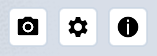

# 3D-viewer

De 3D-viewer is de **hoofdfunctionaliteit van Netherlands3D**. De interface biedt toegang tot de verschillende
functies. De 3D-viewer wordt geactiveerd na het klikken op de knop **Bekijk de viewer** op de voorpagina.

Dit hoofdstuk beschrijft de belangrijkste functies van de 3D-viewer en de instellingen.

## Beschrijving van het instellingenmenu

### Startscherm

_(Afbeelding) 3D-Viewer startscherm_

Na het opstarten van de 3D viewer is het instellingen menu actief. In het instellingenmenu zijn de volgende onderdelen beschikbaar;

* [Locatie bepalen (Link)](../3D-viewer-locatie-bepalen/)
* [Functionaliteiten (Link)](../3D-viewer-functionaliteiten/)
* [Instellingen-submenu (Link)](../3D-viewer-instellingen-sub/)

---

## Werkruimte

_(Afbeelding) 3D-Viewer interface_

De interface is opgedeeld in het 3D-scherm met daaromheen de knoppen van de interface gegroepeerd in vier menu's:

1. Werkbalk – linksboven  
2. Project openen/opslaan - linksonder  
3. Applicatiebalk – rechtsboven  
4. Weergave en informatie - onder  

---

### Werkbalk

{ style="height:230px;width:50px"  align=left }

Het hoofdmenu (linksboven) bevat de volgende functies (van boven naar onder);

* [Zoekfunctie (Link)](../zoekfunctie/)
* [Object informatie (Link)](../object-informatie/)
* [Ondergrond doorzicht (Link)](../ondergrond-doorzicht/)
* [Lagen (Link)](../lagen/)
* [Toevoegen (link)](../toevoegen/)
* [Zonnestand (Link)](../zonnestand/)
* [Downloaden (Link)](../gebied-downloaden/)

{ style="height:100px;width:50px" align=left }

Het Project opslaan/openen-menu bevindt zich in de linker onder hoek en bevat de volgende functies;

* [Project opslaan (Link)](/docs/handleiding/project-openen-opslaan/#project-opslaan)
* [Project openen (Link)](/docs/handleiding/project-openen-opslaan/#project-openen)

---

### Applicatiebalk

{ width="200" }

De Applicatiebalk rechtsbovenin bevat de volgende functies (van links naar rechts):

**Schermafbeelding maken, Instellingen en Informatie.**

#### Schermafbeelding maken

Klik op `Schermafbeelding` om automatisch een afdruk van de 3D viewer als .png-bestand te downloaden. Bekijk de
afbeelding door naar de map `C:\Users\Gebruikersnaam\Downloads` te gaan`.

#### Instellingen

Zie [Instellingen](../3D-viewer-instellingen/)

#### Informatie

De knop `Informatie` opent de Homepage in een apart browser-venster.

---

### Weergave en informatie

{ width="360px" }

Het menu bevat de volgende functies:

#### Weergave naar noorden draaien

Klik op `Weergave naar noorden draaien` om de kijkrichting automatisch naar het noorden te richten.   

#### Orthografisch/perspectief

Klik op `Wissel tussen Orthografisch/perspectief` om de kijkrichting automatisch in loodrecht naar beneden en zonder
perspectief te wijziggen. Klik nogmaals om het beeld terug te brengen naar de oorspronkelijke toestand.

{ align=left width="260px" }

#### Mini-map

De minimap is de kleine versie van de map bij instellingen zie 2. Instellingen
Beweeg met de muis over de minimap om deze te vergroten.  
Door op een locatie in de minimap te klikken wordt in de 3D viewer bijbehorende locatie weergegeven.

Met de knoppen `+/-` of met je scroll-wiel kan worden in-/uitgezoomd.

#### Positie

In de onderbalk van de viewer staan (rechts) de coördinaten van de positie van de viewer.
{ width="360px" }

!!! question "Waarom zie ik x,y,z-coördinaten en geen gps-coördinaten?"

	Het coördinatenstelsel van Netherlands3D is gebaseerd op het rijksdriehoeksstelsel.  
	[Lees hier meer over het rijksdriehoeksstelsel](https://www.kadaster.nl/zakelijk/registraties/basisregistraties/rijksdriehoeksmeting/rijksdriehoeksstelsel).

---

### Navigeren

Het scherm toont de locatie die in het instellingenmenu is ingevoerd of – als er geen invoer is gedaan - de
default-locatie (het kadastrale nulpunt van Nederland in het centrum van Amersfoort). Het beeld is in perspectief, onder een lichte hoek en vanaf een hoogte van 300 meter.

#### Besturen en navigeren

`Verplaats de muis` al dan niet in `combinatie met muisknoppen en/of toetsenbordknoppen` om door de 3D wereld in de viewer te navigeren.

Dit kan op verschillende manieren;

#### [Scroll/Zoom]

`Verdraai het muiswiel` om naar voren of naar achteren te bewegen in de kijkrichting.

!!! tip "standaard of snel zoomen"

	Standaard scrollen geeft een normale snelheid van in- uitzoomen. Met de SHIFT-knop ingedrukt kan je 2x zo snel in- uitzoomen. Wel zo handig!

---

<video controls>
<source src="../video/scroll.mp4" type="video/mp4">
</video>
_(Video) Scroll/Zoom_

#### [Panning]

Door met de `muis én de ingedrukte linkermuisknop` over het scherm `omhoog of omlaag` of
`naar links of naar rechts te bewegen`, kan de kijker zich resp. omhoog of omlaag of resp. naar links of naar rechts in
de 3D wereld verplaatsen.

<video controls>
<source src="../video/panning.mp4" type="video/mp4">
</video>
_(Video) Panning_

#### [Draaien manier A.]

Door met de `muis en de ingedrukte middelste muisknop` over het scherm te `bewegen`, kan de kijker
`om het kijkpunt heen draaien`. Alternatief; Dit kan ook met de `linkermuisknop in combinatie met de alt-toets`.

<video controls>
<source src="../video/orbit.mp4" type="video/mp4">
</video>
_(Video) Draaien manier A._

#### [Draaien manier B.]

Door met de `muis en de ingedrukte linkermuisknop` in `combinatie met de ctrl-toets` over het scherm te `bewegen`, kan
de kijker het beeld `naar links of naar rechts en/of naar boven of naar beneden draaien`.

<video controls>
<source src="../video/orbit.pan.mp4" type="video/mp4">
</video>
_(Video) Draaien manier B._
