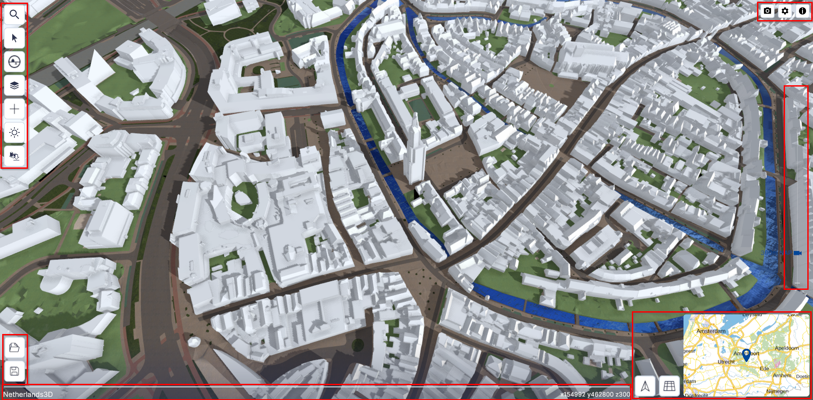
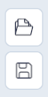

# 3D-viewer
De 3D-viewer is de **hoofdfunctionaliteit van Netherlands3D.eu.** De interface biedt toegang tot de verschillende functionaliteiten. De 3D-viewer wordt geactiveerd na het klikken op `Bekijk de viewer op de homepage in de Headline.  
 
Dit hoofdstuk beschrijft de belangrijkste functionaliteiten van de 3D-viewer en de instellingen.   

---

## Gedetailleerde beschrijving van de functionaliteiten

### **Startscherm**

_(Afbeelding) 3D-Viewer startscherm_

Na het opstarten van de 3D viewer is het instellingen menu actief. Het instellingenmenu is onderverdeeld in de functies; 

* [Locatie bepalen (Link)](../3D-viewer-locatie-bepalen/)  
* [Functionaliteiten (Link)](../3D-viewer-functionaliteiten/)   
* [Instellingen-submenu (Link)](../3D-viewer-instellingen-sub/)   

---

## **Interface**

_(Afbeelding) 3D-Viewer interface_

De interface is onderverdeeld in het 3D-scherm met daaromheen de knoppen van de interface gegroepeerd in vier menu's;  
<ol>
<li>Hoofdmenu – linksboven</li>  
<li>Project openen/opslaan - linksonder</li>  
<li>Bovenbalk – rechtsboven</li>  
<li>Navigeren - rechtsonder</li>  
</ol>

---

### **Hoofdmenu**  
{ style="height:230px;width:50px"  align=left }

Het hoofdmenu (linksboven) bevat de volgende functies (van boven naar onder);

* [Object informatie (Link)](../object-informatie/)  
* [Ondergrond doorzicht (Link)](../ondergrond-doorzicht/)   
* [Lagen (Link)](../lagen/)   
* [Zonnestand (Link)](../zonnestand/)   
* [Gebied downloaden (Link)](../gebied-downloaden/)  
&nbsp;
   
 

{ style="height:100px;width:50px" align=left }

Het Project opslaan/openen-menu bevindt zich in de linker onder hoek en bevat de volgende functies;

* [Project opslaan (Link)](/docs/handleiding/project-openen-opslaan/#project-opslaan)  
* [Project openen (Link)](/docs/handleiding/project-openen-opslaan/#project-openen)   
&nbsp;

---

### **Bovenbalk**  
{ width="150"  align=left }
 
De bovenbalk rechtsbovenin bevat de volgende functies (van links naar rechts); **Schermafbeelding maken, Instellingen en Informatie.**
 
     
#### **Schermafbeelding maken**   
Klik op `Schermafbeelding` om automatisch een afdruk van de 3D viewer als .png-bestand te downloaden. Bekijk de afbeelding door naar de map `C:\Users\Gebruikersnaam\Downloads` te gaan`.

#### **Instellingen**  
Zie [Instellingen](../3D-viewer-instellingen/)
 
#### **Informatie**  
De knop `Informatie` opent de Homepage in een apart browser-venster.

&nbsp;

---

### **Orientatie en Mini-map**  
{ width="360px" }

Het menu bevat de volgende functies:   
 
{ align=left width="50px" }
#### **Weergave naar noorden draaien**   
Klik op `Weergave naar noorden draaien` om de kijkrichting automatisch naar het noorden te richten.   
&nbsp;

{ align=left width="50px" } 
#### **Orthografisch/perspectief**   
 Klik op `Wissel tussen Orthografisch/perspectief` om de kijkrichting automatisch in loodrecht naar beneden en zonder perspectief te wijziggen. Klik nogmaals om het beeld terug te brengen naar de oorspronkelijke toestand. 
&nbsp;

{ align=left width="260px" }  
#### **Mini-map**   
De minimap is de kleine versie van de map bij instellingen zie 2. Instellingen 
Beweeg met de muis over de minimap om deze te vergroten.  
Door op een locatie in de minimap te klikken wordt in de 3D viewer bijbehorende locatie weergegeven. 
 
Met de knoppen `+/-` kan worden in-/uitgezoomd.
 
&nbsp;

#### **Positie**   
In de blauwe onderbalk van de viewer staan (rechts) de coördinaten van de positie van de viewer. 
{ width="360px" }  

!!! tip "Waarom zie ik x,y,z-coördinaten en geen gps-coördinaten?"

	(*) Het coördinatenstelsel van Netherlands3d.eu is gebaseerd op het RD-coördinatenstelsel.  
	Lees [hier](https://www.kadaster.nl/zakelijk/registraties/basisregistraties/rijksdriehoeksmeting/rijksdriehoeksstelsel) (externe link) meer over het RD-coördinatenstelsel.

&nbsp;

---

### **Navigeren** 
Het scherm toont de locatie die in het instellingenmenu is ingevoerd of – als er geen invoer is gedaan - de default-locatie (centrum Amersfoort). Het beeld is in perspectief, onder een lichte hoek en vanaf een hoogte van 300 meter.

#### **Besturen en navigeren**  
`Verplaats de muis` al dan niet in `combinatie met muisknoppen en/of toetsenbordknoppen` om door de 3D wereld in de viewer te navigeren.  
Dit kan op verschillende manieren; 
 
#### **[Scroll/Zoom]**  
`Verdraai het muiswiel` om naar voren of naar achteren te bewegen in de kijkrichting.

<video controls>
<source src="../video/scroll.mp4" type="video/mp4">
</video>
_(Video) Scroll/Zoom_
 
 
#### *[Panning]**  
Door met de `muis én de ingedrukte linkermuisknop` over het scherm `omhoog of omlaag` of `naar links of naar rechts te bewegen`, kan de kijker zich resp. omhoog of omlaag of resp. naar links of naar rechts in de 3D wereld verplaatsen. 

<video controls>
<source src="../video/panning.mp4" type="video/mp4">
</video>
_(Video) Panning_
 
 
#### **[Draaien manier A.]**  
Door met de `muis en de ingedrukte middelste muisknop` over het scherm te `bewegen`, kan de kijker `om het kijkpunt heen draaien`. 
Alternatief; Dit kan ook met de `linkermuisknop in combinatie met de alt-toets`. 

<video controls>
<source src="../video/orbit.mp4" type="video/mp4">
</video>
_(Video) Draaien manier A._
 
 
#### **[Draaien  manier B.]**  
Door met de `muis en de ingedrukte linkermuisknop` in `combinatie met de ctrl-toets` over het scherm te `bewegen`, kan de kijker het beeld `naar links of naar rechts en/of naar boven of naar beneden draaien`.

<video controls>
<source src="../video/orbit.pan.mp4" type="video/mp4">
</video>
_(Video) Draaien manier B._
 
 