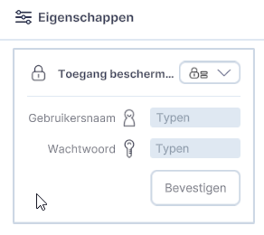
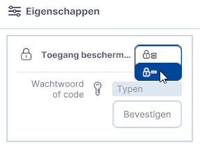

# Toevoegen laag met afschermde bron

### Invullen gebruikersnaam en wachtwoord
{style="height:230px;width:50px" align=left }

Als er een laag van een afgeschermde bron wordt geladen (via het importeren menu), krijg je bovenstaande venster in beeld. Dit kunnen WMS/WFS/GeoJSON en 3D-Tiles lagen zijn, welke je via een bestand of url koppelt.

## Switchen tussen gebruikersnaam/wachtwoord en code
{style="height:230px;width:50px" align=left }

Wanneer je geen gebruikersnaam en wachtwoord hebt, maar alleen een code (bijvoorbeeld een API-key) dan kan je via bovenstaande knop switchen tussen gebruikersnaam/wachtwoord en code.

### Invullen Code
{style="height:230px;width:50px" align=left }

Als er een laag van een afgeschermde bron wordt geladen (via het importeren menu), krijg je bovenstaande venster in beeld. Dit kunnen WMS/WFS/GeoJSON en 3D-Tiles lagen zijn, welke je via een bestand of url koppelt.

Als je de gegevens hebt ingevuld, wordt de laag gemaakt en de gegevens uit bestand of bron geladen.