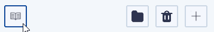
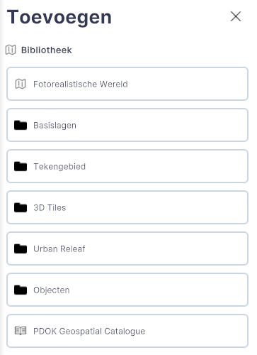

# Bibliotheek

Functies, Lagen, submenu.  
  
  
_(Afbeelding) Activeren Bibliotheek_

---

## Gedetailleerde beschrijving van de functies

### Menu

Met de functie Bibliotheek zijn alle objecten uit te objectenbibliotheek, het toevoegen van Fotorealistische wereld (Google realitymesh), basislagen, tekengebieden, 3D-Tiles, Urban Releaf lagen, objecten en catalogi onder één knop gebundeld.

  
_(Afbeelding) opzet Bibliotheek_

---

### **Fotorealistische Wereld**

Met de functie Fotorealistische Wereld kan je de **3D tiles van Google Earth koppelen en visualiseren** in Netherlands3D.eu. Voor gedetailleerde informatie over de werking klik op deze link: [Toevoegen Fotorealistische wereld](../toevoegen-fotorealistische-wereld)

### **Basislagen**

Met de functie Basislagen kan je de **4 beschikbare basislagen** (opnieuw) koppelen in Netherlands3D.eu. Voor gedetailleerde informatie over de werking klik op deze link: [Toevoegen basislagen](../toevoegen-basislagen)

### **Tekengebied**

Met de functie Basislagen kan je **Tekengebieden** toevoegen in Netherlands3D.eu. Voor gedetailleerde informatie over de werking klik op deze link: [Toevoegen tekengebied](../toevoegen-selectiegebied)

### **3D Tiles**

Met de functie 3D Tiles kan je **basis 3D Tiles lagen** toevoegen in Netherlands3D.eu. Voor gedetailleerde informatie over de werking klik op deze link: [Toevoegen 3D Tiles](../toevoegen-3d-tiles)

### **Urban Releaf**

Met de functie Urban Releaf kan je de **Urban Releaf lagen** toevoegen in Netherlands3D.eu. (zijn alleen actief binnen Utrecht) Voor gedetailleerde informatie over de werking klik op deze link: [Toevoegen Urban Releaf](../toevoegen-urban-releaf)

### **Objecten**

Met de functie Objecten kan je de **objecten uit de objectenbibliotheek** toevoegen in Netherlands3D.eu. Voor gedetailleerde informatie over de werking klik op deze link: [Toevoegen objecten bibliotheek](../toevoegen-objecten-biep)

--- 
!!! tip "Je vindt de Bibliotheek op 2 manieren"
   Naast dat je de bibliotheek vindt in het linksondermenu, kan je de bibliotheek ook vinden door op het `+` teken te klikken en vervolgens op de knop `Vanuit bibliotheek` te klikken. Je komt dan ook direct in de bibliotheek.
    
---