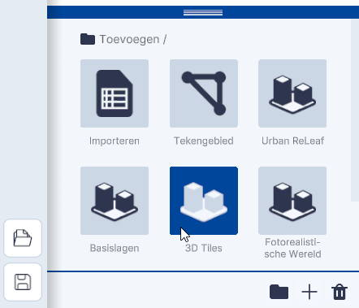
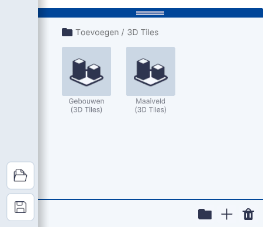
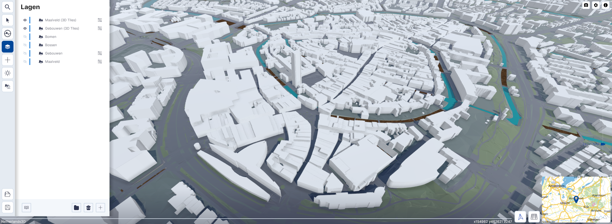
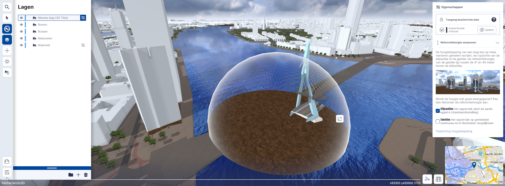
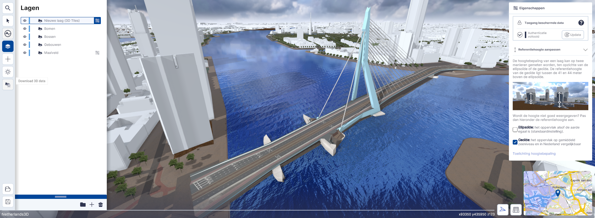

# 3D Tiles

Functies, Lagen, submenu.  
  
 
/// caption
(Afbeelding) Toevoegen / 3D Tiles
///

---

## Gedetailleerde beschrijving van de functies

### Menu

Met de functie Tiles kunnen 3D Tiles uit twee voorgedefinieerde lagen worden gekoppeld.  

/// caption
(Afbeelding) Toevoegen / 3D Tiles
///

---

### Gebouwen (3D tiles)

Met `Gebouwen (3D tiles)` worden gebouwen uit de 
[3D Basisvoorziening van het Kadaster](https://www.pdok.nl/introductie/-/article/3d-basisvoorziening-1) gekoppeld.  

  
/// caption
(Afbeelding) Gebouwen (3D Tiles)
///

---

### Maaiveld (3D tiles)

Met `Maaiveld (3D tiles)` wordt het maaiveld uit de 
[3D Basisvoorziening van het Kadaster](https://www.pdok.nl/introductie/-/article/3d-basisvoorziening-1) gekoppeld.

  
/// caption
(Afbeelding) Maaiveld en Gebouwen (3D Tiles)
///

---

#### Referentiehoogte aanpassen

3D-Tile lagen kunnen op een verkeerde hoogte liggen. We hebben daarvoor een instelling gemaakt die je bij het eigenschappenpaneel kan activeren. Als standaard staat deze ingesteld op Ellipsoïde. Heb je een laag die op een verkeerde hoogte ligt, klik dan op één van de 2 mogelijkheden.
 

  
/// caption
(Afbeelding) Referentiehoogte op Ellipsoïde
///
 

  
/// caption
(Afbeelding) Referentiehoogte op Geoïde
///
 

!!! tip "Uitleg Referentiehoogte"
    De hoogte van een 3D-tiles laag kan op twee manieren gemeten worden, ten opzichte van de ellipsoïde of de geoïde. De referentiehoogte van de geoïde ligt (voor Nederland) tussen de 41 en 44 meter boven de ellipsoïde. Voor meer informatie, zie deze site [Uitleg Geoïde/ellipsoïde](https://3dtilesnederland.nl/over-terrein-en-3d-tilesets)