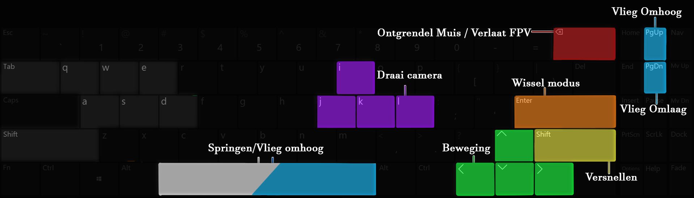

# First Person Viewer

!!!tip "De First Person Viewer (FPV) is een beta functionaliteit van Netherlands3D."

De First Person Viewer maakt het mogelijk voor gebruikers om zich op realistische ooghoogte door de 3D-wereld te bewegen. Zo kan je ervaren hoe een aangepaste omgeving te beleven is vanaf ooghoogte.

---
## Beginnen
Om de First Person Viewer te starten, volg je de onderstaande stappen:

1. Zet de functionaliteit aan via Instellingen → Functionaliteiten → First Person Viewer.
2. Er verschijnt een First Person Viewer-knop rechtsonder in beeld, naast de noordpijl.
3. Sleep het poppetje uit de knop naar de gewenste locatie in de wereld waar je wilt rondlopen. Vanaf hier opent de First Person Viewer.

 

{ width="550px" }  

---

### Verlaten
Je kunt de first person viewer verlaten door rechtsboven op de knop ‘verlaat first-person-viewer’ te klikken. Ook kun je de **Backspace** toets twee seconden vasthouden om de first person viewer te verlaten.
Als muisvergrendeling aanstaat, kun je de muis loslaten door éénmaal op **Backspace** te drukken.

De first person viewer vergrendeld de muisaanwijzer vast in de first person viewer. Deze kun je weer ontgrendelen door één keer op **Backspace** te drukken.
Het verlaten van de first person viewer kan op meerdere manieren;

- Houd de **Backspace**-toets 2 seconden ingedrukt. Linksboven in het scherm verschijnt een voortgangsbalk zien die aangeeft hoe lang je backspace nog moet indrukken voordat je de first person viewer verlaat.
- Druk één keer op Backspace om de muis vrij te geven, en klik vervolgens rechtsboven op de 'verlaten' knop om de First Person Viewer te verlaten. 

{ width="550px" }  

---
### Muisvergrendeling
Om je muis automatisch te vergrendelen kun je muisvergrendeling aanzetten in de instellingen. 

Deze instelling zorgt ervoor dat je de muis niet ingedrukt hoeft te houden tijdens het bewegen, wat aan te raden is bij het opnemen van video’s of tijdens een showcase.
Om de muis los te ontgrendelen druk je eenmaal op **Backspace**. 

---

## Besturing
Er zijn verschillende manieren van bewegen in de first person viewer. Je kunt **lopen**, **vliegen**, **fietsen** en **autorijden**, in aparte bewegingsmodi.

Bewegen kan op twee manieren;

- met de **pijltjestoetsen**, *óf* 
- met de knoppen **'W, A, S en D'**.

Hieronder volgt uitleg per bedieningsmethode. Kies de methode die voor jou het prettigst werkt.

 

#### Pijltjestoetsen
Met de pijltjestoetsen kun je rondbewegen in de First Person Viewer. Door te klikken en je muis te bewegen, verander je je kijkrichting. De pijltjestoetsen bewegen je vervolgens in die richting.
Op dit onderstaande kaartje is zichtbaar welke knoppen waarvoor dienen:

{ width="1000px" }  

**Bewegingsmodi**:

- *Versnellen*: houdt **Shift** ingedrukt.

Loopmodus:

- *Springen*: druk op **Spatiebalk**.

Vliegmodus:

- *Omhoog vliegen*: **Spatiebalk** *of* **PageUp**.
- *Omlaag vliegen*: **PageDown**.

Automodus en fietsmodus:

- *Sturen*: Gebruik **pijltjes naar links en rechts** om het voertuig te sturen. In deze modi kun je vrij rondkijken zonder de voertuigen te draaien met de camera.
- *Handrem*: **Spatie**

 

#### W A S D
Je kunt ook kiezen om rond te bewegen door de knoppen 'W, A, S en D' te gebruiken. 

- Vooruit: **W**.
- Achteruit: **S**.
- Links: **A**.
- Rechts: **D**.

Deze knoppen zijn bepaald met respect tot hun positie op het toetsenbord, net als de pijltjestoetsen. 
Door te klikken en je muis te bewegen, verander je je kijkrichting. De knoppen 'W, A, S, en D' zullen jou bewegen in de gekozen kijkrichting.

Onderstaand kaartje toont de knoppenindeling:

{ width="1000px" }  

**Bewegingsmodi**

- *Versnellen*: houdt **Shift** ingedrukt.

Loopmodus:

- *Springen*: druk op **Spatiebalk**.

Vliegmodus:

- *Omhoog vliegen*: **Spatiebalk** *of* **Q**.
- *Omlaag vliegen*: **E**.

Automodus en fietsmodus:

- *Sturen*: Gebruik **"A" en "D"** om het voertuig te sturen. In deze modi kun je vrij rondkijken zonder de voertuigen te draaien met de camera.
- *Handrem*: **Spatie**

 

### Algemene besturing:
Wisselen tussen bewegingsmodi: **Tab** of **Enter**.
De camera te draaien zonder de muis: 

- *Omhoog draaien*: **I**.
- *Omlaag draaien*: **K**.
- *Naar links draaien*: **J**.
- *Naar rechts draaien*: **L**.

Handige sneltoetsen:

- *Screenshot*: **C**.
- *"Snap" naar het hoogste niveau*: **R**.
- *Verberg alle UI (User Interfaces): **H**. Druk nogmaals H om de UI weer te tonen*.

---

### Movement Modus
De first person viewer heeft vier bewegings-modi, lopen en vliegen. Je kunt van modus wisselen door:

- In het instellingenpaneel een andere modus aan te klikken.
- De toetsen **Tab** en **Enter** te gebruiken.

{ width="550px" }  

In het instellingenpaneel kun je de instellingen van de huidige modus aanpassen. Typ zelf de gewenste waardes in en klik vervolgens uit het veld om de waardes vast te leggen.

### Functionaliteiten
De first person viewer heeft enkele functionaliteiten die in de beta versie beschikbaar zijn voor gebruik:

- Ondergronds kijken:
Bij het activeren van deze functie verschijnt een cirkel op het grondvlak, waarmee je ondergronds kunt kijken. In de interface die opent, kun je de grootte van de circel, en de lagen die gebruikt worden aanpassen. 

- Gebouwen informatie:
Klik met de muis op het betreffende gebouw. Als u *muisvergrendeling* gebruikt, verschijnt er een cursor in het midden van uw scherm. Richt deze cursor  op het gewenste gebouw en klik. 
In de interface verschijnt gebouwinformatie, uit de Basisadministratie Adressen en Gebouwen (BAG). *Let op, houd voor deze functionaliteit uw muis stil wanneer u klikt, bewegende selectie wordt meestal niet gedetecteerd.*

- Zonnestand simuleren: 
Hiermee kan je de Zonnestand simuleren door tijd en datum aan te passen, of de zon in de slider op te pakken en te bewegen.

- Lagenpaneel (simpel): In dit paneel kun je lagen aan en uit zetten. Dit paneel is ontworpen om situaties te vergelijken, aanpassingen kunnen alleen buiten de first person viewer gemaakt worden. 

- Meet-tool: Meet afstanden snel op. Open het paneel. Klik in de wereld om een meetpunt aan te maken. Klik nogmaals elders om een tweede punt aan te maken. Hiertussen zal automatisch een lijn komen met daarbij de afstand tussen de twee punten. Je kunt meerdere punten maken, waar elk opvolgende punt een nieuwe lijn maakt. Klik op het kruisje in een meting in de interface om een lijn te verwijderen. Let op: deze afmetingen zijn benaderingen, de afstanden zijn niet exact. 

- Reset to start: Deze button hersteld de beginpositie van de first person viewer.

