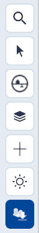
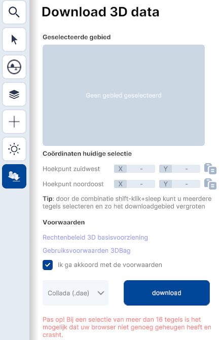
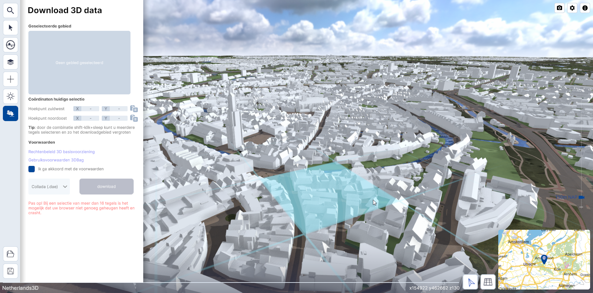
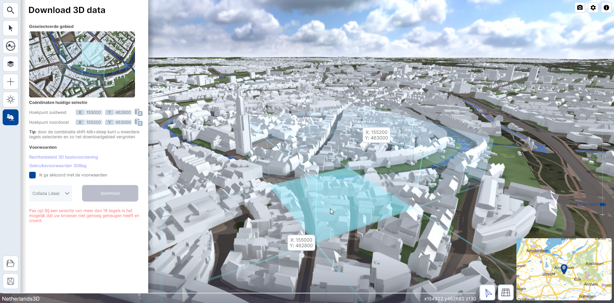
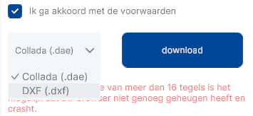

# Gebied downloaden

Functie, hoofdmenu.  

   { width="240px" align=left }

Met de functie Gebied Downloaden kunnen delen van een **gebied als bestand worden gedownload** (in de formaten .DAE en .DXF). Deze functie bevordert de aansluiting en uitwisseling met andere visualisatie- en CAD programma's. 
Dit hoofdstuk beschrijft de belangrijkste functies van Gebied Downloaden en geeft uitleg over de interface en essentiële functies.  

---

## Beschrijving

Met **Gebied downloaden** kunnen delen van een gebied worden opgeslagen en in andere software worden ingeladen. 

<video controls>
<source src="../video/gebied.downloaden.mp4" type="video/mp4">
</video>
_(Video) Gebied downloaden_

---

### **Menu**
Door met de muis op het `Gebied downloaden-icoon` in het hoofdmenu te klikken wordt de tool actief. Het menu klapt open en de **instellingen worden zichtbaar**.

{ width="350px" }  
_(Afbeelding) Gebied downloaden-menu_

---

### **Werking**

* #### **Gebied downloaden**   
Na het activeren van de functionaliteit wordt het menu actief en kun je met de muis meerdere secties van 100x100 meter selecteren.

_(Afbeelding) Gebied downloaden, 100x100 sectie_
 
* #### **Selecteer gebied**   
Door met de muis, in combinatie met de linkermuisknop en shift-toets te slepen kun je het selectiegebied vergroten.  

_(Afbeelding) Meerdere secties van 100x100 geselecteerd._

* #### **Export format kiezen**
  
_(Afbeelding) Keuze voor export format._

!!! tip "Waarom kan ik het selectiegebied niet roteren?"
	Het selectiegebied is altijd loodrecht op de horizontale-as/op het noorden georiënteerd.

* #### **Coördinaten huidige selectie**   
Met deze functie kun je de coördinaten van het hoekpunt zuidwest en het hoekpunt noordoost naar het klembord kopiëren.

* #### **Voorwaarden**   
NB! Voordat je het geselecteerde gebied kunt downloaden, dien je akkoord te gaan met de voorwaarden door `Ik ga akkoord met de voorwaarden`.  
Je vindt de link onder;  
`Rechtenbeleid 3D basisvoorziening` & 
`Gebruiksvoorwaarden 3DBag`.

* #### **Downloaden**   
Klik op `download` om een .DAE (Collada) of .DXF (CAD) bestand te downloaden. Het bestand kun je in een 3D modelleerprogramma zoals bijvoorbeeld Blender, Sketchup of CAD software importeren en bewerken.