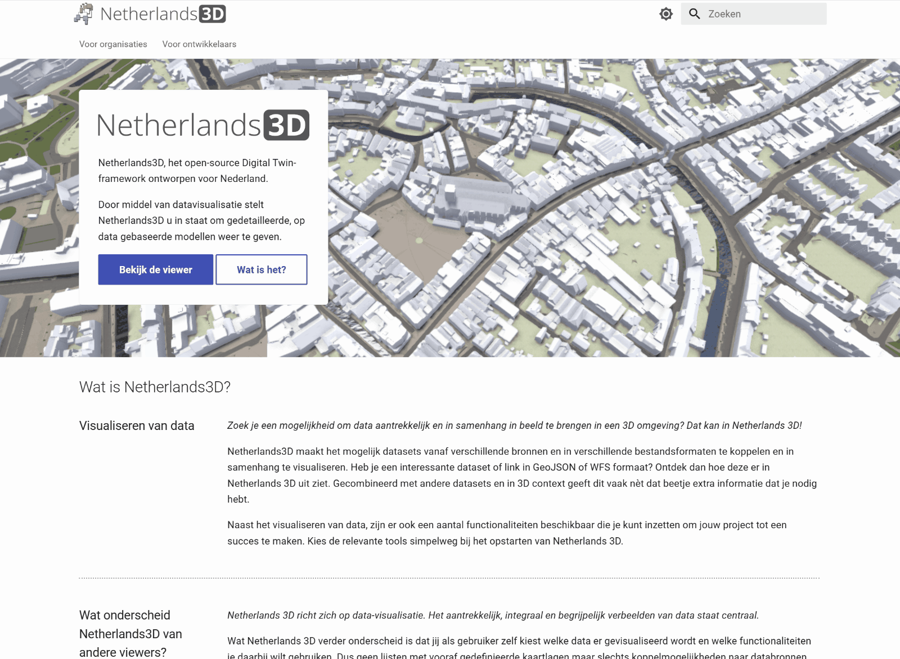
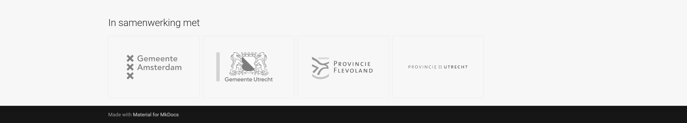

# Homepage

Op de homepage is **algemene informatie over het Netherlands3D** project te vinden.  
Naast de **functionaliteiten** bieden we specifiek voor twee doelgroepen informatie aan:  
**voor organisaties/gebruikers** en **Voor ontwikkelaars**.

---

## Hoofdstukken

/// caption
(Afbeelding) Hoofdmenubalk
///

### Functionaliteiten

In het hoofdstuk Handleiding vind je een gedetailleerde beschrijving van alle functionaliteiten ondersteund met
afbeeldingen en/of filmpjes.

### Voor organisaties

Dit hoofdstuk is onder ontwikkeling en bevat straks een uitgebreide bron van informatie.  
Het doel is om organisaties te ondersteunen met gidsen, best practices en antwoorden op veel gestelde vragen die
essentieel zijn voor het gebruik van het Netherlands3D platform.

### Voor ontwikkelaars

Ben je een ontwikkelaar en wil je bijvoorbeeld eigen functionaliteiten binnen Netherlands3D ontwikkelen? Dan vind je
in dit hoofdstuk de benodigde technische documentatie.  
Deze documentatie is bedoeld voor ontwikkelaars die willen begrijpen hoe het platform werkt, de architectuur willen
verkennen en nieuwe modules of functionaliteiten willen bijdragen.

---

## Schermmodus { width="16" }

Door op het `Schermmodus-icoon` te klikken kan de interface kan de modus veranderd worden in `Dark`; lichte tekst op een
donkere achtergrond of `Light`; donkere tekst op een lichte achtergrond. In de Dark modus gebruikt het systeem minder
energie en hoeft het systeem in het geval van een laptop minder snel te worden opgeladen.

_(Afbeelding) Dark/Light modus_

---

## Zoeken

Deze zoekfunctie biedt de mogelijkheid om naar trefwoorden te zoeken binnen Netherlands3D. Vul de zoekterm(en) in bij
`Zoeken` en de lijst met klikbare resultaten wordt in de context (hoofdstuk en alinea) getoond.

---

## Headline

/// caption
(Afbeelding) Headline
///

### Bekijk de viewer

Klik op `Bekijk de viewer` in de headline om de 3D-viewer functionaliteit te starten.  
(Zie [3D-viewer functionaliteit ](/docs/handleiding/3D-viewer/) voor de beschrijving.)  
 
### Wat is het

Met de knop `Wat is het?` wordt de tekst ’Wat is Netherlands3D?’ onder het overlay scherm naar boven gehaald.

---

## Content

/// caption
(Afbeelding) Content
///

De content bevat een algemene beschrijving van Netherlands3D.

---

## Footer

/// caption
(Afbeelding) Footer
///

Deze laag bevat de logo's van de bij Netherlands3D betrokken provincies en de mogelijkheid om door de hoofdstukken van
het hoofdmenu in de hoofdbalk te bladeren.