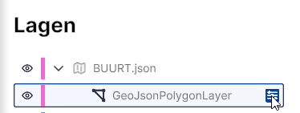
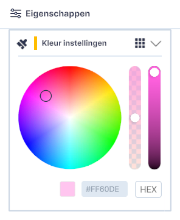

# Kleurenpaneel

Bij het laden van WFS of GeoJSON lagen is er de mogelijkheid om de kleuren van de geladen data te  wijzigen. Later volgt ook de mogelijkheid om op de standaard terreinlaag en de gebouwenlaag de kleur te wijzigen. Hoe je dat doet, lees je hieronder.

## **Openen**

{ style="height:230px;width:50px"  align=left }

Door op het **instellingen** icoon te klikken open je het instellingenvenster waar, wanneer van toepassing, het kleurenpaneel zichtbaar wordt.

{ style="height:230px;width:50px"  align=left }

Met het **kleurenpaneel** kan je kleuren en transparantie van basis en toegevoegde lagen aanpassen (deze kunnen materiaal kleuren uit een .mtl bestand overrulen). Door op een kleur in de cirkel te klikken, of door op het rondje in de kleurenwaaier te klikken en te verslepen, kan je jouw gewenste kleur kiezen. De saturatie is dan nog aanpasbaar via de meest rechtse horizontale balk. Daarnaast kan de transparantie van de kleur worden aangepast (werkt voorlopig alleen voor WFS/GeoJSON). Ook kan je een Hexadecimale Kleurcode invullen in het onderste veld.

De kleur van de geladen en geselecteerde laag zal nu wijzigen naar de gekozen kleur.

---

