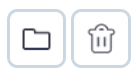
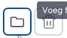
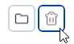

# Lagen organiseren

Basisfunctie, hoofdmenu.

### Menu (linksonder)

Door met de muis op het `Lagen-icoon` in het hoofdmenu te klikken wordt de tool actief.  
en het `toevoegen-menu` klapt open en de functies worden zichtbaar.

 
/// caption
Overzicht
///

### Functies

#### Folders

Met het `Map-icoon` wordt een folder aangemaakt waarvan de naam kan worden aangepast (dubbelklikken) en waarin de gekoppelde lagen of objecten kunnen worden gesleept. Dit helpt bij het organiseren en overzichtelijk houden van de gekoppelde lagen en/of objecten.

 
/// caption
toevoegen folder-menu
///

#### Verwijderen

Met het `Prullenbak-icoon` wordt de geselecteerde laag of object verwijderd. Dit kan ook met de `del/delete-toets` van het toetsenbord. 
NB! Sla voor het verwijderen alle instellingen op met `Project Opslaan`. 

 
/// caption
verwijderen-menu
///

---