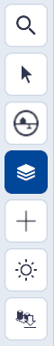
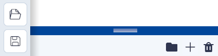
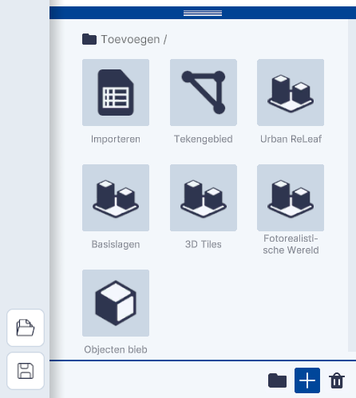

# Lagen toevoegen

(Kern)functies, hoofdmenu.

{ style="height:230px;width:50px" align=left }

Lagen is **dé kernfunctionaliteit van Netherlands3d.eu**. Deze functionaliteit biedt de mogelijkheden om **datalagen en objecten** uit verschillende bronnen te (ont)**koppelen** en de zichtbaarheid hiervan aan te passen. 
 
Dit hoofdstuk beschrijft de belangrijkste functionaliteiten van Lagen en geeft uitleg over de gebruikersinterface en essentiële functies.  

---

## Gedetailleerde beschrijving van de functionaliteiten

### Menu (linksonder)

Door met de muis op het `Lagen-icoon` in het hoofdmenu te klikken wordt de tool actief.  
en het `toevoegen-menu` klapt open en de functionaliteiten worden zichtbaar.

{ width="350px" }
/// caption
(Afbeelding) toevoegen-menu
///

### Functionaliteiten

#### Organiseren

Met het `Map-icoon` wordt een folder aangemaakt waarvan de naam kan worden aangepast (dubbelklikken) en waarin de gekoppelde lagen of objecten kunnen worden gesleept. Dit helpt bij het organiseren en overzichtelijk houden van de gekoppelde lagen en/of objecten.

#### Verwijderen

Met het `Prullenbak-icoon` wordt de geselecteerde laag of object verwijderd. Dit kan ook met de `del/delete-toets` van het toetsenbord. NB! Sla voor het verwijderen alle instellingen op met `Project Opslaan`. 

!!! tip "Waar is de undo-functie?"
	Sla na toevoegingen en/of aanpassingen het project regelmatig op. Er is geen UNDO-functie in Netherlands3D.eu.

#### Toevoegen

Het koppelen van datalagen al dan niet in combinatie met objecten is dé kernfunctionaliteit van Netherlands3D. Met
het `+ icoon` opent het Toevoegen menu en zijn de verschillende teken-, koppel- en importmogelijkheden (gedeeltelijk)
zichtbaar. Door met de muis de blauwe bovenbalk omhoog te slepen opent het menu volledig.

Het menu bevat de volgende zeven functies:
  
//// html | div.two-column

1. [Importeren (link)](toevoegen-importeren.md)
2. [Selectiegebied (link)](toevoegen-selectiegebied.md)
3. [Urban ReLeaf (link)](toevoegen-urban-releaf.md)
4. [Basislagen (link)](toevoegen-basislagen.md)
5. [3D Tiles (link)](toevoegen-3d-tiles.md)
6. [Fotorealistische Wereld (link)](toevoegen-fotorealistische-wereld.md)
7. [Objecten bibliotheek (link)](toevoegen-objecten-biep.md)

{ width="350px"}
/// caption
_(Afbeelding) Toevoegen menu, volledig zichtbaar_
///

////