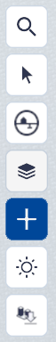
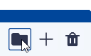
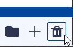

# Lagen toevoegen

Basisfunctie, hoofdmenu.

   { width="240px" align=left }

Lagen is onderdeel van de **basisfuncties van Netherlands3d.eu**. Deze functie biedt de mogelijkheden om **datalagen en objecten** uit verschillende bronnen te (ont)**koppelen** en de zichtbaarheid hiervan aan te passen. 
 Dit hoofdstuk beschrijft de belangrijkste functies van Lagen en geeft uitleg over de gebruikersinterface en essentiële functies. Voor meer informatie kijk bij [Lagen importeren](../toevoegen-importeren)

---

## Gedetailleerde beschrijving van de functies

### Menu (linksonder)

Door met de muis op het `Lagen-icoon` in het hoofdmenu te klikken wordt de tool actief.  
en het `toevoegen-menu` klapt open en de functies worden zichtbaar.

 
_Overzicht_

### Functies

#### Organiseren

Met het `Map-icoon` wordt een folder aangemaakt waarvan de naam kan worden aangepast (dubbelklikken) en waarin de gekoppelde lagen of objecten kunnen worden gesleept. Dit helpt bij het organiseren en overzichtelijk houden van de gekoppelde lagen en/of objecten.

 
_toevoegen folder-menu_

#### Verwijderen

Met het `Prullenbak-icoon` wordt de geselecteerde laag of object verwijderd. Dit kan ook met de `del/delete-toets` van het toetsenbord. NB! Sla voor het verwijderen alle instellingen op met `Project Opslaan`. 

 
_verwijderen-menu_

!!! tip "Waar is de undo-functie?"
	Sla na toevoegingen en/of aanpassingen het project regelmatig op. Er is geen UNDO-functie in Netherlands3D.eu.

#### Toevoegen

Het toevoegen van lagen gebeurt via de bibliotheek. Voor meer informatie klik hier  [Bibliotheek](../bibliotheek-basis)

---