# Lagen toevoegen

Basisfunctie, hoofdmenu.

   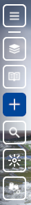{ width="240px" align=left }

Het toevoegen van lagen gebeurt via het uploaden van een eigen bestand, het laden via een url of het laden van lagen via de bibliotheek. Voor meer informatie over de Bibliotheek klik hier  [Bibliotheek](../bibliotheek-basis)

### **Importeren Eigen bestand**   

De functie `Importeren` biedt de mogelijkheid om **lagen en Objecten** via het importeren van bestanden of **via weblinks te koppelen**.

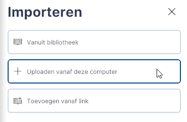  
_Uploaden vanaf deze computer_  
  
Met `Uploaden vanaf deze computer` kunnen .OBJ, .CSV, .JSON, .GEOJSON en .GLB bestanden worden gekoppeld.  
Na klikken op `Uploaden vanaf deze computer` opent de Verkenner (Windows)/Finder (MacOs) en kan het bestand worden geladen.
   

!!! tip "Drag and Drop"
   
    Met klik en slepen van een bestand vanuit verkenner of Finder in het viewervenster, worden bovenstaande formaten ook ingeladen. LET OP: Dit kan niet met meerdere bestanden tegelijk.

---

### **Importeren bestand vanaf link**   

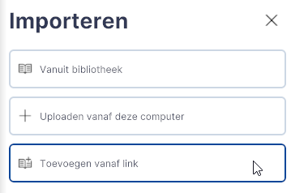  
_Toevoegen vanaf link_

Met **Toevoegen vanaf link** kan je databronnen (WFS, WMS, GeoJSON, 3D-Tiles) via een weblink koppelen.  
Klik op `Toevoegen vanaf link`. Het menu; Laag toevoegen via URL wordt geopend.

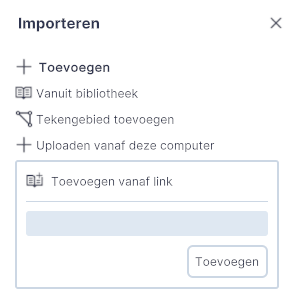 

Kopieër en plak de link van het bestand in het vakje [URL link].   
In de nabije toekomst is hier een link naar veelgebruikte WFS/WMS-lagen te vinden.

Na `Toevoegen` is de **link gekoppeld** en de **data zichtbaar** in de 3D-Viewer. 

---

### **Importeren van een Catalogus**

Op dezelfde manier kan je ook een catalogus aan de bibliotheek toevoegen bijvoorbeeld een demo omgeving die is gepubliceerd door https://hub.clearly.app/home. Kopieër en plak de link van de catalogus https://ogc-demo.clearly.app/v2/ in het venster. Dan zal de catalogus worden toegevoegd aan de bibliotheek via de bibliotheek kan je dan alle lagen die beschikbaar zijn en voldoen aan onze importformaten, importeren in het lagenpaneel. 
Voor meer informatie over de Bibliotheek klik hier  [Bibliotheek](../bibliotheek-basis)

 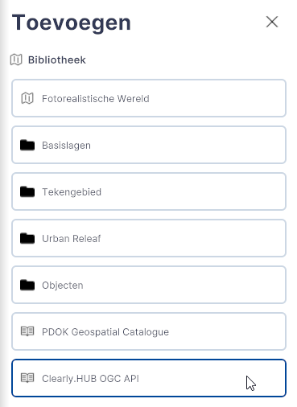 
 _importeren van een catalogus_

---

## **Voorbeelden**

### **Bestand Importeren met .OBJ**   

Stap1. Klik op `Uploaden vanaf deze computer` en importeer het .OBJ-bestand.

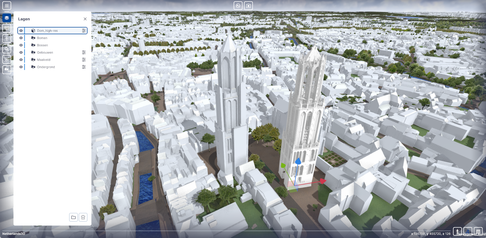 
_Gedetailleerde Domtoren middels .OBJ geïmporteerd_  

Na het **importeren** wordt het **Object in de 3D omgeving** en in de lijst onder Lagen **zichtbaar**.  

!!! tip "Waarom heeft het geimporteerde Object niet de juiste afmetingen?"
   
    De viewer neemt automatisch de oriëntatie en schaal van het Object (3D-model) zoals het is gemaakt over. Met de transformatie-tools kunnen de schaal en/of oriëntatie van het Object worden aangepast. Het is ook mogelijk om de schaal van het Object en/of oriëntatie in een extern 3D-programma zoals Blender aan te passen en opnieuw te importeren.

---
  
Stap 2a. Het geselecteerde Object kan met de **transformatie-tools** op de **juiste locatie** of aangepaste **oriëntatie en schaal** worden gebracht. Klik op het gekoppelde `Object` in Lagen en de transformatie-tool is geactiveerd.
    
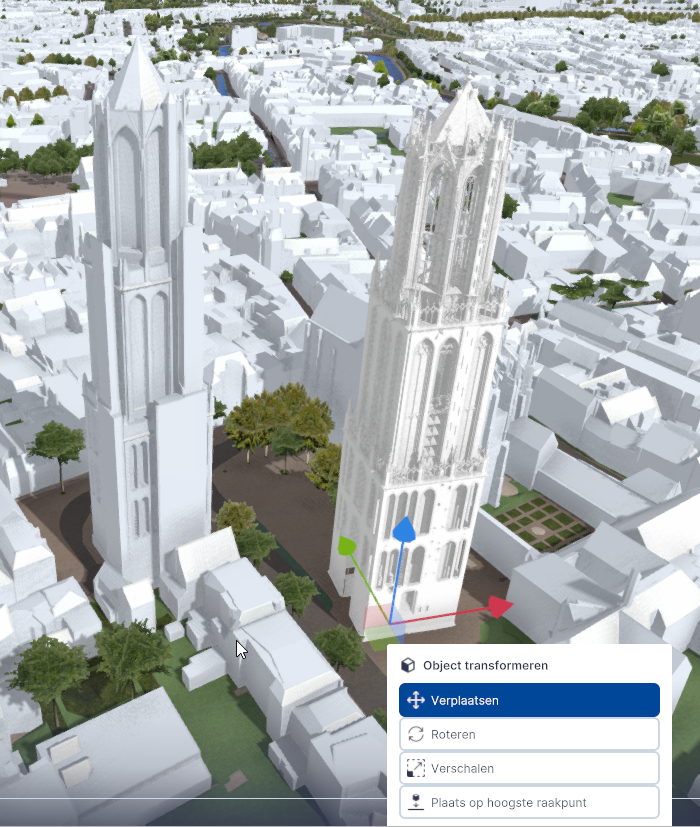{ width="248px" }
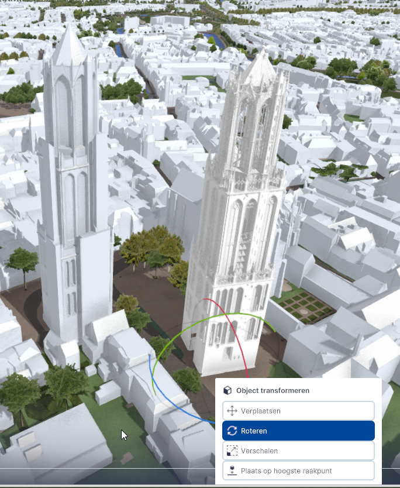{ width="248px" }
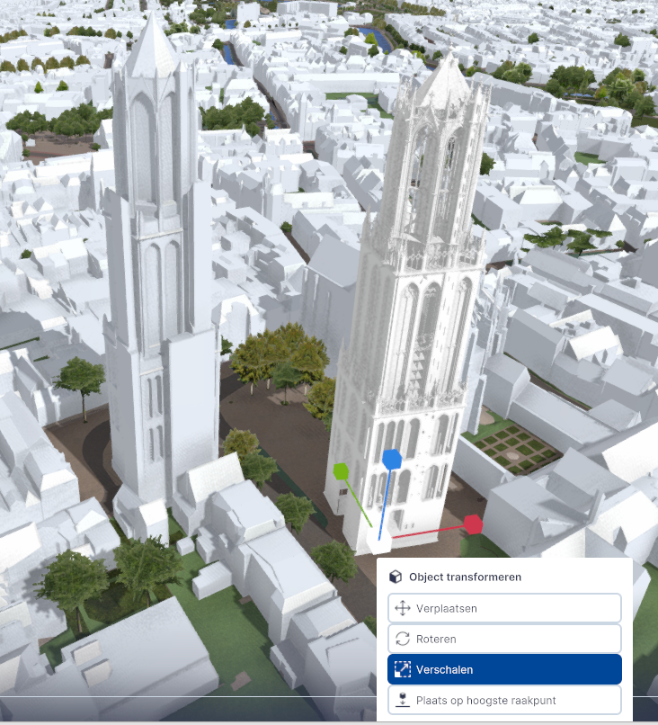{ width="248px" }  
_Verplaatsen, roteren en verschalen met de transformatie-tool_

---

Stap 2b. Met de `Eigenschappen` -functie kan de **locatie, oriëntatie en schaal** van het geimporteerde Object **handmatig worden ingevoerd**.  

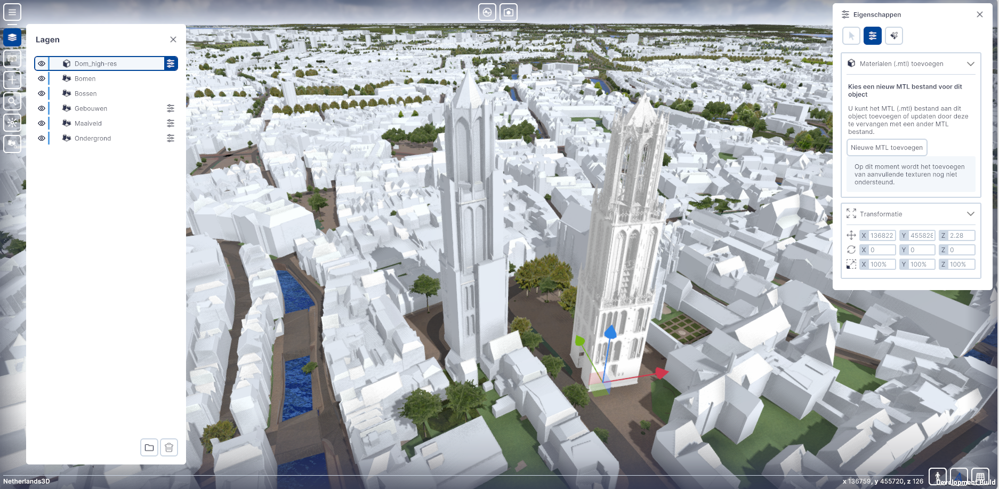
_Handmatig invoeren van locatie, oriëntatie en schaal._ 
 
--- 
 
Stap 3. Met **Bestand toevoegen** kan het **.mtl-bestand** dat bij het .OBJ-bestand behoord **aan het 3D-model gekoppeld**. Hiermee wordt kleur- en textuur-informatie meegeladen met het 3D-model.  
Klik op `Bestand toevoegen` in het Eigenschappen-menu en selecteer het .mtl-bestand in de Verkenner/Finder.

---

### **Toevoegen vanaf link**   
Klik op `Toevoegen vanaf link` en koppel de link.   
 
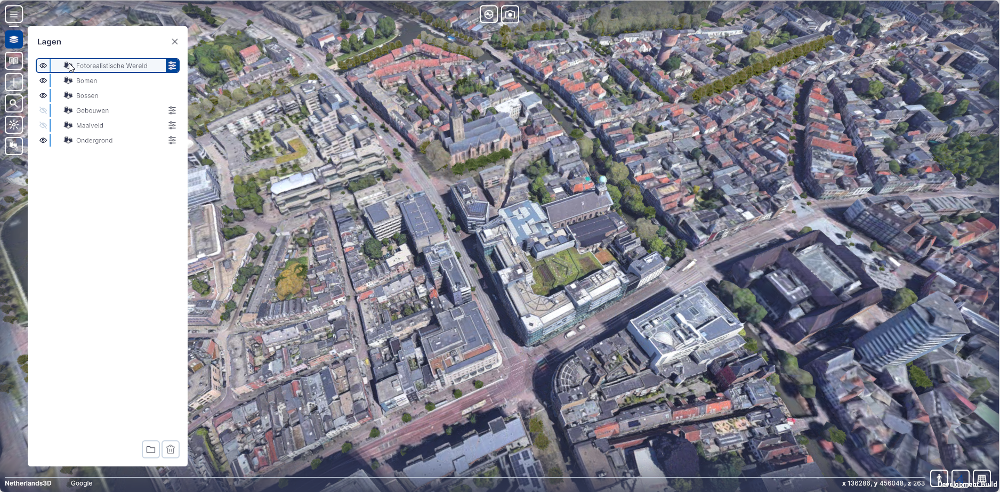
_Voorbeeld 1;  Luchtfoto's van Nederland gekoppeld met WMS-link_  

---

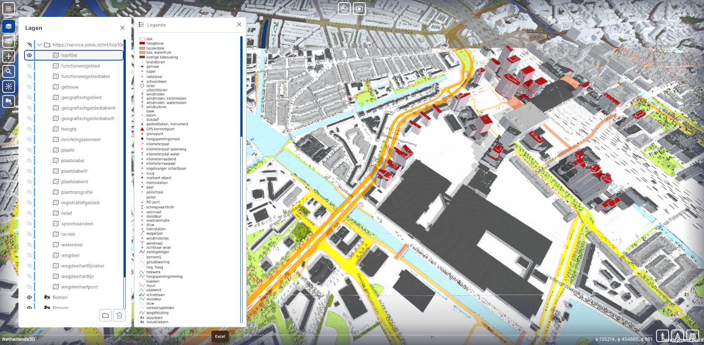
_Voorbeeld 2;  Landelijke BRT kaart gekoppeld met WMS-link_
---