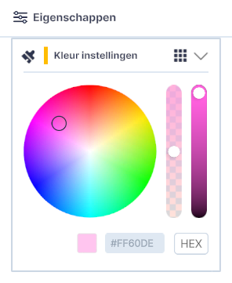

# Lagen

(Kern)functionaliteit, hoofdmenu.  
{ style="height:230px;width:50px" align=left }

Lagen is **dé kernfunctionaliteit van Netherlands3d.eu**. Deze functionaliteit biedt de mogelijkheden om **datalagen en objecten** uit verschillende bronnen te (ont)**koppelen** en de zichtbaarheid hiervan aan te passen. 

Dit hoofdstuk beschrijft de belangrijkste functionaliteiten van Lagen en geeft uitleg over de gebruikersinterface en essentiële functies.  
 
 
 

---

## Overzicht van functionaliteiten

Door het uit-/aanvinken van datalagen worden deze verborgen of getoond. 
Met behulp van links en/of het importeren van bestanden worden datalagen en objecten gekoppeld.

<video controls>
<source src="../video/lagen.mp4" type="video/mp4">
</video>
_(Video) gebruik van Lagen_

---

## Gedetailleerde beschrijving van de functionaliteiten

### **Menu (linksboven)**
Door met de muis op het `Lagen-icoon` in het hoofdmenu te klikken wordt de tool actief.  
Het menu klapt open en de **basislagen worden zichtbaar**.

{ width="350px" }  
_(Afbeelding) lagen-menu_

---

### **Functionaliteiten**

* #### **Standaardlagen**   
  De lagen Bomen, Bossen, Gebouwen en Maaiveld zijn in de basisversie standaard gekoppeld.

* #### **Laagvolgorde**   
  Met de muis en linkermuisknop kan de volgorde van de lagen worden gewijzigd.  
  `Klik` op een laag en `sleep` de laag naar de gewenste plek door de `linkermuisknop` ingedrukt te houden. Door de laag op een andere laag te slepen wordt deze onder die laag gekoppeld. Sleep je de laag tussen twee lagen, Dan wordt deze er tussen geplaatst na het `loslaten` van de `linkermuisknop`. Met deze functie kunnen lagen op- of juist onder elkaar worden gesorteerd.

_(Afbeelding) Rangschikken van lagen_

!!! tip "Waarom zie ik geen effect bij het verslepen van de lagen?"
	Het verplaatsen van lagen heeft alleen een zichtbaar effect bij lagen waarin WMS-data gekoppeld is.  
	[zie Voorbeeld koppelen bestand met URL](../toevoegen-importeren/#bestand-bestand-via-url).

* #### **Tonen/verbergen**   
  Klik op het `oog` voor het verbergen of tonen van de inhoud van de datalagen in de 3D-Viewer.

* #### **Transformatie tool**   
  De locatie, oriëntatie en schaal van toegevoegde objecten wordt met de transformatie tool aangepast.

_(Afbeelding) Transformatie tool geactiveerd door selectie in Lagen_
   

* #### **Eigenschappen**   
  Van toegevoegde objecten en sommige lagen kunnen eigenschappen zoals b.v. de locatie, oriëntatie en schaal maar ook object/laag specifieke eigenschappen worden aangepast.  
  Klik op het `Eigenschappen-icoon` om het eigenschappenmenu te openen.

_(Afbeelding) Instellingen actief_

* #### **Kleurenpaneel**

Bij het laden van WFS of GeoJSON lagen is er de mogelijkheid om de kleuren van de geladen data te  wijzigen. Later volgt ook de mogelijkheid om de kleur te wijzigen van de standaard terreinlaag en de gebouwenlaag. Hoe je dat doet, lees je hieronder.

{ style="height:230px;width:50px"  align=left }

Door op het **instellingen** icoon te klikken open je het instellingenvenster waar, wanneer van toepassing, het kleurenpaneel zichtbaar wordt.

{ style="height:230px;width:50px"  align=left }

Met het **kleurenpaneel** kan je kleuren en transparantie van basis en toegevoegde lagen aanpassen (deze kunnen materiaal kleuren uit een .mtl bestand overrulen). Door op een kleur in de cirkel te klikken, of door op het rondje in de kleurenwaaier te klikken en te verslepen, kan je jouw gewenste kleur kiezen. De saturatie is dan nog aanpasbaar via de meest rechtse horizontale balk. Daarnaast kan de transparantie van de kleur worden aangepast (werkt voorlopig alleen voor WFS/GeoJSON). Ook kan je een Hexadecimale Kleurcode invullen in het onderste veld.

De kleur van de geladen en geselecteerde laag zal nu wijzigen naar de gekozen kleur.

-----
