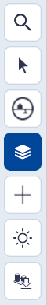
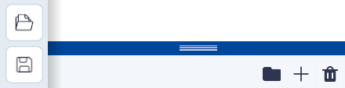

# Lagen

(Kern)functionaliteit, hoofdmenu.  
{ style="height:230px;width:50px" align=left }

Lagen is **dé kernfunctionaliteit van Netherlands3d.eu**. Deze functionaliteit biedt de mogelijkheden om **datalagen en objecten** uit verschillende bronnen te (ont)**koppelen** en de zichtbaarheid hiervan aan te passen. 
 
Dit hoofdstuk beschrijft de belangrijkste functionaliteiten van Lagen en geeft uitleg over de gebruikersinterface en essentiële functies.  
 
 
 

---

## Overzicht van functionaliteiten

Door het uit-/aanvinken van datalagen worden deze verborgen of getoond. 
Met behulp van links en/of het importeren van bestanden worden datalagen en objecten gekoppeld.

<video controls>
<source src="../video/lagen.mp4" type="video/mp4">
</video>
_(Video) gebruik van Lagen_

---

## Gedetailleerde beschrijving van de functionaliteiten

### **Menu (linksboven)**
Door met de muis op het `Lagen-icoon` in het hoofdmenu te klikken wordt de tool actief.  
Het menu klapt open en de **basislagen worden zichtbaar**.

{ width="350px" }  
_(Afbeelding) lagen-menu_

---

### **Functionaliteiten**

* #### **Standaardlagen**   
De lagen Bomen, Bossen, Gebouwen en Maaiveld zijn in de basisversie standaard gekoppeld.

* #### **Laagvolgorde**   
Met de muis en linkermuisknop kan de volgorde van de lagen worden gewijzigd.  
`Klik` op een laag en `sleep` de laag naar de gewenste plek door de `linkermuisknop` ingedrukt te houden. Door de laag op een andere laag te slepen wordt deze onder die laag gekoppeld. Sleep je de laag tussen twee lagen, Dan wordt deze er tussen geplaatst na het `loslaten` van de `linkermuisknop`. Met deze functie kunnen lagen op- of juist onder elkaar worden gesorteerd.

_(Afbeelding) Rangschikken van lagen_

!!! tip "Waarom zie ik geen effect bij het verslepen van de lagen?"
	Het verplaatsen van lagen heeft alleen een zichtbaar effect bij lagen waarin WMS-data gekoppeld is.  
	[zie Voorbeeld koppelen bestand met URL](../toevoegen-importeren/#bestand-bestand-via-url).

* #### **Tonen/verbergen**   
Door het `uit-/aanvinken` van datalagen worden deze verborgen of getoond. 
Met behulp van links en/of het importeren van bestanden worden datalagen en objecten gekoppeld.

* #### **Transformatie tool**   
De locatie, oriëntatie en schaal van toegevoegde objecten wordt met de transformatie tool aangepast.

_(Afbeelding) Transformatie tool geactiveerd door selectie in Lagen_
   
 
* #### **Eigenschappen**   
Van toegevoegde objecten en sommige lagen kunnen eigenschappen zoals b.v. de locatie, oriëntatie en schaal maar ook object/laag specifieke eigenschappen worden aangepast.  
Klik op het `Eigenschappen-icoon` om het eigenschappenmenu te openen.

_(Afbeelding) Instellingen actief_

---

### **Menu (linksonder)**
Door met de muis op het `Lagen-icoon` in het hoofdmenu te klikken wordt de tool actief.  
en het `toevoegen-menu` klapt open en de functionaliteiten worden zichtbaar.

{ width="350px" }  
_(Afbeelding) toevoegen-menu_

---

### **Functionaliteiten**

* #### **Organiseren**   
Met het `Map-icoon` wordt een folder aangemaakt waarvan de naam kan worden aangepast (dubbelklikken) en waarin de gekoppelde lagen of objecten kunnen worden gesleept. Dit helpt bij het organiseren en overzichtelijk houden van de gekoppelde lagen en/of objecten.

* #### **Verwijderen**   
Met het `Prullenbak-icoon` wordt de geselecteerde laag of object verwijderd. Dit kan ook met de `del/delete-toets` van het toetsenbord. NB! Sla voor het verwijderen alle instellingen op met `Project Opslaan`. 

!!! tip "Waar is de undo-functie?"
	Sla na toevoegingen en/of aanpassingen het project regelmatig op. Er is geen UNDO-functie in Netherlands3D.eu.

* #### **Toevoegen**  
Het koppelen van datalagen al dan niet in combinatie met objecten is dé kernfunctionaliteit van Netherlands3d.eu. Met het `+ icoon` opent het Toevoegen menu en zijn de verschillende teken-, koppel- en importmogelijkheden (gedeeltelijk) zichtbaar. Door met de muis de blauwe bovenbalk omhoog te slepen opent het menu volledig.  
 
Het menu bevat de volgende 7 teken- koppel- en importmogelijkheden;
  
{ width="350px"  align=left }

 
 
[1. Importeren (link)](../toevoegen-importeren/)  
[2. Selectiegebied (link)](../toevoegen-selectiegebied/)  
[3. Urban ReLeaf (link)](../toevoegen-urban-releaf/)  
[4. Basislagen (link)](../toevoegen-basislagen/)  
[5. 3D Tiles (link)](../toevoegen-3d-tiles/)  
[6. Fotorealistische Wereld (link)](../toevoegen-fotorealistische-wereld/)  
[7. Objecten biep (link)](../toevoegen-objecten-biep/)  
 
 
 
 
 
 
 
 

_(Afbeelding) Toevoegen menu, volledig zichtbaar_
 