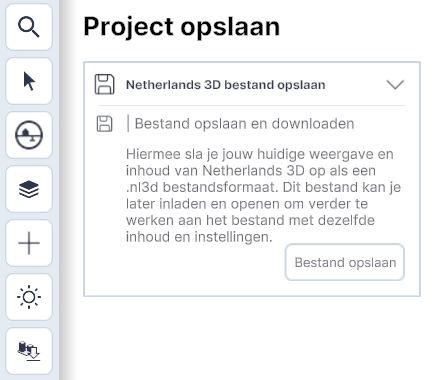

#  Project openen/opslaan 

{ style="height:100px;width:50px" align=left }

Het Project opslaan/openen-menu bevindt zich in de linker onder hoek en bevat de volgende functies;

* `Project openen`   
* `Project opslaan`  
&nbsp;

#### **Project opslaan**
Met `Project opslaan` worden alle nieuwe instellingen, locatie, lagen etc. van de viewer opgeslagen. Met de knop `Project opslaan` wordt een venster geopend met aanvullende uitleg en de knop Bestand opslaan.

{ width="350px" }

Met de knop `Bestand opslaan` worden de instellingen automatisch in een .nl3d bestand gedownload in de map `C:\Users\Gebruikersnaam\Downloads`. 

#### **Project openen** 
Met de knop `Project openen` wordt een venster geopend met aanvullende uitleg en de knop `Bestand openen`. Hiermee wordt de Verkenner (Windows) of Finder (MacOS) geopend en kan een eerder gemaakt .nl3d-bestand worden geopend. Hierna zijn de in-het-.nl3d-bestand-opgeslagen instellingen, datalagen, locatie etc. weer actief. 

{ width="350px" }

&nbsp;