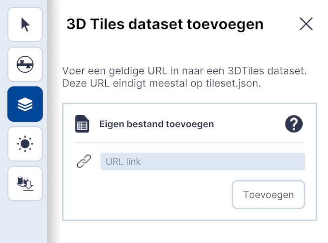

# 3D Tiles

Functionaliteit, Lagen, submenu.  
  
{ width="350px" }  
_(Afbeelding) Toevoegen / 3D Tiles_

---

## Gedetailleerde beschrijving van de functionaliteiten

### **Menu**  
Met de functionaliteit Tiles kunnen 3D Tiles uit een eigen laag of twee voor gedefinieerde lagen worden gekoppeld.  
 
{ width="350px" }  
_(Afbeelding) Toevoegen / 3D Tiles_
 
---

### **Eigen laag (3D Tiles)** 
Met `Eigen laag (3D Tiles)` kan een eigen databron met een URL Link worden gekoppeld.  
Copy /past de link in het veld `URL Link` en klik op `Toevoegen`.  
 
{ width="350px" }  
_(Afbeelding) Toevoegen / 3D Tiles dataset_
 
---

### **Gebouwen (3D tiles)** 
Met `Gebouwen (3D tiles)` wordt data uit de .... bron gekoppeld.  
 
  
_(Afbeelding) Gebouwen (3D Tiles)_
 
---

### **Maaiveld (3D tiles)** 
Met `Maaiveld (3D tiles)` wordt data uit de .... bron gekoppeld.  
 
  
_(Afbeelding) Maaiveld en Gebouwen (3D Tiles)_
 