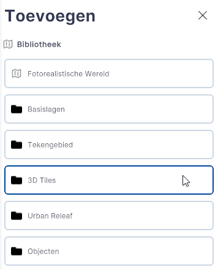
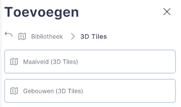
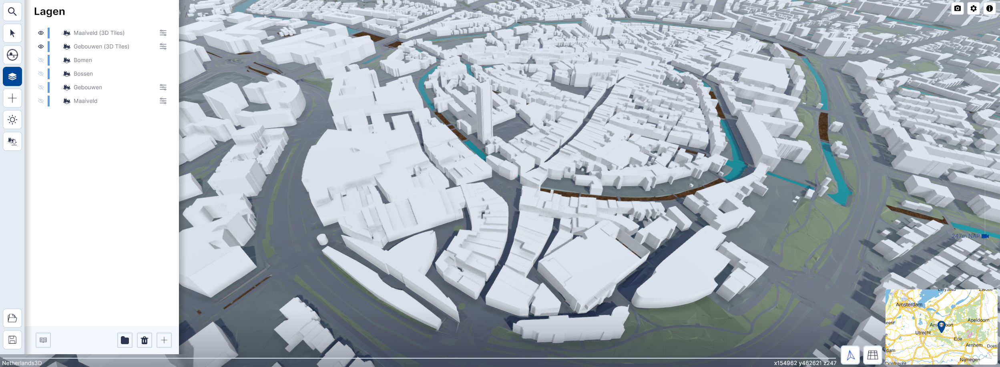

# 3D Tiles

Functies, Lagen, submenu.  
  
 
/// caption
(Afbeelding) Toevoegen / 3D Tiles
///

---

## Gedetailleerde beschrijving van de functionaliteiten

### Menu

Met de functionaliteit Tiles kunnen 3D Tiles uit twee voorgedefinieerde lagen worden gekoppeld.  

/// caption
(Afbeelding) Toevoegen / 3D Tiles
///

---

### Gebouwen (3D tiles)

Met `Gebouwen (3D tiles)` worden gebouwen uit de 
[3D Basisvoorziening van het Kadaster](https://www.pdok.nl/introductie/-/article/3d-basisvoorziening-1) gekoppeld.  

  
/// caption
(Afbeelding) Gebouwen (3D Tiles)
///

---

### Maaiveld (3D tiles)

Met `Maaiveld (3D tiles)` wordt het maaiveld uit de 
[3D Basisvoorziening van het Kadaster](https://www.pdok.nl/introductie/-/article/3d-basisvoorziening-1) gekoppeld.

  
/// caption
(Afbeelding) Maaiveld en Gebouwen (3D Tiles)
///
