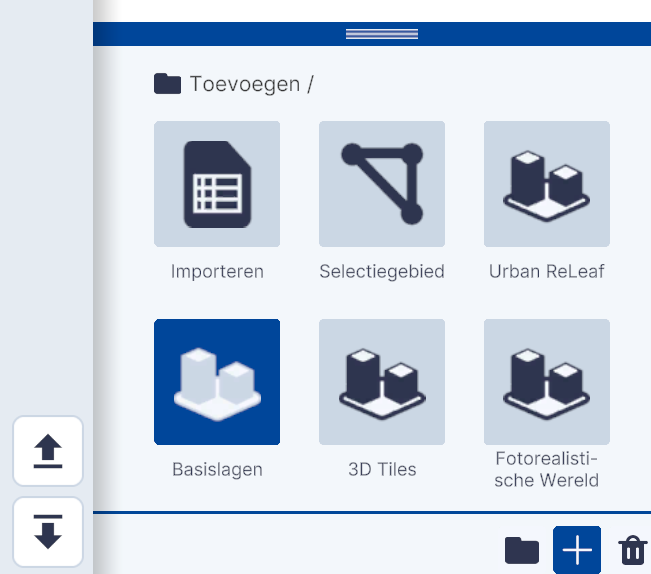
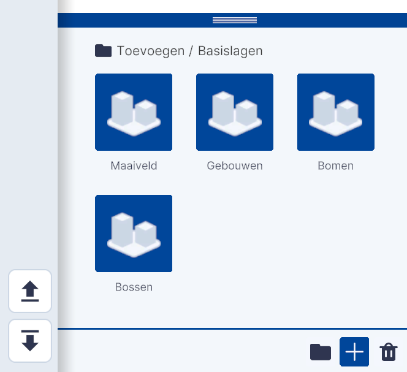
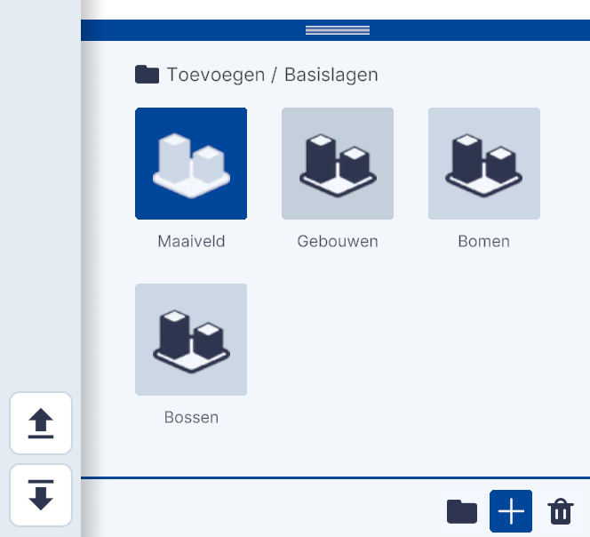

# Basislagen

Functies, Lagen, submenu.  
  
{ width="350px" }  
_(Afbeelding) Toevoegen / Basislagen_

---

## Gedetailleerde beschrijving van de functionaliteiten

### **Basislagen**  
Met de functionaliteit Basislagen kunnen de vier basislagen welke in de standaard/basisversie zijn gekoppeld worden verwijderd of toegevoegd.  
 
{ width="350px" }
{ width="350px" }  
_(Afbeelding) De vier basislagen_  
 
Na het aanklikken van één van de lagen; `Maaiveld, Gebouwen, Bomen en/of Bossen` wordt deze laag verwijderd uit de viewer het bijbehorende icoon wordt lichtgrijs. Na het opnieuw aanklikken wordt de laag weer toegevoegd en het icoon donkerblauw.  
 