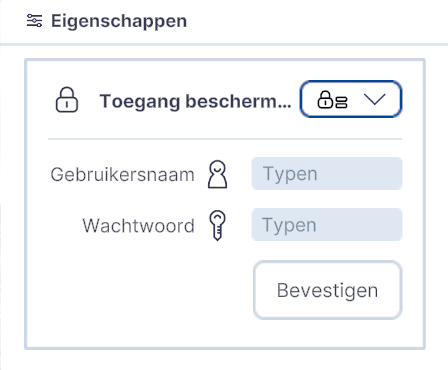

# Fotorealistische Wereld

Functies, Lagen, submenu.  
  
{ width="350px" }  
_(Afbeelding) Toevoegen / Fotorealistische Wereld_

---

## Gedetailleerde beschrijving van de functies

Met de functie Fotorealistische Wereld kunnen de **3D tiles van Google Earth** worden **gekoppeld en gevisualiseerd** in Netherlands3D.eu.

### **Toevoegen**
Klik op `Fotorealistische Wereld` en het de laag **RealityMesh (3D Tiles)** wordt toegevoegd en het **Eigenschappenmenu** wordt rechtsboven in het scherm geopend.  
  
  
_(Afbeelding) Utrecht CS in 3DBAG_  
  
!!! tip "Waarom is de deze functie beschermd?"	
	NB! Aangezien de 3D Google Earth Tiles een betaalde service van Google is, kan deze functie niet zonder inlogcode of sleutel worden vrijgegeven.  
  
Klik op `Update` om verder te gaan.  

---

### **Met Gebruikersnaam en Wachtwoord**
Toegangsscherm met Gebruikersnaam en Wachtwoord:
{ width="350px" }  
_(Afbeelding) Toegangsscherm met gebruikersnaam en wachtwoord_  
 
Voer bij de `Gebruikersnaam` en `Wachtwoord` en klik op `Bevestigen`. De 3D Tiles worden direct geladen.  
 
!!! tip "Ik heb geen toegangscode of sleutel. Wat kan ik doen?" 
	Indien er geen gebruikersnaam/wachtwoord beschikbaar is; Ga naar Google en maak via het Google-account een 'sleutel’ aan. Hoe je dat doet lees je hier (externe link); [Aanmaken Google-sleutel](https://developers.google.com/maps/documentation/embed/get-api-key).

---

### **Met Google sleutel**
Klik op het vinkje in het `pull-down-menu` met het slotje naast **Toegang bescherm...** en het volgende menu verschijnt;   
 
{ width="350px" }  
_(Afbeelding) Toegangsscherm met Google-sleutel_  
 
Plak de sleutel in het veld `Typen` en klik op `Bevestigen`. De 3D Tiles worden direct geladen.  
 

  
_(Afbeelding) Utrecht CS in Google Earth 3D Tiles_  
 
!!! tip "Ik zie na het inloggen geen 3D Tiles in de viewer?"	
	NB! De Google Earth Tiles zijn (nog) niet voor heel Nederland zichtbaar/beschikbaar. Voor grote delen van NL geldt dat er alleen een topdown satellietfoto beschikbaar is.  
 